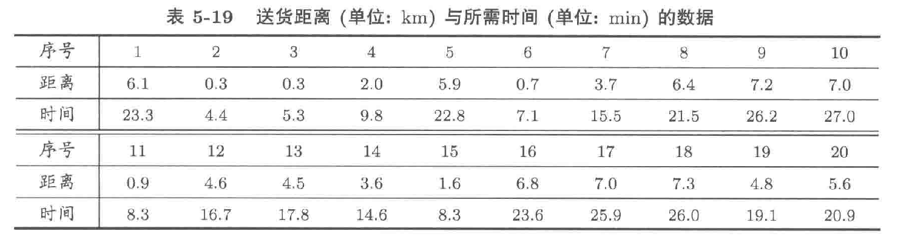

**练习5.24** 某快餐店外卖部经理想要了解完成一份订单所需时间和送货距离之间的关系。他随机抽取了20份订单，获取了这些订单的送货距离和所需时间，将所得数据列入下表。试建立完成一份订单所需时间与送货距离的经验方程。



```{R}
distance <- c(6.1,0.3,0.3,2.0,5.9,0.7,3.7,6.4,7.2,7.0,
              0.9,4.6,4.5,3.6,1.6,6.8,7.0,7.3,4.8,5.6)
time <- c(23.3,4.4,5.3,9.8,22.8,7.1,15.5,21.5,26.2,27.0,
					8.3,16.7,17.8,14.6,8.3,23.6,25.9,26.0,19.1,20.9)
```

1. 绘制散点图，观察距离 `distance` 和 `time` 之间的关系：
    ```{R}
    plot(distance, time, type="p")
    ```
2. 将送货时间作为响应变量 $Y$，送货距离 $x$ 作为解释变量。由散点图知，我们可以使用简单的线性回归模型来拟合其经验方程：
    $$
    Y = a + b  x + \varepsilon
    $$
3. 使用如下R语言进行模型的参数估计和模型评价：
    ```{R}
    tmpModel <- lm(time ~ distance)
    summary(tmpModel)
    ```
4. 所以送货时间 $Y$ 对于送货距离 $x$ 的经验方程为：
    $$
    Y = 4.222 + 3.009 x
    $$
    该模型的$R^{2}$
    ```{R}
    summary(tmpModel)$r.squared
    ```
    该模型参数的估计值：
    ```{R}
    tmpModel$coefficients
    coef(tmpModel)
    ```
    该模型的残差平方和：
    ```{R}
    sum(tmpModel$residuals ^ 2)
    ```