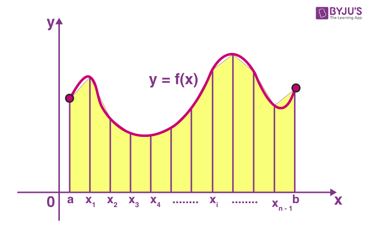

# 定积分
定积分（Definite Integral）是微积分中的基本概念之一，用于描述一个函数在某个区间上的累积变化。它通常用于计算曲线与坐标轴之间的面积、物理量的累积、概率等问题。

在一个封闭区间 $[a,b]$ 上的连续函数 $f(x)$，其定积分可以被定义为：
$$
\int_{a}^{b} f(x)\,dx
$$
其表示函数$f(x)$在区间$[a,b]$上的累积值。几何上可以解释为曲线$y=f(x)$和$x$轴之间在$[a,b]$范围内围成的面积。上式中：

- $a$ 和 $b$ 分别称为积分的下界和上界
- $f(x)$ 被称为被积函数


## 使用R语言计算定积分
R语言内置了函数 `integrate(f, a, b)` 用于计算函数 `f` 以 `a` 为下界，`b` 为上界的定积分；例如，我们可以通过如下的代码计算定积分：
$$
\int_{0}^{1}x^{2}\,dx
$$
```{R}
# 定义函数 f = x^2
f <- function(x){
  return(x^2)
}

# 利用 integrate 函数对于 f 进行积分，下界为0，上界为1
integrate(f,0,1)
```

但是很多时候，我们可以通过使用**匿名函数**的方式直接计算 $\displaystyle\int_{0}^{1}x^{2}\,dx$，不需要定义一个函数 `f`：
```{R}
integrate(function(x) x^2, 0, 1)
```

#### 例：
根据连续型随机变量的均值和方差的定义：
$$
\begin{split}
E(X) &= \int_{-\infty}^{\infty} x\cdot p(x)\, dx \\
D(X) &= \int_{-\infty}^{\infty} [x - E(X)]^{2}\cdot p(x)\, dx \\
\end{split}
$$
其中 $p(x)$ 为连续型随机变量 $X$ 的概率密度函数。

使用 `integrate` 函数，计算在 $0,1$ 上的均匀分布的均值和方差（hints:R内置了均匀分布的概率密度函数 `dunif(x, a, b)`

```{R}
integrate(function(x) x * dunif(x, 0, 1), -Inf, Inf)
```


```{R}
integrate(function(x) (x - 0.5)^2 * dunif(x, 0, 1), -Inf, Inf)
```


## 梯形法则\*

{width=40% #fig:fig1}

根据图\ref{fig:fig1}，我们可以通过将曲线下的面积划分成很$n$个等高的小梯形来估计其定积分；令图\ref{fig:fig1}中的$x_0 = a, x_{n} = b$，每个小梯形的高为 $h \triangleq (b-a)/n$，上下底的长度之和为 $f(x_{i}) + f(x_{i-1}), i = 1,2,\dots,n$，于是有：
$$
\begin{split}
\int_{a}^{b} f(x)\,dx &\approx \sum_{i=1}^{n} \frac{f(x_i) + f(x_{i-1})}{2} \cdot \frac{(b-a)}{n} \\
& = \frac{h}{2}\left[f(x_{0}) + f(x_{n}) + 2\sum_{i=1}^{n}f(x_{i})\right]
\end{split}
$$
具体可以写成如下代码：
```{r}
# 定义一个名为 trapezoid_int 的函数采用梯形法来估算定积分，f为被积函数，a为积分下界，b为积分上界，n为小梯形的个数
trapezoid_int <- function(f, a, b, n=10000){
  x <- seq(a, b, length.out=n+1) # 由于我们需要将整个区域分成n块，所以我们需要在[a,b]中定义n+1个点
  h = (b-a) / n # 计算间隔的长度（小梯形的高）
  y = f(x)      # 计算每个 f(x_i)
  
  integral = h/2 * (y[1] + y[n+1] + 2*sum(y[2:n])) # 根据上面的公式进行计算得到定积分
  return(integral) # 返回定积分的结果
}

trapezoid_int(function(x) x**2, 0, 1)
```


# Questions
1. 计算 $\sin(x)$ 在 $[0,2\pi]$ 上的定积分
2. 计算 $\sin(x) + \cos(x)$ 在 $[0,2\pi]$ 上的定积分
3. 计算 $e^{-x}$ 在 $[0,+\infty]$ 上的定积分

