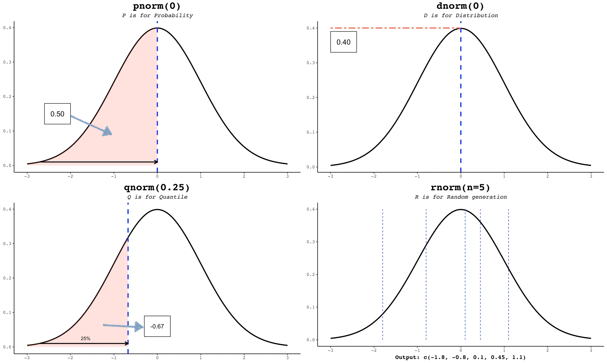

# 5.1 二项分布 (Binomial Distribution)
$$
\xi \sim B(n,p)
$$

## 5.1.1 相关R语言函数
- `dbinom(k,n,p)` (**d**ensity of **binom**ial distribution)：计算参数为 $n$ 和 $p$ 的二项分布在 $k$ 点的密度，即 $\mathrm{P}(\xi = k)$
	$$
	\mathrm{P}(\xi = k) = {n\choose k}p^{k}(1-p)^{n-k},\quad k=0,1,\dots,n
	$$
- `pbinom(x,n,p)` (**p**robability of **binom**ial distribution)：计算参数为 $n$ 和 $p$ 的二项分布在 $x$ 点的分布函数值，即 $F(x) = \mathrm{P}(\xi \leq x)$ 
	$$
	F(x) = \mathrm{P}(\xi \leq x) = \sum_{k\leq x} \mathrm{P}(\xi = k) = \sum_{k\leq x}{n\choose k}p^{k}(1-p)^{n-k}
	$$
- `rbinom(m,n,p)` (**r**andom of **binom**ial distribution)：生成 $m$ 个服从参数为 $n$ 和 $p$ 的二项分布的随机数。

## 5.1.2 相关例题
#### 例1模拟二项分布随机变量 
假设某个实验成功的概率为 $0.3$，在一次实验中重复 $10$ 次。请用 R 语言模拟 $1000$ 次实验，输出每次实验成功的次数 $\xi$ 分布，并通过 $1000$ 次模拟，计算每次试验成功次数 $\xi$ 的算术平均值。
```{R}
p <- 0.3
n <- 10
m <- 1000
results <- rbinom(m, n, p)
table(results)

hist(results, 
     freq=F, 
     col="lightblue", 
     main="Histogram of B(10, 0.3)", 
     xlab="Number of Successes",
     ylab="Frequency")

mean(results)
```

#### 例2计算某个事件的概率
对于四选一的 $10$ 道选择题，如果某人用随机猜测答案的方法，其猜对的题目个数 $\xi$ 服从什么分布？计算恰好猜对 $3$ 道题的概率。
```{R}
dbinom(3,10,1/4)
```

#### 例3计算累积概率（分布函数值）
假设一台机器有 $8$ 个零件，每个零件正常工作的概率是 $0.9$，计算至少有 $6$ 个零件正常工作的概率。

```{R}
1 - pbinom(5, 8, 0.9)
```

#### 例4绘制二项分布的密度图像
假设某个事件发生的概率是 $0.4$，重复 $20$ 次，绘制事件发生次数的密度图像：
```{R}
k <- 0:20 # 事件发生次数所有可能的取值 [0,20]
d_k <- dbinom(k, 20, 0.4)
plot(k, d_k,
     type="h")
```

#### 例5绘制二项分布的分布函数图像
假设一项产品的合格率是 $50%$，某公司抽检了 $10$ 件产品，绘制合格产品数的分布函数。
```{R}
x <- 0:10
y <- pbinom(x, 10, 0.5)
plot(c(0,1), c(y[1], y[1]),
     col = "blue",
     type = "l",
     lwd = .5,
     ylab = "F(x)",
     xlab = "x",
     ylim = c(0,1.1),
     xlim = c(0,9.5),
     main = "B(10,0.5)"
     )

for (i in 2:10) {
  points(i-1,y[i-1], col="blue")
  lines(c(i-1,i), c(y[i], y[i]),
        col="blue", lwd=.5)
}
```

# 5.2 超几何分布 (Hypergeometric Distribution)
$$
\xi \sim H(M,K,n)
$$

## 5.2.1 相关R语言函数
- `dhyper(i, K, M-K, n)` (**d**ensity of **hyper**geometric distribution)：计算参数为 $M,K$ 和 $n$ 的超几何分布在 $i$ 处的密度，即 $\mathrm{P}(\xi = i)$
	$$
	\mathrm{P}(\xi = i) = \frac{{K\choose i}{M-K\choose n-i}}{{M\choose n}},\quad i=0,1,\dots,n
	$$
- `phyper(x, K, M-K, n)` (**p**robability of **hyper**geometric distribution)：计算参数为 $M,K$ 和 $n$ 的超几何分布在 $x$ 点的分布函数值，即 $\mathrm{P}(\xi \leq x)$ 
	$$
	F(x) = \mathrm{P}(\xi \leq x) = \sum_{i\leq x} \mathrm{P}(\xi = i) = \sum_{i\leq x} \frac{{K\choose i}{M-K\choose n-i}}{{M\choose n}}
	$$
- `rhyper(m, K, M-K, n)` (**r**andom of **hyper**geometric distribution)：生成 $m$ 个服从参数为 $M,K$ 和 $n$ 的超几何分布的随机数。


## 5.2.2 相关例题
#### 例1计算超几何分布的概率
假设一个箱子里有 $20$ 个球，其中 $8$ 个是红球，$12$ 个是黑球。现在从中随机抽取 $5$ 个球（不放回），求其中正好有 $3$ 个红球的概率。
```{R}
M = 20
K = 8
n = 5

dhyper(3, K, M-K, n)
```

#### 例2累积概率（分布函数）计算
假设有 $50$ 名学生，其中 $30$ 名学生通过了考试，$20$ 名学生未通过。现随机抽取 $10$ 名学生，求至少有 $6$ 名学生通过考试的概率。
```{R}
K = 30
M = 50
n = 10

1 - phyper(5, K, M-K, n)
phyper(4, M-K, K, n)
```

#### 例3模拟超几何分布随机变量
假设一个卡片组里有 $40$ 张卡片，其中 $10$ 张是稀有卡。随机抽取 $8$ 张卡片，模拟 $1000$ 次试验，观察每次抽取的稀有卡数量。并绘制其直方图
```{R}
M = 40
K = 10
n = 8
results = rhyper(1000, K, M-K, n)
table(results)
hist(results, freq=F,
     col="lightblue",
     xlab="x",
     ylab="Frequency",
     main="The histogram of H(40,10,8)")
```

#### 例4绘制超几何分布的密度图像
假设一个队伍有 $15$ 名女生和 $10$ 名男生，从中随机抽取 $5$ 人。绘制抽到不同数量女生的密度函数。
```{R}
M = 25
K = 15
n = 5
k = 0:n

plot(k, dhyper(k, K, M-K, n), 
     type = "h", 
     col = "blue",
     xlab = "x", ylab = "frequency",
     lwd = 1.5)
```

#### 例5绘制超几何分布的分布函数
假设一个项目组有 $30$ 名员工，其中 $12$ 名是女性。随机抽取 $10$ 名员工，绘制不同抽取女性员工数量的累积分布函数图。
```{R}
M <- 30
K <- 12
n <- 10

x <- 0:10
y <- phyper(x, K, M-K,n)

plot(c(x[1], x[2]), c(y[1], y[1]),
     type="l",
     lwd=1.5,
     xlim=c(0,9.5),
     ylim=c(0,1),
     xlab="x",
     ylab="F(x)")


for (i in 2:10) {
  points(i-1, y[i-1])
  lines(c(i-1, i), c(y[i], y[i]),lwd=1.5)
}
```

#### 例6二项分布和超几何分布的对比
假设一个库存有 $200$ 个产品，其中 $50$ 个是有缺陷的，$150$ 个是完好的。分别使用放回和不放回的抽样方式随机抽取 $20$ 个产品，抽到的有缺陷产品的数目分别记为 $X$ 和 $Y$，在一张图中绘制 $X$ 和 $Y$ 的分布函数图像。

```{R}
M <- 200
K <- 50
n <- 20
p <- K/M

k <- 0:20
X <- pbinom(k, n, p)
Y <- phyper(k, K, M-K, n)

# 创建一个空的图片，以便后续通过循环添加
plot(0,0,type='h',
     xlim = c(0,19.5),
     ylim = c(0,1)
     )
for (i in 2:length(k)) {
  lines(c(k[i-1], k[i]), c(X[i], X[i]),
        col="red")
  lines(c(k[i-1], k[i]), c(Y[i], Y[i]),
        col="blue")
  points(k[i], X[i],col="red")
  points(k[i], Y[i],col="blue")
}
legend("bottomright", legend = c("B(20,1/4)", "H(200,150,20)"), 
       lty=c(1,1), 
       col = c("red", "blue"),
       cex=.7)
```

# 5.3 泊松分布 (Poisson Distribution)
$$
\xi \sim P(\lambda)
$$

## 5.3.1 相关R语言函数
- `dpois(k, λ)` (**d**ensity of **Pois**son distribution)：计算参数为 $\lambda$ 的泊松分布在 $k$ 点的密度值，即 $\mathrm{P}(\xi=k)$
  $$
  \mathrm{P}(\xi = k) = \frac{\lambda^{k}}{k!} e^{-\lambda},\quad k = 0,1,2,\dots
	$$
- `ppois(x, λ)` (**p**robability of **Pois**son distribution)：计算参数为 $\lambda$ 的泊松分布在 $x$ 点的分布函数值，即 $\mathrm{P}(\xi \leq x)$
  $$
	\mathrm{P}(\xi\leq x) = \sum_{k\leq x}\mathrm{P}(\xi = k) = \sum_{k \leq x} \frac{\lambda^{k}}{k!}e^{-\lambda}
	$$
- `rpois(m, λ)` (**r**andom of **Pois**son distribution)：生成 $m$ 个服从参数为 $\lambda$ 的泊松分布的随机数。

## 5.3.2 例题
#### 例1
- **利用数学期望和方差的定义** 使用R语言估算 $\xi\sim P(10.5)$ 的数学期望和方差
$$
\begin{split}
\mathbb{E}(\xi) &= \sum_{k=0}^{\infty} k \cdot \mathbb{P}(\xi = k) \\
D(\xi) &= \sum_{k=0}^{\infty}[k-\mathbb{E}(\xi)]^{2}\cdot \mathbb{P}(\xi=k)
\end{split}
$$


```{R}
lambda = 10.5
k = 0:30
p <- dpois(k, lambda)
# 利用cumsum函数计算向量的前n项和，通过计算 k*p 的前n项和可以近似得到随机变量的数学期望
plot(k, cumsum(k*p),
     xlab="k", ylab="mean",
     type="l")
lines(c(0,30), c(lambda,lambda), lty=2,col="red")

# 利用cumsum函数计算向量的前n项和，通过计算 (k-10.5)**2*p 的前n项和可以近似得到随机变量的数学期望
plot(k, cumsum((k - lambda)**2*p),
     xlab="k", ylab="variance",
     type="l")
lines(c(0,30), c(lambda,lambda), lty=2,col="red")
```

- **利用大数定理**估计$\xi \sim P(10.5)$ 的数学期望
```{R}
N = 100000
sample_from_pois = rpois(N, 10.5)
mean(sample_from_pois)
```

#### 例2
假设在某地区，每分钟发生的某种事件的平均发生次数是 $3$ 次。请生成 $1000$ 个随机样本，表示每分钟发生的事件次数。
```{R}
N = 1000
lambda = 3
results = rpois(N, lambda)
table(results)
hist(results,
     freq=F,
     xlab="The frequency of event occurrence",
     ylab="Frequency",
     main="Histogram of P(3)")
```

#### 例3计算发生某事件的概率
假设在某银行，每小时接待 $10$ 名客户的平均概率符合泊松分布。求每小时接待 $5$ 名客户的概率。

```{R}
lambda = 10
dpois(5, lambda)
```

#### 例4计算事件发生的累计概率（分布函数）
假设在某工厂，每小时的事故发生次数的平均值是 $2$。求每小时发生不超过 $4$ 起事故的概率。
```{R}
lambda <- 2
ppois(4, lambda)
```


# 5.4 均匀分布 (Uniform Distribution)
$$
\xi \sim U(a,b)
$$

## 5.4.1 相关R语言函数
- `dunif(x, a, b)` (**d**ensity of **unif**orm distribution)：计算 $U(a,b)$ 在 $x$ 点的概率密度值：$p(x)$
  
	$$
	p(x) =\begin{cases}
	\frac{1}{b-a}, & a<x<b \\
	0,  & \text{其他}
	\end{cases} 
	$$
- `punif(x, a, b)` (**p**robability of **unif**orm distribution)：计算 $U(a,b)$ 在 $x$ 点的分布函数值：$F(x)$
	$$
	F(x) = \int _{-\infty}^{x} p(t)\, dt  = \begin{cases}
0, & x < a \\
\frac{x-a}{b-a}, & a \leq x <b \\
1,  & b \leq x
\end{cases}
	$$
- `runif(m, a, b)` (**r**andom of **unif**orm distribution)：生成 $m$ 个服从 $U(a,b)$ 的随机数。


## 5.4.2 例题
#### 例1
通过公式，计算 $U(1,20)$ 的均值和方差
$$
\begin{split}
\mathbb{E}(\xi) &= \int_{-\infty}^{\infty} x\cdot p(x)\, dx \\
D(\xi) &= \int_{-\infty}^{\infty} [x - \mathbb{E}(\xi)]^{2}\cdot p(x)\, dx \\
\end{split}
$$

```{R}
integrate(function(x) x * dunif(x, 1, 20), -Inf,Inf)
integrate(function(x) (x-10.5)**2* dunif(x, 1,20), -Inf, Inf)
```

#### 例2 绘制均匀分布的密度函数图像
若 $\xi \sim U(1,20)$ 绘制 $\xi$ 的密度函数图像：
$$
p(x) = \begin{cases}\frac{1}{19}, &0<x <20 \\ 0,& \text{others}\end{cases}
$$
```{R}
x <- seq(-10, 30, by = 0.001)
plot(x[x >= 0 & x <= 20], dunif(x[x >= 0 & x <= 20], 0, 20),
  type = "l",
  lwd = 2.5,
  col = "blue",
  xlim = c(-10, 30),
  ylim = c(0, 0.1),
  xlab = "x",
  ylab = "density"
)
lines(x[x < 0], dunif(x[x < 0]), lwd = 2.5, col = "blue")
points(c(0, 20), dunif(c(0, 20), 0, 20), col = "blue", lwd = 1.5)
lines(x[x > 20], dunif(x[x > 20]), lwd = 2.5, col = "blue")
```
#### 例3 绘制均匀分布的分布函数图像
若 $\xi \sim U(1,20)$ 绘制 $\xi$ 的分布函数图像：
```{R}
x <- seq(-10,30,by=0.001)
plot(x, punif(x,1,20),
     type='l',
     col='blue',
     xlab="x", ylab="F(x)",
     lwd=1.5)
```

# 5.5 正态分布 (Normal Distribution)
$$
\xi \sim N(\mu,\sigma^{2})
$$

## 5.5.1 相关R语言函数


- `dnorm(x, mu, sigma)` (**d**ensity of **norm**al distribution)：计算 $N(\mu,\sigma^{2})$ 在 $x$ 点的密度，即 $\varphi_{\mu,\sigma}(x)$
  $$
	\varphi_{\mu,\sigma}(x) = \frac{1}{\sigma \sqrt{ 2\pi }}\exp\left[ \frac{(x-\mu)^{2}}{2\sigma^{2}} \right]
	$$
- `pnorm(x, mu, sigma)` (**p**robability of **norm**al distribution)：计算 $N(\mu,\sigma^{2})$ 在 $x$ 点的分布函数值，即 $\Phi_{\mu,\sigma}(x)$
  $$
	\Phi_{\mu,\sigma}(x) = \int _{-\infty}^{x} \varphi_{\mu,\sigma}(t) \, dt 
	$$
- `rnorm(m, mu, sigma)` (**r**andom of **norm**al distribution)：生成 $m$ 个服从 $N(\mu,\sigma^{2})$ 随机数。
- `qnorm(p, mu, sigma)` (**q**uantile of **norm**al distribution)：计算正态分布函数的反函数：
  $$
	\begin{split}
	p &= \Phi_{\mu,\sigma}(x) \\
	x& = \Phi_{\mu,\sigma}^{-1}(p) \\
	\end{split}
	$$


## 5.5.2 例题
#### 例1 计算 $N(\mu,\sigma^{2})$ 的数学期望和方差
根据连续型随机变量数学期望和方差的定义，计算 $N(3, 9)$ 的数学期望和方差
$$
\begin{split}
\mathbb{E}(\xi) &= \int_{-\infty}^{\infty}x\cdot p(x) \,dx\\
D(\xi) &= \int_{-\infty}^{\infty}[x - \mathbb{E}(\xi)]^{2}\cdot p(x) \,dx
\end{split}
$$

```{R}
integrate(function(x) x * dnorm(x, 3,3), -Inf, Inf)
integrate(function(x) (x - 3)^2 * dnorm(x, 3,3), -Inf, Inf)
```


#### 例2 二项分布和正态分布的近似
对于 $B(n,p)$，当 $n$ 足够大（一般认为大于或等于 $30$），且 $np$ 和 $n(1-p)$ 均大于 $5$ 时，我们可以用正态分布 $N(np, np(1-p))$ 近似该二项分布：例如，从 $B(50, 0.1)$ 中抽取 $1000$ 个随机数，同时绘制这$1000$个随机数的直方图和$N(5, 100\times 0.1 \times 0.9)$的概率密度曲线图进行对比：
```{R}
n <- 100
p <- 0.1
mu <- n*p
sigma <- sqrt(n*p*(1-p))
N <- 1000
Binom_rand <- rbinom(N, n, p)
x <- seq(min(Binom_rand) - 1, max(Binom_rand) +1, by=1e-3)
y <- dnorm(x, mu, sigma)
hist(Binom_rand, freq=F, ylim=c(0, 1.1*max(y)))
lines(x, y, lty=3, col="red", lwd=2)
```

#### 例3 泊松分布和正态分布的近似
当 $P(\lambda)$ 的参数 $\lambda \to \infty$ 时，其近似于正态分布 $N(\lambda, \lambda)$
```{R}
lambda <- 100
N <- 1000
Pois_rand <- rpois(N, lambda)
x <- seq(min(Pois_rand), max(Pois_rand), by=1e-3)
y <- dnorm(x, lambda, sqrt(lambda))
hist(Pois_rand, freq=F, ylim=c(0, 1.1 * max(y)))
lines(x, dnorm(x, lambda, sqrt(lambda)), lty=3, col="red", lwd=2)
```

#### 例4计算某范围内的概率
假设在某项考试中，分数符合均值为 $75$，标准差为 $10$ 的正态分布。求分数在 $65$ 到 $85$ 之间的概率。

- **答** 定义分数为随机变量 $\xi \sim N(75, 10^{2})$，题目要求我们计算 $\mathbb{P}(65<\xi< 85)$。由于随机变量 $\xi$ 为连续型随机变量，因此我们有：
$$
\mathbb{P}(65<\xi<85) = \mathbb{P}(65 < \xi \le 85) = \mathbb{P}(\xi \le 85) - \mathbb{P}(\xi \le 65) = \Phi_{75,10}(85) - \Phi_{75,10}(65)
$$
```{R}
# 设置均值和标准差
mean_score <- 75
sd_score <- 10

# 计算分数在65到85之间的概率
probability <- pnorm(85, mean_score, sd_score) - pnorm(65, mean_score, sd_score)
print(probability)
```

#### 例5计算正态分布的分位数
假设某公司希望筛选出前 $5\%$ 的员工获得奖励。已知员工绩效分数符合均值为 $70$，标准差为 $8$ 的正态分布。计算绩效分数的前 $5\%$ 阈值。
```{R}
mean_score <- 70
std_score <- 8

threshold = qnorm(1 - 5e-2, mean_score, std_score)
print(threshold)
```

#### 例6正态分布的标准化
生成 $1000$ 个服从 $N(3,9)$ 的随机数，将其标准化后，绘制起直方图，与标准正态分布的概率密度曲线进行对比（即转化为标准正态分布，均值为 $0$，标准差为 $1$）。

```{R}
mu = 3
sigma = sqrt(9)
N = 1000
rand_raw = rnorm(N, mu, sigma)
rand_normalization = (rand_raw - mu) / sigma
x = seq(-4,4,by=1e-3)
y = dnorm(x)

hist(rand_normalization, freq=F, ylim = c(0, 1.1*max(y)))
lines(x, y, lwd=2, col="red", lty=3)
```

