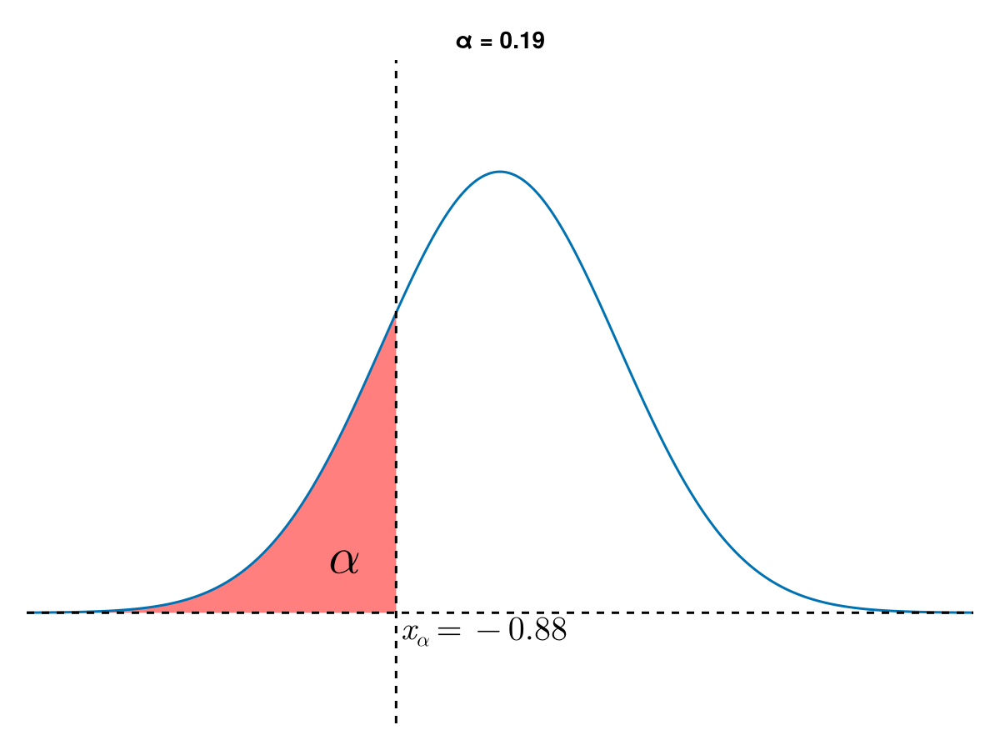

# 10.1 总体均值的估计
根据**大数定律**，应该用
$$
\bar{X} \triangleq \frac{1}{n}\sum_{k=1}^{n}X_{k}
$$
估计总体均值，并称 $\bar{X}$ 为**样本均值**，或**均值**，或**平均数**。当样本是重复观测时，随着样本容量的增加样本均值“收敛于”总体均值。我们可以使用 `mean()` 计算样本均值。

## 常用函数
1. `sort(x, decreasing=...)`：对向量 `x` 进行排序，默认为 `decreasing=F` 即从小到大（升序）进行排序；若 `decreasing=T` 则从大到小（降序）进行排序。
2. `colnames(m)` 修改矩阵 `m` 的列名、`rownames(m)`  修改矩阵的行名
3. `t(m)` 对矩阵进行转置

## 例
若 $X \sim N(10,100)$，对其进行重复观测 $1000$ 次，得到样本 $X_{i}, (i=1,2,\dots,1000)$，并通过该样本估计总体的均值：
```{R}
n <- 1000             # 定义样本量
x <- rnorm(n, 10, 10) # 生成观测值
estim_mean <- mean(x) # 计算均样本值
true_mean <- 10       # 真实均值
cat("估计均值为", estim_mean, "与总体均值的差异为", abs(true_mean - estim_mean))
```


# 10.2 总体分位数的估计
$\alpha$ 分位数描述了随机变量概率分布的位置信息，随机变量落在它两边的概率分别接近于 $\alpha$ 和 $1-\alpha$。根据大数定律，应该用满足如下条件的 $\hat{x}_{\alpha}$ 提取信息
$$
\frac{\text{小于}\hat{x}_{\alpha}\text{的数据个数}}{n}\le \alpha,\,\frac{\text{大于}\hat{x}_{\alpha}\text{的数据个数}}{n}\le 1-\alpha
$$

#### 定义4.4.8
对于任意 $\alpha \in (0,1)$，记 $k$ 为数 $\alpha n + 0.5$ 的整数部分，并约定 $X_{(0)}$ 等于 $X_{(1)}$，$X_{(n+1)}$ 等于 $X_{(n)}$，称
$$
\hat{x}_{\alpha} = (\alpha n + 0.5 - k)(X_{(k+1)} - X_{(k)}) + X_{(k)} \tag{4.7}
$$
为样本 $X_{1},X_{2},\dots,X_{n}$ 的**样本$\alpha$分位数**，简称为**$\alpha$分位数**。

在R语言中，我们可以直接使用 `quantile(x, probs=...,type=...)` 函数计算样本的 `alpha` 分位数，其中`probs`对应于上面的$\alpha$，`type`为计算百分位数的方法`type=5`对应于$(4.7)$的分位数计算方法。
```{R}
x <- runif(1000, 0, 2)
quantile(x, c(0.25, 0.75))
```

特别的，对于中位数，即 $0.5$ 分位数，我们可以使用函数 `median(x)` 进行计算，结果与 `quantile(x, 0.5)` 一致
```{R}
x <- runif(1000, 0, 2)
quantile(x, 0.5)
median(x)
```

```{R}
x<-c(42,55,64,70,75,78,80,82,82,82,85,85,85,85,88,90,90,92,95,87)
quantile(x,0.4,type=4)
```
{width=60%}

# 10.3 总体众数的估计
当总体变量为**连续型随机变量**时，样本中的各个样本点相等的概率为 $0$，因此不能用样本数据中出现最多的值作为总体变量众数的估计，根据强大数定律，连续随机变量的众数应该用频率直方图中最高矩形的底边区间中点来近似。

对于**分类变量**或**离散变量**，称样本数据中出现次数最多的值为**样本众数**。对于连续变量，称直方图中最高的频率矩形底边中点的横坐标为 $X$ 相对应于该直方图的**样本众数**。简称**众数**，使用 $\mathbb{O}(X)$ 表示总体变量 $X$ 的众数。

## 10.3.1 对于离散型随机变量 ($X\sim P(1)$)
```{R}
x <- rpois(1000, lambda=1)
tmpFreq <- table(x)
tmpId <- which.max(tmpFreq)
names(tmpId)
plot(0:10, dpois(0:10,1), type="h")
```

## 10.3.2 对于连续型随机变量 ($X\sim N(1,9)$)
```{R}
x <- rnorm(1000, 1, 3)
tmp <- hist(x, plot=F)  # 计算x的分组数据统计结果
tmpId <- which.max(tmp$density) # 计算最大密度所在的区间序号
tmpInterval <- tmp$breaks[tmpId:(tmpId+1)] # 获得第tmpId区间的矩形左右横坐标
mean(tmpInterval) # 平均后得到第tmpId区间的中心
```

# 10.4 总体方差的估计
根据强大数定律，应该使用
$$
\frac{1}{n}\sum_{k=1}^{n}(X_{k}-\mathbb{E}(X))^{2}
$$
来近似方差，但实际上，我们无法得到具体的总体期望 $\mathbb{E}(X)$，只能通过样本均值 $\bar{X}$ 来估计总体期望，称
$$
S^{2} = \frac{1}{n-1}\sum_{k=1}^{n}(X_{i}- \bar{X})^{2}
$$
为**样本方差**。注意此处除以的是 $n-1$，这是为了保证 $\mathbb{E}(S^{2})=D(X_{1})$，即样本方差是总体方差的无偏估计。

在R语言中，可以使用 `var(x)` (**var**iance) 计算数据向量 `x` 的样本方差：
```{R}
n <- 100
x <- rnorm(n, 1, 3)
var(x)
estim_1 <- 1/n * sum((x - mean(x)) ^ 2) # 除以n
estim_1
estim_2 <- 1/(n-1) * sum((x - mean(x)) ^ 2) # 除以(n-1)
estim_2
```

# 10.5 总体标准差、标准得分和变异系数的估计
#### 样本标准差
样本方差的平方根:
$$
S = \sqrt{S^{2}} = \sqrt{\frac{1}{n-1} \sum_{k=1}^{n}(X_{i}- \bar{X})^{2}}
$$
在R语言中，可以直接使用 `sd(x)` (**s**tandard **d**eviation) 计算数据向量 `x` 的样本标准差。
```{R}
x <- rnorm(100, 1,3)
sd(x)
sqrt(var(x))
```

#### 标准得分的估计
假设 $X_{1},X_{2},\dots,X_{n}$ 为样本，对于 $1\le i\le n$，称
$$
Z_{i} = \frac{X_{i}- \bar{X}}{S}
$$
为第 $i$ 个样本数据的**标准化**或**标准得分**：称$Z_{1},Z_{2},\dots,Z_{n}$为相应的**标准化样本**。R语言中可以直接使用 `scale` 完成分数的标准化。（其默认就是按照列进行数据的标准化，即计算每一列的样本均值和标准差然后对相应的列进行标准化）

以书上P161的案例4.8为例：
```{R}
x<-c(79.0,87.0,75.0,94.0,69.0, 81.0,64.0,62.0,71.0,70.0,
     64.0,70.0,69.0,67.0,61.0,71.0,72.0,71.0, 88.0,83.0) 
y<-c(86.0,78.0,73.0,90.0,42.0,75.0,71.0,87.0,71.0,41.0,
     75.0,78.0,68.0,73.0,61.0,60.0,70.0,47.0,74.0,70.0)
xy <- matrix(c(x,y), 20,2)
xyScale <- scale(xy)
xyScale[3,]
```

#### 变异系数的估计
样本标准差于样本均值的绝对值之比。
$$
\frac{S}{\lvert\bar{X}\rvert}
$$

```{R}
tmpX <- rpois(1000, 3)
sd(tmpX) / abs(mean(tmpX))
```

# 10.6 盒型图的绘制
对于已经获取的样本数据 $x_{1},x_{2},\dots,x_{n}$ 而言，其四分位数，最小样本值 $x_{(1)}$ 和最大样本值 $x_{(n)}$ 概括了样本中的大部分信息，因此，人们称 $x_{1},Q_{1},Q_{2},Q_{3},x_{(n)}$ 为**样本数据的五数概括**，简称**五数概括**，在R语言中可以通过函数`fivenum()`计算得到
```{R}
fivenum(x)
```   
通过盒型图，可以展示样本观测数据中的离群数据，推断总体密度图像的整体特征（对称，U型，左倾或右倾）。
在**改良盒型图**中，下（左）虚线下（左）端的坐标为
$$
a = \max\{x_{(1)}, Q_{1} - kQ_{d}\}
$$
上（右）虚线上（右）端的坐标为
$$
b = \min\{x_{(n)}, Q_{3} + kQ_{d}\}
$$
其中 $Q_{d} = \frac{Q_{3} - Q_{1}}{2}$ 为**四分位距**，一般设置 $k=1.5$；

在R语言中，我们可以用 `boxplot(x, range=)` 函数绘制数据向量 `x` 的盒型图，其中 `range` 对应于上面的 `k`

```{R}
x1 <- c(42,55,64,70,75,78,80,82,82,82,85,85,85,85,88,90,90,92,95,99)
x2 <- c(39,52,61,68,72,76,77,78,79,78,83,83,81,81,85,87,86,91,91,98)
xy <- data.frame("A class" = x1, "B class" = x2)
boxplot(xy, range=1.5, ylab="score")
```


# Questions
1. 用R语言程序代码模拟参数为 $40$, $10$ 和 $10$ 的超几何分布随机数 $n=10$ 个，计算样本均值、样本下四分位数，样本中位数，样本方差，样本数据标准的粉，样本众数和样本变异系数。
2. 模拟标准正态分布随机数 $n=10$，计算这 $10$ 个随机数的样本方差。
3. 重复 2. $10000$ 次，得到样本方差数据 $x_{1},x_{2},\dots,x_{10000}$，计算这些数据的样本均值和方差；在 $n=1000$ 的情况下，重复 2. $10000$ 次，得到样本方差数据 $y_{1},y_{2},\dots, y_{10000}$，计算这些数据的样本均值和方差。从无偏性和方差的角度对比分析样本方差估计总体方差的特性。
4. 对于 1. 中的分布，使用R语言程序代码绘制样本下四分位数 $x_{0.25}$ 与样本容量了 $n (n = 10,11,\dots,1000)$ 之间关系的变化折线图，解释图形的实际含义。
