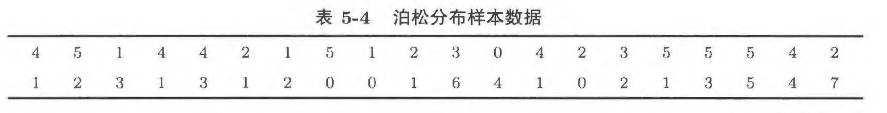
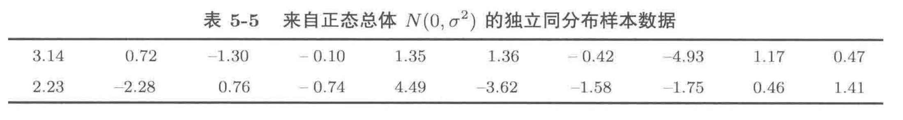

# 11.1 不同估计方法的随机模拟比较
设置参数 $a$ 的实际值为 $a_{0}$，用计算机重复模拟样本数据。对于第 $k$ 此模拟的样本数据计算估计量 $T$ 的值 $T_{k}, 1\le k \le n$，记
$$
\bar{T} = \frac{1}{n}\sum_{k=1}^{n}T_{k} \tag{11.1}
$$
$$
\widehat{\text{mse}}(T, a_{0}) = \frac{1}{n}\sum_{k=1}^{n}(T_{k} - a_{0})^{2} \tag{11.2}
$$

依据大数定律，当 $n$ 充分大时，$\bar{T}$ 和 $\widehat{\text{mse}}(T,a_{0})$ 分别接近于 $\mathbb{E}(T)$ 和 $\text{mse}(T,a_{0})$。

#### 例11.1.1 {#E11.1.1}
若 $X_{1},X_{2},X_{3}$ 是来自总体变量 $X\sim N(\mu, \sigma^{2})$ 的样本，就可分别以样本方差 $S^{2}$ 和统计量 $T = \frac{1}{3}\sum_{k=1}^{3}(X_{k} - \bar{X})^{2}$ 估计样本方差。试用随机模拟的方法判断 $S^{2}$ 和 $T$ 中哪一个估计总体方差的效果更好。

1. 模拟真实参数为 $\mu=0$ 和 $\sigma = 0.5,0.8,1,2,5$ 的情况，重复估计 $10000$ 次，通过估计量的算术平均值和均方误差估计两种估计方法的效果。
    ```{R}
    m <- 10000    # 重复估计次数为10000
    barS2 <- c()  # 存储不同sigma参数下，估计量S2的平均值
    barT <- c()   # 存储不同sigma参数下，估计量T的平均值
    mseS2 <- c()  # 存储不同sigma参数下，估计量S2的均方误差
    mseT <- c()   # 存储不同sigma参数下，估计量T的均方误差
    # 通过for循环遍历不同sigma的情形
    for (trueSigma in c(0.5, 0.8, 1,2,5)) {
      tmpX <- matrix(rnorm(3 * m, 0, trueSigma), m, 3) # 生成3*m个观测值，并排列成m行3列的矩阵
      tmpS2 <- apply(tmpX, 1, var) # 使用apply函数对于矩阵的每一行进行操作
      tmpT <- 2/3 * tmpS2             # 通过S2计算T
      barS2 <- c(barS2, mean(tmpS2))  # 将S2的均值存储到向量barS2中
      barT <- c(barT, mean(tmpT))     # 将T的均值存储到向量barT中
      mseS2 <- c(mseS2, mean((tmpS2 - trueSigma^2)^2)) # 将S2的均方误差存储到向量mseS2中
      mseT <- c(mseT, mean((tmpT - trueSigma^2)^2))   # 将T的均方误差存储到向量mseT中
    }
    myResults <- c(barS2, barT, mseS2, mseT) # 将结果拼接成一个长向量
    myResults <- matrix(myResults, 5,4)    # 将结果向量转换成一个5行4列的矩阵
    # 将结果转换成一个数据框，其行名为 mean(S2), mean(T), mse(S2), mse(T)
    myResults <- data.frame(t(myResults), 
                            row.names = c('mean(S2)', 'mean(T)', 'mse(S2)', 'mse(T)'))
    names(myResults) <- c(0.25,0.64,1,4,25) # 将数据框的列名改为 0.25,0.64,1,4,25
    round(myResults,3)  # 将结果保留3位小数
    ```
2. 以 $\mu=2,\sigma^{2}=4$ 为例，通过图像来对比两种估计的效果
    ```{R}
    m <- 3      # 样本量  
    n <- 10000  # 重复估计次数
    hatPara <- data.frame(S2 = rep(0,n), T = rep(0,n)) # 构建一个n行的数据框用于存储重复估计的结果
    
    for (i in 1:n) {
      tmpSample <- rnorm(m, mean=0, sd=2) # 生成估计样本
      hatPara$S2[i] <- var(tmpSample)     # 计算S2并赋给数据框S2这一列的i行
      hatPara$T[i] <- var(tmpSample) * (m-1)/m # 计算T并赋给数据框T这一列的i行
    }
    boxplot(hatPara, horizontal=T)  # 绘制箱型图
    abline(v=4,col="red", lty=2, lwd=2) # 绘制实际的参数（方差）
    abline(v=mean(hatPara$S2), col="green", lwd=2) # 绘制S2的均值
    abline(v=mean(hatPara$T), col="blue", lwd=2)   # 绘制T的均值
    ```

# 11.2 极大似然估计 (maximum likelihood estimation)
#### 案例11.2.1 {#E11.2.1}
已知一枚硬币出现正面的概率 $p$ 或为 $0.1$ 或为 $0.9$，若掷这枚硬币 $1$ 次，如何根据实验结果判定 $p$？于是存在两种准则

- **准则一**：判断结论使得样本数据出现的概率大。即出现正面，判断 $p=0.9$；否则，判断 $p=0.1$
- **准则二**：判断结论使得样本数据出现的概率小。即出现正面，判断 $p=0.1$；否则，判断 $p=0.9$

```{R}
p <- 0.1   # 定真实参数为0.1
n <- 10000 # 重复观测1000次
# 定义一个数据框，用于存储在不同观测次数下使用不同准则估计的结果
myR <- data.frame("rule1" = rep(0,n), "rule2" = rep(0,n))
# 利用for循环重复观测1000次
for (i in 1:n) {
  x <- rbinom(1, size = 1, prob = p)  # 根据总体生成1个观测值
  myR$rule1[i] = ifelse(x == 1, 0.9, 0.1) # 根据准则一若x的取值为1，则判断p=0.9，否则为0.1
  myR$rule2[i] = ifelse(x == 1, 0.1, 0.9) # 根据准则一若x的取值为1，则判断p=0.1，否则为0.9
}
sum(myR$rule1 == p) / n # 计算估计正确的频率
sum(myR$rule2 == p) / n 
```


## 11.2.1 （对数）似然函数
用极大似然思想估计参数的方法称为**极大似然方法**，用极大似然方法获得的 $a$ 的估计称为**极大似然估计**，或**极大似然估计量**。一般地，总体变量 $X$ 的重复观测样本 $X_{1},\dots,X_{n}$
$$
L(a)\triangleq p(x_{1})\times p(x_{2}) \times \cdots\times p(x_{n}) \tag{11.3}
$$
其中
$$
p(x_{i}) = \begin{cases}
\mathbb{P}(X = x_{i}),& \text{若}X\text{为离散型随机变量}\\
f(x_{i}), & \text{若}X\text{的密度函数为}f(x)
\end{cases}
$$
因此使得 $L(a)$ 达到最大的 $\hat{a}$ 是 $a$ 的极大似然估计，称 $L(a)$ 为**似然函数**。

由于对数函数是严格增函数，因此**对数似然函数**
$$
l(a)\triangleq \log L(a) = \sum_{i=1}^{n}\log(p(x_{i})) \tag{11.4}
$$
的极大值点也是参数 $a$ 的极大似然估计。

## 11.2.1 R语言的实现
1. 定义对数似然函数 `myL(a,x)`，
  - `a` 为我们估计的参数
  - `x` 为我们的观测值
2. 然后通过优化函数 `optimize(f, x, interval, maximum)` 获取 `myL()` 的最大值点，即似然估计结果。
  - `f` 对应于似然函数 `myL(a,x)`
  - `x` 是我们的观测值，对应于 `myL(a,x)` 中的 `x`
  - `interval` 是估计参数的取值范围
  - `maximum` 由于我们希望似然函数能取到最大，因此，此处 `maximum = TRUE`

#### 案例5.2 
假设总体 $\xi \sim B(10000,p)$，其中总体参数 $p\in [0,1]$，若 $X$ 为总体的容量为 $1$ 的观测样本。

1. 根据二项分布的密度函数
    $$
    p(k) = \mathbb{P}(\xi = k) = {10000\choose k}p^{k}(1-p)^{10000 - k}
    $$
    因此，观测样本 $X$ 出现的概率：
    $$
    \mathbb{P}(\xi = X) = {10000 \choose X}p^{X} (1-p)^{10000 - X}
    $$
2. 由于此处仅有一个观测值，根据极大似然函数的定义：
  $$
  L(p, X) = {10000 \choose X} p^{X}(1-p)^{10000 - X}
  $$
3. 因此，其对数似然函数：
  $$
  \begin{split}
  l(p, X) &= {10000 \choose X} + X\log p + (10000 - X) \log(1-p)  \\
  & \propto X \log p + (10000 - X)\log(1-p)
  \end{split}
  $$

```{R}
# 根据上面的对数似然函数，定义 myL
myL <- function(p, x){
  return (x * log(p) + (10000-x) * log(1-p))
}
y <- rbinom(1, 10000, 0.2) # 生成1个观测值y
hatP <- optimize(f = myL, x = y, interval = c(0,1), maximum = T) # 找出最大值点
hatP[[1]] # 返回最大值
```


#### 例 5.1.4
下表是来自泊松分布 $P(\lambda)$ 的独立同分布样本数据，求 $\lambda$ 的极大似然估计：



1. 根据泊松分布的密度函数：
    $$
    \mathbb{P}(\xi = k) = \frac{\lambda ^{k}}{k!}e^{-\lambda}
    $$
    所以样本 $X$ 出现的概率为
    $$
    \mathbb{P}(\xi = X) = \frac{\lambda ^{X}}{X!}e^{-\lambda}
    $$
2. 根据似然函数的定义：
  $$
  L(\lambda, X) = \frac{\lambda^{X_{1}}}{X_{1}!}e^{-\lambda}\frac{\lambda^{X_{2}}}{X_{2}!}e^{-\lambda}\cdots\frac{\lambda^{X_{n}}}{X_{n}!}e^{-\lambda} = (e^{-\lambda})^{n}\prod_{i=1}^{n}\frac{\lambda^{X_{i}}}{X_{i}!} 
  $$
3. 于是有对数似然函数
  $$
  \begin{split}
  l(\lambda, X) &= -n\lambda + \sum_{i=1}^{n}[X_{i}\log\lambda - \log (X_{i}!)]\\
  &\propto - n \lambda + \sum_{i=1}^{n}X_{i}\log \lambda
  \end{split}
  $$
```{R}
y = c(4,5,1,4,4,2,1,5,1,2,3,0,4,2,3,5,5,5,4,2,
      1,2,3,1,3,1,2,0,0,1,6,4,1,0,2,1,3,5,4,7) # 观测数据y
# 根据上面的对数似然函数，定义tmpF
tmpF <- function(lambda, x){
  n <- length(x)
  return (-n * lambda + log(lambda) * sum(x))
}
# 使用 optimize 找出tmpF中的最大值点
hatLambda <- optimize(
  f = tmpF,
  x = y,
  interval = c(0,100),
  maximum=T
)
hatLambda[[1]] # 返回最大值点
```

#### 例 5.1.5
下表来自于正态总体 $N(0,\sigma^{2})$ 的独立同分布样本数据，求参数 $\sigma$ 的极大似然估计



1. 根据 $N(0,\sigma^{2})$ 的密度函数：
  $$
  \varphi_{0,\sigma}(x) = \frac{1}{\sigma\sqrt{2\pi }} \exp\left(-{\frac{x^{2}}{2\sigma^{2}}}\right)
  $$
  则样本 $X$ 出现的概率密度为：
  $$
  \varphi_{0, \sigma}(X)= \frac{1}{\sigma \sqrt{2\pi}}\exp\left(-\frac{X^{2}}{2\sigma^{2}}\right)
  $$
2. 根据似然函数定义，对于 $n$ 个观测值 $X_{1},\dots, X_{n}$，似然函数
    $$
    \begin{split}
    L(\sigma, X) &= \frac{1}{\sigma \sqrt{2\pi}}\exp\left(-\frac{X_{1}^{2}}{2\sigma^{2}}\right)\frac{1}{\sigma \sqrt{2\pi}}\exp\left(-\frac{X_{2}^{2}}{2\sigma^{2}}\right)\cdots\frac{1}{\sigma \sqrt{2\pi}}\exp\left(-\frac{X_{n}^{2}}{2\sigma^{2}}\right)  \\
    & = \left(\frac{1}{\sigma \sqrt{2\pi}}\right)^{n} \prod_{i=1}^{n}\exp \left(-\frac{X_{i}^{2}}{2\sigma^{2}}\right) = \left(\frac{1}{\sigma \sqrt{2\pi}}\right)^{n} \exp \left(-\sum_{i=1}^{n}\frac{X_{i}^{2}}{2\sigma^{2}}\right) 
    \end{split}
    $$
3. 因此，其对数似然函数为：
    $$
    \begin{split}
    l(\sigma, X) &= -n\log \sigma - \frac{n}{2} \log 2\pi  -\sum_{i=1}^{n} \frac{X_{i}^{2}}{2\sigma^{2}} \\
    &\propto -n \log \sigma - \frac{1}{2\sigma^{2}}\sum_{i=1}^{n}X_{i}^{2}
    \end{split}
    $$


```{R}
y <- c(3.14,0.72,-1.30,-0.10,1.35,1.36,-0.42,-4.93,1.17,0.47, 
       2.23,-2.28,0.76,-0.74,4.49,-3.62,-1.58,-1.75,0.46,1.41) # 生成观测数据y
# 根据上面的对数似然函数定义myF
myF <- function(sigma, x){
  n <- length(x)
  return(- n * log(sigma) - 1/(2*sigma^2)*sum(x^2))
}
# 使用optimize找出使得似然函数最大的sigma
hatSigma <- optimize(
  f = myF,
  x = y,
  interval = c(0,1000),
  maximum = T
)
hatSigma[[1]] # 返回最大值点
```

#### 例5.1.6
若下表是来自正态总体 $N(\mu, \sigma^{2})$ 的独立同分布 $X_{1},X_{2},\dots,X_{20}$ 的观测数据，求参数 $a = (\mu, \sigma)$ 的极大似然估计


1. $N(\mu, \sigma^{2})$ 的密度函数：
  $$
  \varphi_{\mu,\sigma}(x) = \frac{1}{\sigma\sqrt{2\pi} }\exp\left[-\frac{(x-\mu)^{2}}{2\sigma^{2}}\right]
  $$
  因此，样本 $X$ 出现的概率密度为:
  $$
  \varphi_{\mu,\sigma}(X) = \frac{1}{\sigma\sqrt{2\pi} }\exp\left[-\frac{(X-\mu)^{2}}{2\sigma^{2}}\right]
  $$
2. 根据似然函数的定义，对于重复随机观测 $X_{1}, X_{2}, \dots,X_{n}$，似然函数为：
    $$
    \begin{split}
    L(a, X) &= \frac{1}{\sigma\sqrt{2\pi}}\exp\left[- \frac{(X_{1} - \mu)^{2}}{2\sigma^{2}}\right]\frac{1}{\sigma\sqrt{2\pi}}\exp\left[- \frac{(X_{2} - \mu)^{2}}{2\sigma^{2}}\right]\cdots \frac{1}{\sigma\sqrt{2\pi}}\exp\left[- \frac{(X_{n} - \mu)^{2}}{2\sigma^{2}}\right] \\ 
    & = \left(\frac{1}{\sigma\sqrt{2\pi}}\right)^{n}\prod_{i=1}^{n}\exp\left[-\frac{(X_{i}- \mu)^{2}}{2\sigma^{2}}\right] = \left(\frac{1}{\sigma\sqrt{2\pi}}\right)^{n}\exp\left[-\sum_{i=1}^{n}\frac{(X_{i}- \mu)^{2}}{2\sigma^{2}}\right] 
    \end{split}
    $$
3. 因此，其对数似然函数：
$$
\begin{split}
l(a,X) & = - n \log \sigma - \frac{n}{2} \log 2\pi - \frac{1}{2\sigma^{2}}\sum_{i=1}^{n}(X_{i}-\mu)^{2} \\
&\propto -n\log\sigma - \frac{1}{2\sigma^{2}}\sum_{i=1}^{n}(X_{i} - \mu)^{2}
\end{split}
$$

```{R}
y <- c(3.14,0.72,-1.30,-0.10,1.35,1.36,-0.42,-4.93,1.17,0.47, 
       2.23,-2.28,0.76,-0.74,4.49,-3.62,-1.58,-1.75,0.46,1.41) # 生成观测值y
# 定义函数tmpF，由于optim函数默认优化为最小值优化，所以需要对似然函数取其相反数
tmpF <- function(a, x){
  n <- length(x)
  mu <- a[1]
  sigma <- a[2]
  f <- -n*log(sigma) - sum((x - mu)^2)/(2*sigma^2)
  return(-f)
}

hatA <- optim(par=c(0,2), fn=tmpF, x=y) # 利用optim找出使得-l(a,X)最小的a
hatA[[1]]
```

# Questions
1. 将[例11.1.1](#E11.1.1)中的总体分布 $N(\mu,\sigma^{2})$ 改为泊松分布 $P(3)$，其他条件不变，用随机模拟的方法比较 $S^{2}$ 和 $T$ 中哪一个估计总体方差的效果更好
2. 对于[例11.2.1](#E11.2.1)实验，若硬币出现正面的概率 $p$ 为 $0.3$ 或 $0.7$，请通过随机模拟实验给出基于一次实验结果推断 $p$ 是 $0.3$ 还是 $0.7$ 的好准则。
3. 已知 $X\sim B(10,0.7)$，模拟生成 $X$ 的重复观测数据 $10000$ 个，用极大似然方法估计 $X$ 的数学期望。