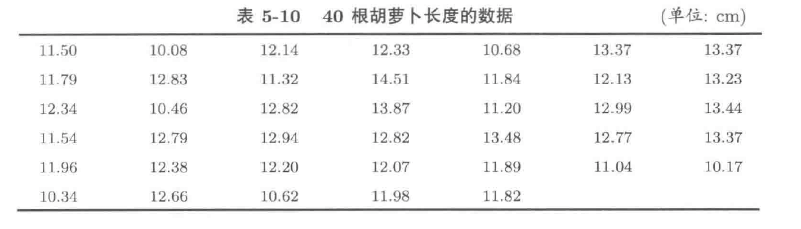
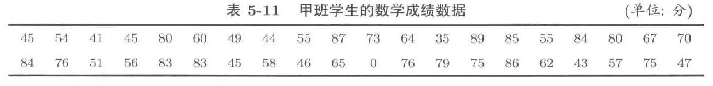
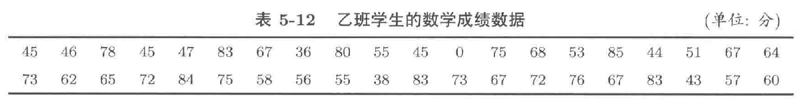

# 12.1 假设检验基本原理
#### 案例
如何检验（判断）一枚硬币是否均匀？设
$$ X = \begin{cases} 1, & \text{掷出正面} \\ 0, & \text{掷出反面} \end{cases} $$
则 $X\sim B(1,\theta)$，据此提出假设：
$$ H_{0}:\, \theta = 0.5 \leftrightarrow H_{1}:\, \theta \neq 0.5 $$
如何根据样本观测值 $X_{1},X_{2},\dots,X_{n}$ 来判断如上的假设？

在根据样本对于假设进行检验时，存在如图\ref{fig:1}所示的四种情况。
\begin{figure}[!h]
  \centering
  \includegraphics[width=0.5\textwidth]{./pics/Hypothesis_test.drawio.png}
  \caption{假设检验的四种情形}
  \label{fig:1}
\end{figure}

#### 假设检验的步骤：
1. 根据实际问题写出问题的原假设和备择假设
2. 给定显著性水平 $\alpha$，通常为 $0.01, 0.05$ 等。
3. 由样本构造统计量，计算原假设成立的条件下，**不利于原假设**的$p$-值。（即犯I类错误的可能性）
4. 若$p$-值小于显著水平$\alpha$，则拒绝原假设，否则无理由拒绝原假设。（即当犯I类错误的可能性特别小时，即可拒绝原假设，接受备择假设）


#### 例12.1.1
观察一枚均匀硬币投掷 $10, 50, 100$ 次 $\left\lvert \bar{X} - 0.5\right\rvert$ 的分布

```{R}
n = c(10, 50, 100)
m = 100000
# 10次
x <- matrix(rbinom(m*n[1],1,0.5), m, n[1])
xBar <- apply(x, 1, mean)
y <- as.factor(xBar - 0.5)
u <- table(y)
v <- prop.table(u)
v
barplot(v)

# 50次
x <- matrix(rbinom(m*n[2],1,0.5), m, n[2])
xBar <- apply(x, 1, mean)
y <- as.factor(xBar - 0.5)
u <- table(y)
v <- prop.table(u)
v
barplot(v)

# 100次
x <- matrix(rbinom(m*n[2],1,0.5), m, n[2])
xBar <- apply(x, 1, mean)
y <- as.factor(xBar - 0.5)
u <- table(y)
v <- prop.table(u)
v
barplot(v)
```

#### 例12.1.2
设总体 $X\sim B(1,p)$，下表列出了总体容量为 $30$ 的独立同分布样本的观测数据。考虑假设检验问题
$$
H_{0}:\, p \ge 0.8
$$
若用样本均值作为检验统计量，计算 $p$ 值，并在显著性水平 $0.05$ 下给出检验结果。
$$
30 \bar{X} \sim B(30,p)
$$
$$
\begin{split}
\mathbb{P}_{H_{0}} (\bar{X} < \bar{x}) &= \mathbb{P}(30\bar{X} < 30\bar{x}) \\
& = \sup_{0.8 \le p \le 1}(\mathbb{P}_{p}(30\bar{X} \le 30 \bar{x}) - \mathbb{P}_{p}(30\bar{X} = 30\bar{x}))
\end{split}
$$

```{R}
x <- c(1,1,1,1,1,1,0,0,0,0,1,1,0,1,0,
       0,1,1,0,1,0,1,0,1,1,1,0,1,1,1)
tmpF <- function(p,x){
  return(pbinom(sum(x), 30, p) - dbinom(sum(x), 30, p))
}
optimize(tmpF, c(0.8,1), x=x, maximum=TRUE)$objective
```
# 12.2 假设检验
## 12.2.1 方差已知-$z$检验
#### \color{C1}{Trick $z$检验}
1. 根据题意确定原假设$H_{0}$和备择假设$H_{1}$，原假设 $H_{0}$ 存在以下两种情形：
    - **双边假设**
    \begin{equation}
    \label{eq:8.1}
    H_{0}:\, \mu = \mu_{0} \leftrightarrow H_{1}:\, \mu \neq \mu_{0} \tag{8.1}
    \end{equation}
    - **单边假设**
    \begin{equation}
    \label{eq:8.2}
    H_{0}:\, \mu \ge \mu_{0} \leftrightarrow H_{1}:\, \mu < \mu_{0} \tag{8.2}\\
    \end{equation}
    \begin{equation}
    \label{eq:8.3}
    H_{0}:\, \mu \le \mu_{0} \leftrightarrow H_{1}:\, \mu > \mu_{0} \tag{8.3}
    \end{equation}
2. 根据**中心极限定理**可知，对于来自总体（总体均值为 $\mu$，方差为 $\sigma^{2}$）的重复观测样本 $X_{1},\dots,X_{n}$，该样本的均值为 $\bar{X} = \frac{1}{n}\sum_{i=1}^{n}X_{i}$ 其服从分布：
    $$
    \bar{X} \sim N\left(\mu, \frac{\sigma^{2}}{n}\right)
    $$
    所以，我们可以对 $\bar{X}$ 进行标准化：
    $$
    Z = \frac{\bar{X} - \mu}{\sigma / \sqrt{n}} \sim N(0,1)
    $$
3. 我们可以根据 $H_{0}$ 成立条件下样本均值 $\bar{X}$ 的分布进行标准化，计算 $p$-值：
	- 对于原假设 (\ref{eq:8.1}) $p$-值为：
		  $$ \begin{split} \mathbb{P}(\lvert \bar{X} - \mu_{0} \rvert  > \lvert \bar{x} - \mu_{0} \rvert ) &= \mathbb{P}\left( \frac{\lvert \bar{X}-\mu_{0} \rvert }{\sigma / \sqrt{ n }}> \frac{\lvert \bar{x} - \mu_{0} \rvert }{\sigma / \sqrt{ n }}\right) \\  &=  1- \mathbb{P}\left( \frac{\lvert \bar{X} - \mu_{0} \rvert}{\sigma / \sqrt{ n }} \leq \frac{\lvert \bar{x} - \mu_{0} \rvert }{\sigma / \sqrt{ n }} \right) \\ & = 1- \mathbb{P}\left( - \frac{\lvert \bar{x} - \mu_{0} \rvert }{\sigma / \sqrt{ n }} \leq \frac{\bar{X} - \mu_{0}}{\sigma/\sqrt{ n }} \leq \frac{\lvert \bar{x}- \mu_{0} \rvert }{\sigma / \sqrt{ n }} \right) \\  & = 1 - \left[ \Phi\left( \frac{\lvert \bar{x} - \mu_{0} \rvert }{\sigma / \sqrt{ n }} \right)  - \Phi\left( - \frac{\lvert \bar{x} - \mu_{0} \rvert }{\sigma/ \sqrt{ n }} \right) \right] \\  &= 2\Phi\left( -\frac{\lvert \bar{x} - \mu_{0} \rvert }{\sigma / \sqrt{ n }} \right) \end{split}  $$
	- 对于原假设 (\ref{eq:8.2}) $p$-值为：
		  $$
		  \begin{split} 
		  \mathbb{P}(\bar{X} - \mu_{0} < \bar{x} - \mu_{0}) &= \mathbb{P}\left( \frac{\bar{X}-\mu_{0}}{\sigma / \sqrt{ n }}< \frac{\bar{x} - \mu_{0}}{\sigma / \sqrt{ n }}\right) \\ 
		  &=\mathbb{P}(Z <\frac{\bar{x} - \mu_{0}}{\sigma / \sqrt{ n }} ) = \Phi\left( \frac{\bar{x} - \mu_{0}}{\sigma / \sqrt{ n }} \right) 
		  \end{split}
		  $$
	- 对于原假设 (\ref{eq:8.3}) $p$-值为：
		  $$ \begin{split} \mathbb{P}(\bar{X} - \mu_{0} > \bar{x} - \mu_{0}) &= \mathbb{P}\left( \frac{\bar{X}-\mu_{0}}{\sigma / \sqrt{ n }}> \frac{\bar{x} - \mu_{0}}{\sigma / \sqrt{ n }}\right) \\ &  =  1- \Phi\left( \frac{\bar{x} - \mu_{0}}{\sigma / \sqrt{ n }} \right) \end{split} $$


#### 例5.3.1 {#E:5.3.1}
某种子公司在销售胡萝卜种子的说明书中声称：用此种胡萝卜的平均长度为 $11.5\mathrm{\, cm}$。某人种植这种胡萝卜后得到的胡萝卜长度数据见下表，若胡萝卜长度的标准差为 $1.15\mathrm{\,cm}$，问：在显著性水平 $0.05$ 下，可接受该种子公司关于胡萝卜平均长度的说明吗？



- **答** 已知胡萝卜的长度 $X\sim N(\mu, 1.15^{2})$
  $$
  H_{0}:\, \mu = 11.5
  $$
  由于总体为正态分布，且方差已知，若原假设 $H_{0}$ 成立，有：
  $$
  \bar{X} - 11.5 \sim N\left(0, \frac{1.15^{2}}{40}\right)
  $$
  我们可以计算 $p$ 值：
  $$
  \mathbb{P}(\lvert \bar{X} - 11.5 \rvert  > \lvert \bar{x} - 11.5 \rvert ) = 2\mathbb{P}\left( \frac{\bar{X} - 11.5}{1.15/ \sqrt{ n }} < - \frac{\lvert \bar{x} - 11.5 \rvert}{11.15/ \sqrt{ n }} \right) 
  $$
    ```{R}
    x <- c(11.50,10.08,12.14,12.33,10.68,13.37,13.37, 
           11.79,12.83,11.32,14.51,11.84,12.13,13.23,
           12.34,10.46,12.82,13.87,11.20,12.99,13.44,
           11.54,12.79,12.94,12.82,13.48,12.77,13.37,
           11.96,12.38,12.20,12.07,11.89,11.04,10.17,
           10.34,12.66,10.62,11.98,11.82)
    n <- length(x)
    sigma <- 1.15
    mu <- 11.5
    p <- 2 * pnorm(-abs(mean(x) - 11.5)/(1.15/sqrt(n)))
    p
    ```
    
## 12.2.2 方差未知
当方差未知时，我们可以使用样本方差 $S^{2}$ 作为总体方差 $\sigma^{2}$ 的无偏估计，但此时，标准化后的随机变量不再服从标准正态分布，而是服从 $t$ 分布：
$$
\frac{\bar{X} - \mu}{S / \sqrt{n}} \sim t(n-1)
$$
因此，当方差未知时，我们一般使用 $t$ 检验来对原假设进行检验。可根据原假设，将假设检验分成两类：

1. **双边假设**
    $$
    H_{0}:\, \mu = \mu_{0} \leftrightarrow H_{1}:\, \mu\neq \mu_{0}
    $$
2. **单边假设** 
    \begin{gather*}
    H_{0}:\mu \le \mu _{0} \leftrightarrow H_{1}:\,\mu > \mu_{0}\\
    H_{0}:\mu \ge \mu _{0} \leftrightarrow H_{1}:\,\mu < \mu_{0}
    \end{gather*}
    

```{R}
x <- c(11.50,10.08,12.14,12.33,10.68,13.37,13.37, 
       11.79,12.83,11.32,14.51,11.84,12.13,13.23,
       12.34,10.46,12.82,13.87,11.20,12.99,13.44,
       11.54,12.79,12.94,12.82,13.48,12.77,13.37,
       11.96,12.38,12.20,12.07,11.89,11.04,10.17,
       10.34,12.66,10.62,11.98,11.82)

# H0: mu == mu0
h <- t.test(x, mu=11.5, alternative = "two.side") 
h$p.value
# H0: mu <= mu0
h <- t.test(x, mu=11.5, alternative = "greater") 
h$p.value
# H0: mu >= mu0
h <- t.test(x, mu=11.5, alternative = "less") 
h$p.value
```


## 12.2.3 双正态总体均值的检验
考虑总体 $X\sim N(\mu_{1}, \sigma^{2})$ 和总体 $Y\sim N(\mu_{2}, \sigma^{2})$，用
$$
X_{1}, X_{2},\dots, X_{n}
$$
表示 $X$ 的重复观测样本；用
$$
Y_{1}, Y_{2},\dots, Y_{n}
$$
表示 $Y$ 的重复观测样本。

类似的，有假设检验问题：
1. 双边假设检验问题
  $$
  H_{0}:\, \mu_{1} = \mu_{2}
  $$
2. 单边假设检验问题
  $$
  \begin{split}
  H_{0}:\, \mu_{1} \le \mu_{2}\\
  H_{0}:\, \mu_{1} \ge \mu_{2}
  \end{split}
  $$

#### 例
下表分别来自甲班和乙班学生的数学成绩样本数据，试对比分析两个班级学生的平均数学成绩





```{R}
x <- c(45,54,41,45,80,60,49,44,55,87,73,64,35,89,85,55,84,80,67,70,
       84,76,51,56,83,83,45,58,46,65,0,76,79,75,86,62,43,57,75,47) # 甲班成绩
y <- c(45,46,78,45,47,83,67,36,80,55,45,0,75,68,53,85,44,51,67,64,
       73,62,65,72,84,75,58,56,55,38,83,73,67,72,76,67,83,43,57,60) # 乙班成绩
```

1. $H_{0}:\, \mu_{1} = \mu_{2}$
    ```{R}
    h <- t.test(x,y, alternative = "two.side")
    h$p.value
    ```


2. $H_{0}:\, \mu_{1} \ge \mu_{2}$
    ```{R}
    h <- t.test(x,y, alternative = "less")
    h$p.value
    ```
3. $H_{0}:\, \mu_{1} \le \mu_{2}$
    ```{R}
    h <- t.test(x,y, alternative = "greater")
    h$p.value
    ```
    
    
## Questions
1. 在显著水平 $0.10$ 下，利用[例5.3.1](#E:5.3.1)中的数据回答假设检验问题
   $$
	H_{0} : \mu = 12.10
	$$
2. 在显著水平 $0.10$ 下，利用[例5.3.1](#E:5.3.1)中的数据回答假设检验问题
   $$
	H_{0} : \mu = 12.25
	$$

3. 问题： 1. 和 2. 的结论矛盾吗？引起这种矛盾的原因是什么？
4. 对于[例5.3.1](#E:5.3.1)的背景问题，如果关心的是用户是否满意胡萝卜的平均长度问题，可以使用假设检验问题
   $$
	H_{0} : \mu \leq 12.18
	$$
	解答吗？ 这样解答的后果是什么？
5. 请解释下列代码的功能
    ```{R,eval=F}
    m <- 10000
    n <- 30
    tmpResults <- 1:m
    for (i in 1:m){
      x <- rnorm(n, 12, 1.15)
      h <- t.test(x, mu=12, alternative = "two.side")
      tmpResults[i] <- ifelse(h$p.value < 0.05, 1, 0)
    }
    mean(tmpResults)
    ```
6. 请解释多次运行 5. 中程序代码所得的结果都在 $0.05$ 的附近
