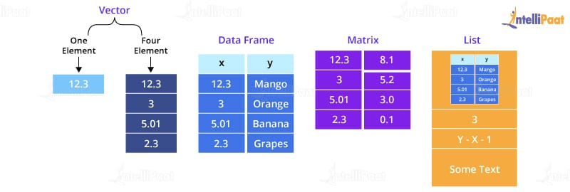
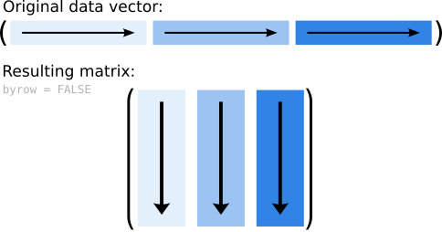
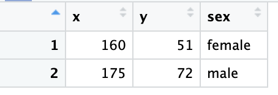

# 1 基础变量类型和函数
## 1.0 变量赋值
- **变量名**：变量名仅包含任何大小写字母,数字 以及下划线`_`（但数字和下划线不能用于变量名开头）；且要注意区分大小写 $\mathrm{a\neq A}$，比如，如下的语句就会报错
  ```{r eval=FALSE}
  a <- 1
  A
  ```
- 三个赋值符号：
  1. `<-` (在RStudio中可以使用快捷键 `alt/option + -` 快速插入)
  2. `=`
  3. `->` 
  
- 以将变量 `a` 赋值为 `1` 为例，以下三种赋值方式等价
  ```{r}
  a <- 1
  a = 1   # 注意：变量名必须在等号的左侧，而值在等号的右侧
  1 -> a
  ```


## 1.1 变量类型
> R语言中变量类型主要包括逻辑型，数值型和字符型三类
>
> 可以使用 `class(变量名)` 的方式查看变量的类型

### 1.1.1 逻辑型 (logical)
- 逻辑型 (logical)：即对于“对(True)”或“错(False)”的表述。仅有 `TRUE` （可简写为 `T`） 和 `FALSE` （可简写为 `F`）两类。
  ```{r}
  # l1,l2,l3, l4 均为逻辑型变量（这里第一个是字母"l"不是数字"1"
  l1 <- TRUE
  l2 <- FALSE
  l3 <- T  # 等价于l1
  l4 <- F  # 等价于l2
  ```
- 试试看下面三个语句的结果，并判断结果是什么类型的变量
  1. `1 > 2`
  2. `1 == 0`
  3. `1 != 0`
- 我们可以使用 `is.logical(变量)` 的方式判断一个变量是否为逻辑型
  ```{R}
  x <- 1 > 2
  is.logical(x)
  is.logical(1 > 2)
  ```

### 1.1.2 数值型 (numeric)
- 数值型 (numeric)：例如人的身高，体重，学生的成绩。我们可以用一个数值来表述这些性质。
  ```{r}
  # n1, n2, n3, n4 均为数值型变量。R语言默认存储为浮点型
  n1 <- 3
  n2 <- 1/3
  n3 <- 0.33333
  n4 <- 3.3333e-1   # 科学计数法：3.3333e-1 等同于 3.3333 * (10^-1)
  ```
- 试试看：
  1. `TRUE + TRUE`
  2. `TRUE - FALSE`
  3. `3 + FALSE`


### 1.1.3 字符型 (character)
- 字符型 (character)：例如人的性别 (gender)，姓名。一般我们使用一串字符来表示这些性质，字符型变量两边由 `"` 或 `'` 包裹。
  ```{R}
  c1 = "TRUE"
  c2 = "FALSE"
  c3 = "this is 'test'"    # 若希望在字符串中加'可以在外侧用"
  c4 = 'this is \'test\''  # 也可以在'前加\实现字符的转意
  ```
- 试试看
  1. `'this is "test"'`
  2. `"this is \"test\""`

### 1.1.4 不同类型之间的相互转换
- 转化为数值型 `as.numeric()`
  ```{R}
  a <- "123"
  as.numeric(a)
  
  b <- T
  as.numeric(b)
  ```
- 转化为字符型 `as.character()`
  ```{R}
  a <- T
  as.character(a)
  
  b <- 1e-3
  as.character(b)
  ```
- 转化为逻辑型 `as.logical()` 一切非零的数值都会被转化为 `TRUE`，而零会被转化为 `FALSE`
  ```{R}
  a <- 1
  as.logical(a)
  
  b <- -1
  as.logical(b)
  
  c <- 0
  as.logical(c)
  ```
- 对于无法转换的类型，R会自动转化为 `NA` 即缺失值
  ```{R}
  a <- "0"
  as.logical(a)
  
  b <- "1this is characters"
  as.numeric(b)
  ```

### 1.1.5 特殊常量
| 变量名 | 含义              |
|--------|-------------------|
| `pi`   | 圆周率，3.1415... |
| `Inf`  | 无穷大 `1/0`      |
| `NaN`  | 不定量，`0/0`     |
| `NA`   | 缺失值            |


```{R}
pi
1/0 
0/0 
NA
```

## 1.2 常用数据结构


### 1.2.1 向量 (vector)
$$
\begin{bmatrix}
1 & 2 & 3 & 4
\end{bmatrix}
$$

#### 生成向量
- 通过 `c()` 来生成向量，只用按顺序输入向量的各个分量即可
  ```{r}
  v1 <- c(1,2,3,4) 
  v1
  ```
- 对于 $[1,2,3,4,5,...,n]$ 这样的等差数列，可以使用 `1:n` 来直接生成
  ```{r}
  v2 <- 1:4
  v2
  ```
- 对于有规则的等差数列，可以使用 `seq()` 来生成
  ```{r}
  seq(-2, 3, by=0.5) # 公差为 0.5，首项为-2，尾项最接近3的等差数列
  seq(2, 4, length.out=4) # 生成首项和尾项分别为2和4的4维向量
  seq(2, by=0.5, length=4)  # 生成首项为2，公差为0.5，长度为4的向量
  ```

- **注意**：向量中的数据类型需要保持一致，否则会出现强制转换!优先级为 `字符型 > 数值型 > 逻辑型` （优先级低的类型会被强制转换为优先级高的类型）
  ```{r}
  c(1,2,"3")    # 字符型最优先
  c(1,2,TRUE)   # 其次是数值型
  ```

#### 元素的索引和修改
- 使用 `a[i]` 来索引向量 `a` 中第 `i` 个元素
  ```{R}
  a <- c(1,2,3)
  a[2]
  ```
- `a[i]` 中的 `[i]` 也可以是个列表
  ```{R}
  b <- c(2,2,2,1,3)
  a[b]
  
  c <- a >= 2    # 返回一个由逻辑值组成的向量
  a[c]
  ```
- 通过对第 `i` 个元素进行赋值，来修改向量中第 `i` 个元素的值
  ```{R}
  a <- c(1,2,3)
  a[1] <- 100
  a
  a[2] = 300
  a
  ```

### 1.2.2 矩阵 (matrix)
- 为向量的推广，其元素具有**相同的数据类型**

#### 矩阵的创建
- 通过函数 `matrix(x,m,n)` 的形式来生成矩阵（将向量 `x` 转换为 `m` 行 `n` 列的矩阵）
  - **列优先**
    ```{R}
    a <- 1:6
    m1 <- matrix(a, 3, 2)
    m1
    ```
    {width=50%}
  - **行优先**
    ```{R}
    a <- 1:6
    m2 <- matrix(a, 3, 2, byrow=T)
    m2
    ```
    {width=50%}
- **注意** 和向量一样，当矩阵中元素的类型不同时，也会强制转换元素类型：优先级也是 `字符型 > 数值型 > 逻辑型` （优先级低的类型会被强制转换为优先级高的类型）
  - 尝试如下代码:
    ```{R, eval=FALSE}
    a1 <- c(1,2,3,4,"5",6)
    m3 <- matrix(a1, 3,2)
    m3
    
    
    a2 <- c(T,2,3,4,5,6)
    m4 <- matrix(a2, 3,2)
    m4
    ```
    
#### 矩阵的索引和元素的修改
- 和向量类似我们用 `a[i,j]` 的形式索引矩阵第 `i` 行 (row)，第 `j` 列 (column) 的元素;

  {width=50%}


  ```{R}
  x <- 1:9
  m <- matrix(x, 3, 3)
  m
  m[3,2] # 矩阵m第3行第2列的元素
  ```
- 和向量类似，我们也可以用一组向量来索引矩阵
  ```{R}
  i <- c(1,3)
  j <- c(1,2)
  m[i,j] # 挑选出第1行和第1,2列，第3行和第1,2列相交的元素组成新的矩阵
  ```
- 索引某一列或某一行 `a[,n]` `a[m,]`
  ```{R}
  m[3,] # 索引第3行
  m[,2] # 索引第2列
  ```
  
- 我们同样可以用赋值的方式来修改矩阵中元素的值
  ```{R}
  x <- 1:9
  m <- matrix(x, 3, 3)
  m
  i <- c(1,3)
  j <- c(1,2)
  m[i,j] <- 1:4  # 挑选出第1行和第1,2列，第3行和第1,2列相交的元素组成新的矩阵
  m
  ```

### 1.2.3 数据框 (data frame)
- 属于矩阵的一种拓展形式，类似于我们常见的表格：每一行代表每一个 subject 的数据，每一列代表不同的数据（可能拥有不同的数据类型）

  

#### 数据框的创建
- `data.frame()`
  ```{R}
  x <- c(160, 175)
  y <- c(51, 72)
  sex <- c("female", "male")
  df <- data.frame(x,y,sex)                  # 使用列变量名 (x, y, sex)
  df2 <- data.frame(height=x, weight=y, sex) # 设置列变量名分别为(height, weight, sex)
  ```
  
  
#### 数据框的索引
- `names()` 用于显示数据框各列的名称
  ```{R}
  names(df)
  names(df2)
  ```
- **对列进行索引**：使用 `df$列变量` 对于数据框的列进行索引，也可使用 `df[j]` 直接检索第 `j` 列
  ```{R}
  df$sex
  df[3]
  df2$height
  df2[2]
  ```   
- **对行进行索引**：使用 `df[i,]` 索引第 `i` 行 (**注意 `i` 后面有个 `,`**)
  ```{R}
  df[1,]
  df2[2,]
  ```   
- **对于元素进行索引**：使用 `df$x[i]` 索引第 `i` 个 subject 的 `x` 属性，类似于矩阵，我们也可以用行和列的方式进行索引 `df[i,j]` 索引第`i`行第 `j` 列的元素。
  ```{R}
  df$x[1]
  df[1,1]
  ```
  
  
### 1.2.3 列表 (list)
- 列表可以视为向量在另一个方面的拓展，其内部可以存储不同类型的数据，且可根据键值 (key)进行索引

#### 列表的生成
- `list(key1=value1,key2=value2, ...)`
  ```{R}
  list1 <- list(1,"2",3)
  list1
  list2 <- list(x=1, y="2", z=3) # x,y,z 为我们索引使用的键值
  list2
  ```   

#### 列表的索引
- 若我们像向量一样进行索引 `a[i]` 我们得到的还是一个列表而非列表内的值
    ```{R}
    class(list1[1]) # 运行后我们可以发现 list1[1] 返回的还是一个列表
    ```
- 我们需要使用 `a[[i]]` 才能得到具体的数值
    ```{R}
    class(list1[[1]]) # list[[1]] 返回的才是具体的元素值
    ```
- 类似于数据框，当我们定义键值后，可以使用 `list2$key` 来进行索引，这时可直接得到列表内元素的值
    ```{R}
    list2$y     
    class(list2$y) # $key 的方式可以直接返回列表的元素值
    ```

## 1.3 数值的基础运算和常用函数
- 基础运算：`+` `-` `*` `/` `^` `sqrt()`
  ```{R}
  1 + 2 * 10    # 乘除以的优先级高于加减
  (1 + 2) * 10  # () 可以提高计算的优先级
  2 ^ 3     # 2的3次方
  2 ** 3    # 2的3次方, 同上
  sqrt(4)   # 对4开平方
  ```
- 常用函数
  1. **指数函数**：`exp(x)` $e^{x}$ ($e\approx 2.718281828459045$ 称为自然常数)
      ```{R}
      x <- seq(-5,2,by=0.001)
      y = exp(x)
      ```
  2. **对数函数**：
      - `log(x)` $\ln(x)$ 
      - `log(x, base=n)` $\log_{n} x$
      ```{R}
      x <- seq(exp(-5),exp(2), by=0.001)
      y = log(x)
      ```
  3. **三角函数**：`sin(x)` `cos(x)` 其中`x` 采用弧度制
      ```{R}
      x <- seq(-3* pi,3*pi,by=1e-3)
      y_sin = sin(x)
      y_cos = cos(x)
      ```
  4. `sum(x)` 求和函数：计算数值型向量 `x` 的所有元素的和；对于矩阵我们有 `colSums()` 对矩阵的列求和，`rowSums()` 对矩阵的行求和。
    ```{r}
    exp(1)
    log(exp(1))
    log(2^3, base=2) # 以2为底，8的对数
    sin(pi/6)
    
    x <- 1:9
    sum(x)
    m <- matrix(x,3,3)
    colSums(m)
    rowSums(m)
    ```
      
## Summary
1. 常见的变量类型：
    1. **逻辑型**：逻辑型的定义；逻辑型和数值型之间的转换；
    2. **数值型**：数值型的定义，科学计数法；
    3. **字符型**：字符型的定义；如何在字符串中引入 `'` 或 `"`；（不同的引号，转义字符 `\'` `\"`
    4. **不同类型之间的转换**：逻辑型 $\to$ 字符型，数值型 $\to$ 字符型，字符型（部分） $\to$ 数值型，逻辑型 $\leftrightarrow$ 数值型；
    5. **特殊常量**：`pi` `Inf` `NaN` `NA`
2. 重要数据结构：
    1. **向量**：生成，索引，修改；强制转换
    2. **矩阵**：生成，索引，修改；强制转换
    3. **数据框**：生成，索引；
    4. **列表**：生成，索引；
3. 基本运算和函数
    
# 2 数据存盘、流程控制和函数的定义
## 2.1 数据存盘与读取
假设我们在R中处理了一组员工数据，进行了某些分析后，想将结果保存起来，以便其他人可以使用或稍后加载继续分析。

```{R}
# 定义一系列变量
names <- c("Alice", "Bob", "Charlie", "David")
age <- c(25, 30, 35, 40)
salary <- c(50000, 60000, 55000, 62000)
department <- c("HR", "IT", "Finance", "Marketing")

# 使用上面的向量生成一个数据框
employee_data <- data.frame(
  Name = names,
  Age = age,
  Salary = salary,
  Department = department
)

# 查看生成的数据框
print(employee_data)
```

> 我们可以在 RStudio 界面的右上角看到我们目前所定义的变量
> 
> {width=50%}

- **数据存盘** 我们可以使用 `save()` 函数，将上面各变量保存到指定的位置。
  ```{R}
  # 定义一个字符串变量作为我们的存储路径（注意：存储的路径应以 .RData 的拓展名结尾）
  save_path <- "./test.RData" # 此处的 './' 表示当前目录下
  
  # 使用 save() 函数存储我们希望存储的变量：save(变量1, 变量2, ...., file=存储路径) 将变量1，变量2 存储到存储路径
  save(employee_data, age, file=save_path) # 此处，将 employee_data 和 age 两个变量存储到 `./test.RData` 中
  ```


- 存储完后，我们可以先尝试删除所有的变量：删除后，我们可以发现之前定义的变量都从RStudio右上角消失了
  ```{R}
  # rm() 用于删除指定的变量
  # ls() 用于列出当前所有的变量名
  # rm(list=ls()) 删除当前所有的变量
  
  rm(list=ls())
  ```

- **数据读取**：然后再使用 `load(数据所在路径)` 函数，从我们存储的数据进行导入：
  ```{R}
  load("./test.RData")
  ```
  导入后，我们可以在RStudio右上角找到我们存储的两个变量 `age` 和 `employee_data`

## 2.2 流程控制
### 2.2.1 关系运算符
1. 大小关系运算符：`>`, `<`, `<=`, `>=`, `==`, `!=`
    ```{R, eval=FALSE}
    1 > 2   # 1大于2?
    1 < 2   # 1小于2?
    2 <= 2  # 2小于等于2?
    2 >= 2  # 2大于等于2?
    1 == 1  # 1等于1?
    2 != 1  # 2不等于1?
    ```
2. 从属关系运算符：`%in%` 用于判断左侧的每个元素是否属于右侧的向量或列表；用数学描述：`a %in% b` 类似于判断 $a\in b$ 是否成立，若成立，则返回 `TRUE`，否则，返回 `FALSE`。
    ```{R}
    1 %in% c(1,2,3,4)
    c(1,2) %in% c(1,2,3,4) # 若左侧为一个向量或列表，则依次判断其中的每个元素是否属于右侧向量或列表
    ```
3. 数据类型判断：`is.na()`, `is.logical()`, `is.numeric()`, `is.vector()`, `is.list()`
    
### 2.2.2 逻辑运算符
用于逻辑型数据之间的运算常见的有：与，或，非，异或运算

1. **与运算** `&` 和 `&&`：只有与运算符两端的条件均为真时，才会返回真，否则返回假；
    - `&` 的输入更为灵活，其两侧既可以是两个逻辑型（或数值型）变量，也可以是两个长度相同的逻辑型（或数值型）向量或列表。
    - `&&` 在 R4.3.0 之后，两侧只能是单个变量，不能是向量；而在 R4.3.0 之前，若两侧为向量，其仅会对两个向量的第一个元素进行与运算，并返回一个逻辑值。
      ```{R, eval=F}
      T & T   # 返回T
      T & F   # 返回F
      F & T   # 返回F
      F & F   # 返回F
      c(T, T, F, F) & c(T, F, T, F)   # 对两端的向量逐元素进行与运算：返回一个长度为4的向量 (T, F, F, F)
      T && F
      ```
      ```{R, eval=F}
      c(T, T, F, F) && c(T, F, T, F) # R4.3.0 之后，此语句会报错；R4.3.0之前的版本，会返回 TRUE （仅对两个向量的第一个元素进行与运算）
      ```
      
2. **或运算** `|` 和 `||`：只要或运算符两端有一端为真，就会返回真，否则返回假
    - `|` 的输入更为灵活，其两侧既可以是两个逻辑型（或数值型）变量，也可以是两个长度相同的逻辑型（或数值型）向量或列表。
    - `||` 在 R4.3.0 之后，两侧只能是单个变量，不能是向量；而在 R4.3.0 之前，若两侧为向量，其仅会对两个向量的第一个元素进行或运算，并返回一个逻辑值。
      ```{R, eval=F}
      T | T   # 返回T
      T | F   # 返回T
      F | T   # 返回T
      F | F   # 返回F
      c(T, T, F, F) | c(T, F, T, F)   # 对两端的向量逐元素进行或运算：返回一个长度为4的向量 (T, T, T, F)
      T || F
      ```
      ```{R, eval=F}
      c(T, T, F, F) || c(T, F, T, F) # R4.3.0 之后，此语句会报错；R4.3.0之前的版本，会返回 TRUE （仅对两个向量的第一个元素进行或运算）
      ```
3. **非运算** `!`：返回与原逻辑值相反的逻辑值
    ```{R, eval=F}
    !T  # 返回F
    !F  # 返回T
    !c(T,F,F)  # 返回(F,T,T)
    ```
4. **异或运算** `xor()`：当且仅当两端仅有一个`TRUE`时返回`TRUE`，否则均返回`FALSE`
    ```{R, eval=F}
    xor(T,F)  # 返回T
    xor(F,T)  # 返回T
    xor(T,T)  # 返回F
    xor(F,F)  # 返回F
    xor(T, c(T,F,T))        # 返回(F,T,F)
    xor(c(T,T,F), c(T,F,T)) # 返回(F,T,T)
    ```
5. `all()` 和 `any()`
    - `all()` 判断一个逻辑型向量（或列表）是否全是 `TRUE`
    - `any()` 判断一个逻辑型向量（或列表）是否含有 `TRUE`
      ```{R, eval=F}
      all(c(T,T,T,F)) # 并非全是T，返回F
      all(c(T,T,T,T)) # 全是T，返回T
      any(c(T,F,F,F)) # 含有T，返回T
      any(c(F,F,F,F)) # 不含T，返回F
      ```


### 2.2.3 条件语句
1. **`if` 语句**：用于条件为 `TRUE` 时，执行特定的代码块
    ```{R,eval=F}
    if (condition) {
      # 当 condition 为TRUE时执行的代码
    }
    ```
    例如：
    ```{R}
    x <- 5
  
    if (x > 0) {
      print("x 是正数")
    }
    
    if (x < 0) {
      print("x 是负数")
    } # 没有任何输出
    ```
          
2. **`if-else` 语句**：在条件为 `FALSE` 时执行另一个代码块。
    ```{R,eval=F}
    if (condition) {
      # 当 condition 为 TRUE 时执行
    } else {
      # 当 condition 为 FALSE 时执行
    }
    ```
    例如
    ```{R}
    x <- -5
  
    if (x > 0) {
      print("x 是正数")
    } else {
      print("x 不是正数")
    } 
    ```
    **️注意** : `else` 必须和 `} `在同一行 ，不然会报错，如下语句就会出现错误
    ```{R,eval=F}
    x <- -5
  
    if (x > 0) {
      print("x 是正数")
    } 
    else {
      print("x 不是正数")
    } 
    ```
3. `if-elseif-else` 语句：允许处理多个条件分支
    ```{R,eval=F}
    if (condition1) {
      # 当 condition1 为 TRUE 时执行
    } else if (condition2) {
      # 当 condition2 为 TRUE 时执行
    } else {
      # 当所有条件都为 FALSE 时执行
    }    
    ```
    例如
    ```{R}
    x <- -5
  
    if (x > 0) {
      print("x 是正数")
    } else if(x < 0) {
      print("x 是负数")
    } else {
      print("x 是 0")
    }
    ```
4. 条件语句的**嵌套**与**多重条件**：我们可以在条件语句中嵌套进一步的条件语句，比如：
    ```{R}
    x <- 1
    y <- 2
    if (x>0) {
      if(y>0){
        print("x,y 均大于零")
      }
    }
    
    # 其等效于
    if((x>0) & (y>0)){
      print("x,y 均大于零")
    }
    ```
5. `ifelse` 函数：用于向量化条件判断。之前的条件语句只能对单个输入变量进行判断，而在某些情况下，我们可能需要对向量中的每个元素分别进行逻辑判断并返回相应的结果，例如：通过`if`语句判断变量`x`是否小于等于`0`，若小于等于`0`返回`0`，否则返回`1`。
    ```{R}
    x <- 9
    if (x <= 0) {
      0
    } else {
      1
    }
    X <- c(-1, 0, 10, -20)
    ifelse(X <= 0, 0, 1)
    ```

    
### 2.2.4 循环语句
用于反复执行代码块，直到满足特定条件或遍历完某个序列。

#### `for` 循环
R语言中 `for` 循环的语句如下所示
```{R,eval=F}
for (variable in sequence) {
  expr
}
```
-	`variable`：循环迭代时的当前元素，称为**循环变量**。
- `sequence`：一个要遍历的序列（如向量、列表、数据框等）。
- `expr`：其由一系列代码组成，称为**循环体**。

其执行过程如下：
1. 将 `sequence` 中的第一个元素赋给 `variable`
2. 执行循环体的代码
3. 判断 `sequence` 是否存在下一个元素，若不存在，就结束循环；否则，将下一个元素赋给 `variable` 开始下一次循环。

#### 例1
for 循环遍历序列 `1:5` 中的每个元素，将每个元素赋值给 `i`，并在每次迭代中打印 `i` 的值。
```{R, eval=T}
for (i in 1:5){
  print(i)  # 打印结果
}
```

#### 例2 
我们也可以使用 `for` 循环，循环遍历列表中的所有元素

```{R, evla=F}
l <- list(3, "Alice", T)
for (j in l) {
  print(j)  # 打印结果
}
```

#### 例3 使用 `for` 循环构造向量
我们尝试构造如下等比数列的前10个元素
$$
a_n = 3 \times 2^{n-1}
$$

```{R}
# 构造一个空的向量 ratio_seq 用于存储等比数列
ratio_seq <- c()

for (i in 1:10) {
  an <- 3 * 2 ^ (i-1)   # 计算数列中的第 i 项，并赋给变量 an
  ratio_seq <- c(ratio_seq, an) # 将变量 an 拼接到向量 ratio_seq 的最后
}
ratio_seq
```

#### 例4 使用 `for` 循环模拟 $10^{n}$ 次投掷硬币时正面朝上的频率
我们可以通过 `for` 循环模拟不同试验次数 $10^{n}$ 下，硬币正面朝上的频率

```{R}
n = 1:5     # 构造使用 for 循环遍历的向量
freq1 = c() # 构造一个空向量 freq1 用于存储模拟的频率数据

# 遍历 1,2,3,4,5
for (i in n) {
  simulation_result = sample(c(0,1) , 10^i, T)  # 将模拟的结果存储为 simulation_result，为 10^i 次模拟投硬币的结果。
  freq1 = c(freq1, mean(simulation_result))   # 计算模拟所得到的频率，存储为向量 freq1 的最后一个元素
}
freq1
```


#### `while` 循环
```{R,eval=F}
while (condition) {
  expr
}
```
- `condition` 为每次循环开始时检查的条件，为一个逻辑型，当条件为 `TRUE` 执行内部的循环体 `expr`，否则中止执行。
- `expr`：**循环体**，与 `for` 循环中的定义相同。


#### 例5
当 $x\le 5$ 时，打印 `x` 的数值，并让 `x = x+1`，一直到 $x>5$ 终止循环
```{R}
x <- 1  # 设置 x 的初始值为 1
# 条件设置为 x <= 5时，进行循环，否则循环终止
while (x <= 5) {
  print(x)  # 打印 x 的值
  x <- x + 1  # 迭代 x，不然可能会造成死循环！
}
```

#### 例6
使用 `while` 循环，模拟掷骰子的重复试验中，第几次才掷出6
```{R}
n <- 0   # n 用于记录试验次数；初始化为 0
x <- 0   # x 为掷骰子的结果，初始化为 0（不属于我们能得到的掷骰子结果）

# 当 x 不为 6 时，一直进行循环
while (x != 6){
  x <- sample(1:6,1,T)  # 进行一次实验，迭代 x 的数值 
  n <- n + 1            # 迭代试验次数，仅进行一次试验，试验次数 +1
}

print(n)  # 显示试验次数
```

## 2.3 定义函数
除了R语言中内置的那些函数，我们也可以根据自身的需要定义自己的函数，大致格式如下：
```{R, eval=F}
function_name <- function(arg1, arg2, ...) {
  # 函数体
  result <- some_operations(arg1, arg2)
  return(result)
}
```
其中：

- `function_name` 函数名，用于调用函数。根据自身习惯自定义，具体命名规则类似于变量。
- `arg1, arg2` 为函数的输入，称为参数 (parameters)，实际可以是多个。
- `return(result)` 用于用于返回函数的结果。

### 2.3.1 例：
#### 例1
将P.7 的公式 $(1.3)$ 函数封装成一个函数
$$
f(x) = (-1)^{[\log_{2}(x)]}
$$

```{R}
# 定义一个名为 f 的函数，其接受输入 x，对 x 进行上面函数的操作并返回结果
f <- function(x){
  result <- (-1)^floor(log2(x))
  return(result)
}

# 直接通过函数名 (f) 调用之前定义的函数
f(20) == (-1)^floor(log2(20))
```

#### 例2
将正态分布的概率密度函数（如下所示）封装成函数，且设置当不输入 $\mu$ 和 $\sigma$ 时，计算标准正态分布的概率密度（$\mu=0$, $\sigma=1$）
$$
f(x;\,\mu, \sigma) =  \frac{1}{\sqrt{2\pi}\sigma} \exp\left[-\frac{(x-\mu)^{2}}{2\sigma^{2}}\right]
$$

```{R}
# 定义函数名为 pdf_normal_dist，其输入三个参数：x, mu, sigma（通过 mu=0, sigma=1 给mu和sigma两个参数设置默认值，即在不设置mu和sigma时，计算标准正态分布在 x 的概率密度）
pdf_normal_dist <- function(x,mu=0,sigma=1){
  result = 1/(sqrt(2 * pi) * sigma)*exp(-(x - mu)^2/(2 * sigma^2))
  return(result)
}

# 对比R内置函数 dnorm 的计算结果
dnorm(2)
pdf_normal_dist(2)
```   
- `sqrt()` 取根号，如 `sqrt(2)` 就是 $\sqrt{2}$ 的结果

#### 例3 
使用R语言定义一个函数用于计算 $[0,1]$ 直接的均匀分布的密度，其函数形式如下
$$
f(x) = \begin{cases}1, & 0<x<1\\ 0, & \text{其他} \end{cases}
$$

```{R}
f <- function(x){
  if (x>0 & x<1){
    return(1)
  } else {
    return(0)
  }
}
f2 <- function(x){
  return(ifelse((x>0) & (x<1), 1, 0))
}
f(1.9999)
```

### 2.3.2 匿名函数
R语言中的函数 `integrate(f, a, b)` 用于计算函数 `f` 的定积分（积分上下限为 `b`, `a`），其用数学形式写作：
$$
\int_{a}^{b} f(x) \, dx
$$
此处，我们需要向 `integrate` 函数中输入一个函数，以 $f(x) = x^{2}$ 为例，我们计算定积分：
$$
\int_{0}^{1}x^{2}\,dx
$$
```{R}
# 定义一个函数名为f的函数，其接受一个参数x返回 x^2
f <- function(x){
  return(x^2)
}

# 计算如上的定积分
integrate(f, 0, 1)
```

在上面的代码中，我们定义了一个函数 `f`，其负责执行 $x^2$ 的操作；但是计算一个定积分就定义一个函数，过多的函数名可能会带来混淆，这时我们就可以使用**匿名函数**即一种没有函数名的函数：
```{R}
# 使用匿名函数的方法计算上面的定积分，这里的 function(x) x^2 就是一个匿名函数
integrate(function(x) x^2, 0, 1)
```


## Questions
1. 尝试解释如下代码的含义，判断输出结果
    ```{R, eval=FALSE}
    a <- 1 > 2
    b <- 1 < 2
    c <- a > b
    print(c)
    ```
2. 尝试解释如下的语句，并判断运算结果：
    ```{R, eval=F}
    # Q4.2.1
    ((-2:2) >= 0) & ((-2:2) <= 0)
    
    # Q4.2.2
    x <- 2
    (x > 0) & (x < 10)
    
    # Q4.2.3
    ((-2:2) >= 0) | ((-2:2) <= 0)
    
    # Q4.2.4 
    x <- 2
    (x <= 0) | (x >= 10)
    ```
    - 思考运算 `(x <= 0) | (x >= 10)` 和 `(x > 0) & (x < 10)` 之间的关系？（hints: 画个数轴进行分析）
      ```{R,eval=F}
      x <- 2
      # 1
      (x <= 0) | (x >= 10)
      # 2
      (x > 0) & (x < 10)
      !((x <= 0) | (x >= 10)) ==  ((x > 0) & (x < 10))
      ```
3. 使用 `if-else if-else` 语句将下表转化成一个函数 `age2period`：通过该函数，我们可以输入一个年龄，其会返回对应的年龄段。比如：`age2period(30)` 的结果是 “青年人”

| 年龄           | 年龄段     |
|----------------|------------|
| $[0, 45)$      | 青年人     |
| $[45,60)$      | 中年人     |
| $[60,75)$      | 年轻老年人 |
| $[75, 90)$     | 老年人     |
| $[90, \infty)$ | 长寿老人   |

  
4. 定义一个函数，输入：`x`, `e` 返回 `sin(x) + e`
5. 利用R语言的内置函数`dnorm(x)` （标准正态分布在`x`点的概率密度），分别使用定义新函数和匿名函数的方法计算：
  $$
  \int_{-\infty}^{\infty}  \varphi(t)\, dt
  $$
  $\varphi(t)$ 是标准正态分布的概率密度函数 (hints: `Inf`表示无穷
    - 根据连续型随机变量数学期望的定义（如下式所示），计算标准正态分布的数学期望：
    $$
    E(X) = \int_{-\infty}^{\infty} t\cdot \varphi(t)\, dt
    $$
    - 根据连续型随机变量方差的定义（如下式所示），计算标准正态分布的方差：
    $$
    D(X) = \int_{-\infty}^{\infty}[t - E(X)]^{2}\cdot\varphi(t)\, dt
    $$
    
    
    
    