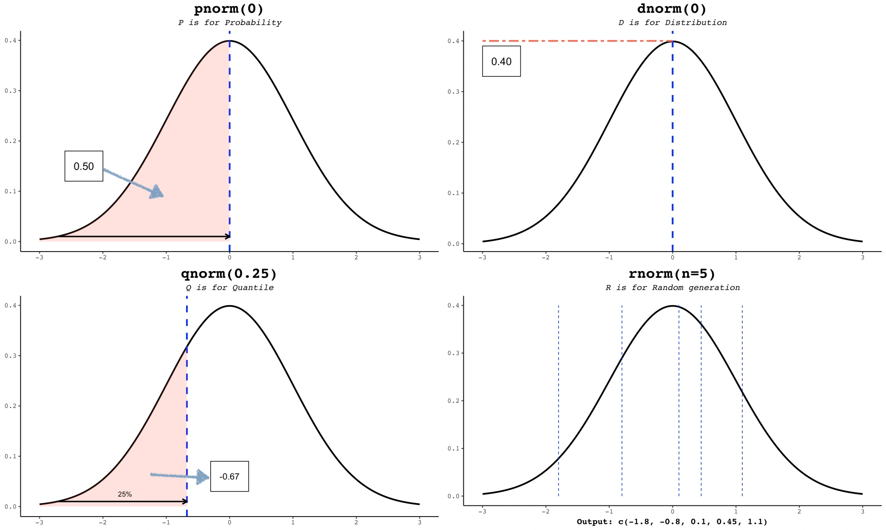
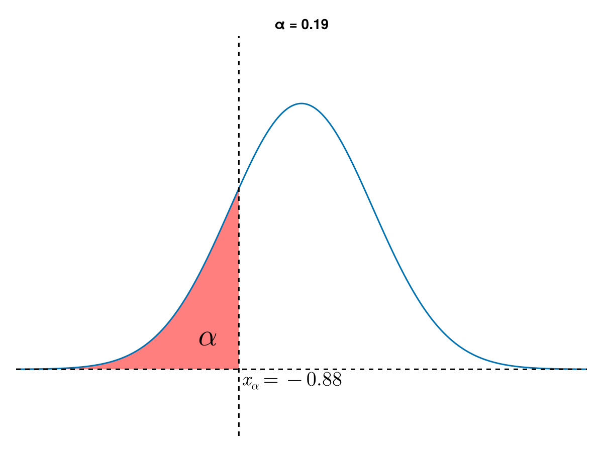
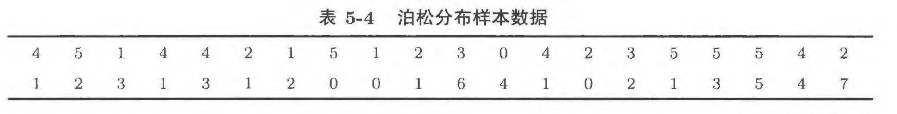
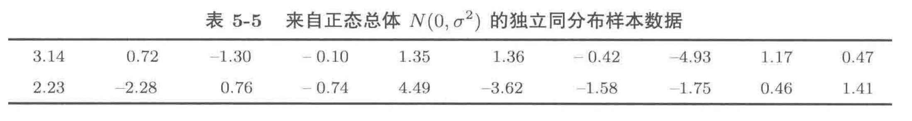
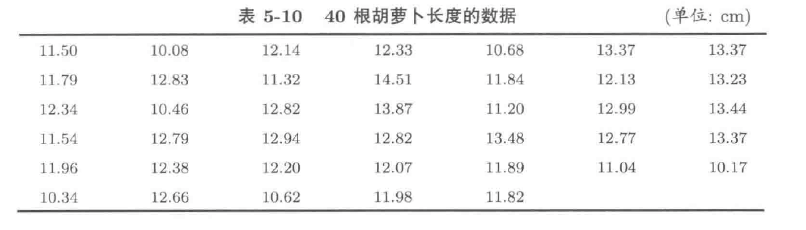
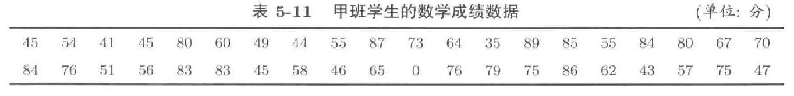
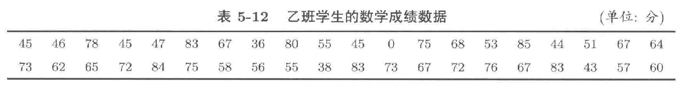

\pagebreak
# 1 常见分布
## 1.1 二项分布 (Binomial Distribution)
$$
\xi \sim B(n,p)
$$

### 1.1.1 相关R语言函数
- `dbinom(k,n,p)` (**d**ensity of **binom**ial distribution)：计算参数为 $n$ 和 $p$ 的二项分布在 $k$ 点的密度，即 $\mathrm{P}(\xi = k)$
	$$
	\mathrm{P}(\xi = k) = {n\choose k}p^{k}(1-p)^{n-k},\quad k=0,1,\dots,n
	$$
- `pbinom(x,n,p)` (**p**robability of **binom**ial distribution)：计算参数为 $n$ 和 $p$ 的二项分布在 $x$ 点的分布函数值，即 $F(x) = \mathrm{P}(\xi \leq x)$ 
	$$
	F(x) = \mathrm{P}(\xi \leq x) = \sum_{k\leq x} \mathrm{P}(\xi = k) = \sum_{k\leq x}{n\choose k}p^{k}(1-p)^{n-k}
	$$
- `rbinom(m,n,p)` (**r**andom of **binom**ial distribution)：生成 $m$ 个服从参数为 $n$ 和 $p$ 的二项分布的随机数。

### 2.1.2 相关例题
#### 例1模拟二项分布随机变量 
假设某个实验成功的概率为 $0.3$，在一次实验中重复 $10$ 次。请用 R 语言模拟 $1000$ 次实验，输出每次实验成功的次数 $\xi$ 分布，并通过 $1000$ 次模拟，计算每次试验成功次数 $\xi$ 的算术平均值。
```{R}
p <- 0.3
n <- 10
m <- 1000
results <- rbinom(m, n, p)
table(results)

hist(results, 
     freq=F, 
     col="lightblue", 
     main="Histogram of B(10, 0.3)", 
     xlab="Number of Successes",
     ylab="Frequency")

mean(results)
```

#### 例2计算某个事件的概率
对于四选一的 $10$ 道选择题，如果某人用随机猜测答案的方法，其猜对的题目个数 $\xi$ 服从什么分布？计算恰好猜对 $3$ 道题的概率。
```{R}
dbinom(3,10,1/4)
```

#### 例3计算累积概率（分布函数值）
假设一台机器有 $8$ 个零件，每个零件正常工作的概率是 $0.9$，计算至少有 $6$ 个零件正常工作的概率。

```{R}
1 - pbinom(5, 8, 0.9)
```

#### 例4绘制二项分布的密度图像
假设某个事件发生的概率是 $0.4$，重复 $20$ 次，绘制事件发生次数的密度图像：
```{R}
k <- 0:20 # 事件发生次数所有可能的取值 [0,20]
d_k <- dbinom(k, 20, 0.4)
plot(k, d_k,
     type="h")
```

#### 例5绘制二项分布的分布函数图像
假设一项产品的合格率是 $50%$，某公司抽检了 $10$ 件产品，绘制合格产品数的分布函数。
```{R}
x <- 0:10
y <- pbinom(x, 10, 0.5)
plot(c(0,1), c(y[1], y[1]),
     col = "blue",
     type = "l",
     lwd = .5,
     ylab = "F(x)",
     xlab = "x",
     ylim = c(0,1.1),
     xlim = c(0,9.5),
     main = "B(10,0.5)"
     )

for (i in 2:10) {
  points(i-1,y[i-1], col="blue")
  lines(c(i-1,i), c(y[i], y[i]),
        col="blue", lwd=.5)
}
```

## 1.2 超几何分布 (Hypergeometric Distribution)
$$
\xi \sim H(M,K,n)
$$

### 1.2.1 相关R语言函数
- `dhyper(i, K, M-K, n)` (**d**ensity of **hyper**geometric distribution)：计算参数为 $M,K$ 和 $n$ 的超几何分布在 $i$ 处的密度，即 $\mathrm{P}(\xi = i)$
	$$
	\mathrm{P}(\xi = i) = \frac{{K\choose i}{M-K\choose n-i}}{{M\choose n}},\quad i=0,1,\dots,n
	$$
- `phyper(x, K, M-K, n)` (**p**robability of **hyper**geometric distribution)：计算参数为 $M,K$ 和 $n$ 的超几何分布在 $x$ 点的分布函数值，即 $\mathrm{P}(\xi \leq x)$ 
	$$
	F(x) = \mathrm{P}(\xi \leq x) = \sum_{i\leq x} \mathrm{P}(\xi = i) = \sum_{i\leq x} \frac{{K\choose i}{M-K\choose n-i}}{{M\choose n}}
	$$
- `rhyper(m, K, M-K, n)` (**r**andom of **hyper**geometric distribution)：生成 $m$ 个服从参数为 $M,K$ 和 $n$ 的超几何分布的随机数。


### 1.2.2 相关例题
#### 例1计算超几何分布的概率
假设一个箱子里有 $20$ 个球，其中 $8$ 个是红球，$12$ 个是黑球。现在从中随机抽取 $5$ 个球（不放回），求其中正好有 $3$ 个红球的概率。
```{R}
M = 20
K = 8
n = 5

dhyper(3, K, M-K, n)
```

#### 例2累积概率（分布函数）计算
假设有 $50$ 名学生，其中 $30$ 名学生通过了考试，$20$ 名学生未通过。现随机抽取 $10$ 名学生，求至少有 $6$ 名学生通过考试的概率。
```{R}
K = 30
M = 50
n = 10

1 - phyper(5, K, M-K, n)
phyper(4, M-K, K, n)
```

#### 例3模拟超几何分布随机变量
假设一个卡片组里有 $40$ 张卡片，其中 $10$ 张是稀有卡。随机抽取 $8$ 张卡片，模拟 $1000$ 次试验，观察每次抽取的稀有卡数量。并绘制其直方图
```{R}
M = 40
K = 10
n = 8
results = rhyper(1000, K, M-K, n)
table(results)
hist(results, freq=F,
     col="lightblue",
     xlab="x",
     ylab="Frequency",
     main="The histogram of H(40,10,8)")
```

#### 例4绘制超几何分布的密度图像
假设一个队伍有 $15$ 名女生和 $10$ 名男生，从中随机抽取 $5$ 人。绘制抽到不同数量女生的密度函数。
```{R}
M = 25
K = 15
n = 5
k = 0:n

plot(k, dhyper(k, K, M-K, n), 
     type = "h", 
     col = "blue",
     xlab = "x", ylab = "frequency",
     lwd = 1.5)
```

#### 例5绘制超几何分布的分布函数
假设一个项目组有 $30$ 名员工，其中 $12$ 名是女性。随机抽取 $10$ 名员工，绘制不同抽取女性员工数量的累积分布函数图。
```{R}
M <- 30
K <- 12
n <- 10

x <- 0:10
y <- phyper(x, K, M-K,n)

plot(c(x[1], x[2]), c(y[1], y[1]),
     type="l",
     lwd=1.5,
     xlim=c(0,9.5),
     ylim=c(0,1),
     xlab="x",
     ylab="F(x)")


for (i in 2:10) {
  points(i-1, y[i-1])
  lines(c(i-1, i), c(y[i], y[i]),lwd=1.5)
}
```

#### 例6二项分布和超几何分布的对比
假设一个库存有 $200$ 个产品，其中 $50$ 个是有缺陷的，$150$ 个是完好的。分别使用放回和不放回的抽样方式随机抽取 $20$ 个产品，抽到的有缺陷产品的数目分别记为 $X$ 和 $Y$，在一张图中绘制 $X$ 和 $Y$ 的分布函数图像。

```{R}
M <- 200
K <- 50
n <- 20
p <- K/M

k <- 0:20
X <- pbinom(k, n, p)
Y <- phyper(k, K, M-K, n)

# 创建一个空的图片，以便后续通过循环添加
plot(0,0,type='h',
     xlim = c(0,19.5),
     ylim = c(0,1)
     )
for (i in 2:length(k)) {
  lines(c(k[i-1], k[i]), c(X[i], X[i]),
        col="red")
  lines(c(k[i-1], k[i]), c(Y[i], Y[i]),
        col="blue")
  points(k[i], X[i],col="red")
  points(k[i], Y[i],col="blue")
}
legend("bottomright", legend = c("B(20,1/4)", "H(200,150,20)"), 
       lty=c(1,1), 
       col = c("red", "blue"),
       cex=.7)
```

## 1.3 泊松分布 (Poisson Distribution)
$$
\xi \sim P(\lambda)
$$

### 1.3.1 相关R语言函数
- `dpois(k, lambda)` (**d**ensity of **Pois**son distribution)：计算参数为 `lambda` 的泊松分布在 $k$ 点的密度值，即 $\mathrm{P}(\xi=k)$
  $$
  \mathrm{P}(\xi = k) = \frac{\lambda^{k}}{k!} e^{-\lambda},\quad k = 0,1,2,\dots
	$$
- `ppois(x, lambda)` (**p**robability of **Pois**son distribution)：计算参数为 `lambda` 的泊松分布在 $x$ 点的分布函数值，即 $\mathrm{P}(\xi \leq x)$
  $$
	\mathrm{P}(\xi\leq x) = \sum_{k\leq x}\mathrm{P}(\xi = k) = \sum_{k \leq x} \frac{\lambda^{k}}{k!}e^{-\lambda}
	$$
- `rpois(m, lambda)` (**r**andom of **Pois**son distribution)：生成 $m$ 个服从参数为 `lambda` 的泊松分布的随机数。

### 1.3.2 例题
#### 例1 {#E:1.3.2.1}
- **利用数学期望和方差的定义** 使用R语言估算 $\xi\sim P(10.5)$ 的数学期望和方差
$$
\begin{split}
\mathbb{E}(\xi) &= \sum_{k=0}^{\infty} k \cdot \mathbb{P}(\xi = k) \\
D(\xi) &= \sum_{k=0}^{\infty}[k-\mathbb{E}(\xi)]^{2}\cdot \mathbb{P}(\xi=k)
\end{split}
$$


```{R}
lambda = 10.5
k = 0:30
p <- dpois(k, lambda)
# 利用cumsum函数计算向量的前n项和，通过计算 k*p 的前n项和可以近似得到随机变量的数学期望
plot(k, cumsum(k*p),
     xlab="k", ylab="mean",
     type="l")
lines(c(0,30), c(lambda,lambda), lty=2,col="red")

# 利用cumsum函数计算向量的前n项和，通过计算 (k-10.5)**2*p 的前n项和可以近似得到随机变量的数学期望
plot(k, cumsum((k - lambda)**2*p),
     xlab="k", ylab="variance",
     type="l")
lines(c(0,30), c(lambda,lambda), lty=2,col="red")
```

- **利用大数定律**估计$\xi \sim P(10.5)$ 的数学期望
```{R}
N = 100000
sample_from_pois = rpois(N, 10.5)
mean(sample_from_pois)
```

#### 例2
假设在某地区，每分钟发生的某种事件的平均发生次数是 $3$ 次。请生成 $1000$ 个随机样本，表示每分钟发生的事件次数。
```{R}
N = 1000
lambda = 3
results = rpois(N, lambda)
table(results)
hist(results,
     freq=F,
     xlab="The frequency of event occurrence",
     ylab="Frequency",
     main="Histogram of P(3)")
```

#### 例3计算发生某事件的概率
假设在某银行，每小时接待 $10$ 名客户的平均概率符合泊松分布。求每小时接待 $5$ 名客户的概率。

```{R}
lambda = 10
dpois(5, lambda)
```

#### 例4计算事件发生的累计概率（分布函数）
假设在某工厂，每小时的事故发生次数的平均值是 $2$。求每小时发生不超过 $4$ 起事故的概率。
```{R}
lambda <- 2
ppois(4, lambda)
```


## 1.4 均匀分布 (Uniform Distribution)
$$
\xi \sim U(a,b)
$$

### 1.4.1 相关R语言函数
- `dunif(x, a, b)` (**d**ensity of **unif**orm distribution)：计算 $U(a,b)$ 在 $x$ 点的概率密度值：$p(x)$
  
	$$
	p(x) =\begin{cases}
	\frac{1}{b-a}, & a<x<b \\
	0,  & \text{其他}
	\end{cases} 
	$$
- `punif(x, a, b)` (**p**robability of **unif**orm distribution)：计算 $U(a,b)$ 在 $x$ 点的分布函数值：$F(x)$
	$$
	F(x) = \int _{-\infty}^{x} p(t)\, dt  = \begin{cases}
0, & x < a \\
\frac{x-a}{b-a}, & a \leq x <b \\
1,  & b \leq x
\end{cases}
	$$
- `runif(m, a, b)` (**r**andom of **unif**orm distribution)：生成 $m$ 个服从 $U(a,b)$ 的随机数。


### 1.4.2 例题
#### 例1
通过公式，计算 $U(1,20)$ 的均值和方差
$$
\begin{split}
\mathbb{E}(\xi) &= \int_{-\infty}^{\infty} x\cdot p(x)\, dx \\
D(\xi) &= \int_{-\infty}^{\infty} [x - \mathbb{E}(\xi)]^{2}\cdot p(x)\, dx \\
\end{split}
$$

```{R}
integrate(function(x) x * dunif(x, 1, 20), -Inf,Inf)
integrate(function(x) (x-10.5)**2* dunif(x, 1,20), -Inf, Inf)
```

#### 例2 绘制均匀分布的密度函数图像
若 $\xi \sim U(1,20)$ 绘制 $\xi$ 的密度函数图像：
$$
p(x) = \begin{cases}\frac{1}{19}, &0<x <20 \\ 0,& \text{others}\end{cases}
$$
```{R}
x <- seq(-10, 30, by = 0.001)
plot(x[x >= 0 & x <= 20], dunif(x[x >= 0 & x <= 20], 0, 20),
  type = "l",
  lwd = 2.5,
  col = "blue",
  xlim = c(-10, 30),
  ylim = c(0, 0.1),
  xlab = "x",
  ylab = "density"
)
lines(x[x < 0], dunif(x[x < 0]), lwd = 2.5, col = "blue")
points(c(0, 20), dunif(c(0, 20), 0, 20), col = "blue", lwd = 1.5)
lines(x[x > 20], dunif(x[x > 20]), lwd = 2.5, col = "blue")
```

#### 例3 绘制均匀分布的分布函数图像
若 $\xi \sim U(1,20)$ 绘制 $\xi$ 的分布函数图像：
```{R}
x <- seq(-10,30,by=0.001)
plot(x, punif(x,1,20),
     type='l',
     col='blue',
     xlab="x", ylab="F(x)",
     lwd=1.5)
```

## 1.5 正态分布 (Normal Distribution)
$$
\xi \sim N(\mu,\sigma^{2})
$$

### 1.5.1 相关R语言函数


- `dnorm(x, mu, sigma)` (**d**ensity of **norm**al distribution)：计算 $N(\mu,\sigma^{2})$ 在 $x$ 点的密度，即 $\varphi_{\mu,\sigma}(x)$
  $$
	\varphi_{\mu,\sigma}(x) = \frac{1}{\sigma \sqrt{ 2\pi }}\exp\left[ \frac{(x-\mu)^{2}}{2\sigma^{2}} \right]
	$$
- `pnorm(x, mu, sigma)` (**p**robability of **norm**al distribution)：计算 $N(\mu,\sigma^{2})$ 在 $x$ 点的分布函数值，即 $\Phi_{\mu,\sigma}(x)$
  $$
	\Phi_{\mu,\sigma}(x) = \int _{-\infty}^{x} \varphi_{\mu,\sigma}(t) \, dt 
	$$
- `rnorm(m, mu, sigma)` (**r**andom of **norm**al distribution)：生成 $m$ 个服从 $N(\mu,\sigma^{2})$ 随机数。
- `qnorm(p, mu, sigma)` (**q**uantile of **norm**al distribution)：计算正态分布函数的反函数：
  $$
	\begin{split}
	p &= \Phi_{\mu,\sigma}(x) \\
	x& = \Phi_{\mu,\sigma}^{-1}(p) \\
	\end{split}
	$$


### 1.5.2 例题
#### 例1 计算 $N(\mu,\sigma^{2})$ 的数学期望和方差
根据连续型随机变量数学期望和方差的定义，计算 $N(3, 9)$ 的数学期望和方差
$$
\begin{split}
\mathbb{E}(\xi) &= \int_{-\infty}^{\infty}x\cdot p(x) \,dx\\
D(\xi) &= \int_{-\infty}^{\infty}[x - \mathbb{E}(\xi)]^{2}\cdot p(x) \,dx
\end{split}
$$

```{R}
integrate(function(x) x * dnorm(x, 3,3), -Inf, Inf)
integrate(function(x) (x - 3)^2 * dnorm(x, 3,3), -Inf, Inf)
```


#### 例2 二项分布和正态分布的近似
对于 $B(n,p)$，当 $n$ 足够大（一般认为大于或等于 $30$），且 $np$ 和 $n(1-p)$ 均大于 $5$ 时，我们可以用正态分布 $N(np, np(1-p))$ 近似该二项分布：例如，从 $B(50, 0.1)$ 中抽取 $1000$ 个随机数，同时绘制这$1000$个随机数的直方图和$N(5, 100\times 0.1 \times 0.9)$的概率密度曲线图进行对比：
```{R}
n <- 100
p <- 0.1
mu <- n*p
sigma <- sqrt(n*p*(1-p))
N <- 1000
Binom_rand <- rbinom(N, n, p)
x <- seq(min(Binom_rand) - 1, max(Binom_rand) +1, by=1e-3)
y <- dnorm(x, mu, sigma)
hist(Binom_rand, freq=F, ylim=c(0, 1.1*max(y)))
lines(x, y, lty=3, col="red", lwd=2)
```

#### 例3 泊松分布和正态分布的近似
当 $P(\lambda)$ 的参数 $\lambda \to \infty$ 时，其近似于正态分布 $N(\lambda, \lambda)$
```{R}
lambda <- 100
N <- 1000
Pois_rand <- rpois(N, lambda)
x <- seq(min(Pois_rand), max(Pois_rand), by=1e-3)
y <- dnorm(x, lambda, sqrt(lambda))
hist(Pois_rand, freq=F, ylim=c(0, 1.1 * max(y)))
lines(x, dnorm(x, lambda, sqrt(lambda)), lty=3, col="red", lwd=2)
```

#### 例4计算某范围内的概率
假设在某项考试中，分数符合均值为 $75$，标准差为 $10$ 的正态分布。求分数在 $65$ 到 $85$ 之间的概率。

- **答** 定义分数为随机变量 $\xi \sim N(75, 10^{2})$，题目要求我们计算 $\mathbb{P}(65<\xi< 85)$。由于随机变量 $\xi$ 为连续型随机变量，因此我们有：
$$
\mathbb{P}(65<\xi<85) = \mathbb{P}(65 < \xi \le 85) = \mathbb{P}(\xi \le 85) - \mathbb{P}(\xi \le 65) = \Phi_{75,10}(85) - \Phi_{75,10}(65)
$$
```{R}
# 设置均值和标准差
mean_score <- 75
sd_score <- 10

# 计算分数在65到85之间的概率
probability <- pnorm(85, mean_score, sd_score) - pnorm(65, mean_score, sd_score)
print(probability)
```

#### 例5计算正态分布的分位数
假设某公司希望筛选出前 $5\%$ 的员工获得奖励。已知员工绩效分数符合均值为 $70$，标准差为 $8$ 的正态分布。计算绩效分数的前 $5\%$ 阈值。
```{R}
mean_score <- 70
std_score <- 8

threshold = qnorm(1 - 5e-2, mean_score, std_score)
print(threshold)
```

#### 例6正态分布的标准化
生成 $1000$ 个服从 $N(3,9)$ 的随机数，将其标准化后，绘制其直方图，与标准正态分布的概率密度曲线进行对比（即转化为标准正态分布，均值为 $0$，标准差为 $1$）。

```{R}
mu = 3
sigma = sqrt(9)
N = 1000
rand_raw = rnorm(N, mu, sigma)
rand_normalization = (rand_raw - mu) / sigma
x = seq(-4,4,by=1e-3)
y = dnorm(x)

hist(rand_normalization, freq=F, ylim = c(0, 1.1*max(y)))
lines(x, y, lwd=2, col="red", lty=3)
```

## Summary
1. 掌握二项分布，超几何分布，泊松分布和正态分布的**分布函数**，**密度函数**，**随机数生成**和**分位数计算**的方法。
2. 掌握离散型（参考[例1](#E:1.3.2.1)）和连续型随机变量数学期望与方差（即如何根据定义和`integrate`函数计算）的计算方法：

\newpage
# 2 大数定律和中心极限定理的模拟
## 2.1 大数定律
### 2.1.1 大数定律的模拟
考察均匀分布随机变量 $\xi\sim U(0,1)$ 重复观测的算术平均值随着重复观测的变化情况。
```{R}
# m为我们希望生成的随机数的个数（重复观测次数）
m <- 10000 
my_cols = c("blue", "green", "yellow", "grey", "pink", "black") # 由于我们希望生成6组随机数序列，我们定义六种颜色用于绘图

# 通过for循环生成6组随机数
for (i in 1:6){
  x <- runif(m, 0, 1) # 生成m个服从U(0,1)的随机数（重复观测m次）
  x_bar = c() # 定义一个空向量x_bar用于存储x中前j个元素算术平均数
  # 内部的for循环用于计算x中前j个元素的算术平均数
  for (j in 1:m){
    x_bar <- c(x_bar, mean(x[1:j])) # 将计算得到前j个元素的算术平均数作为最后一个元素添加到向量x_bar中
  }
  # 当i为1时，通过plot新建一张图片
  if (i==1){
    plot(x_bar, 
         type="l",
         lwd=1.,
         xlab="n",
         ylab="x_bar",
         col=my_cols[i])}
  else {
    # 若i不为1，通过lines函数向图像中添加折线图
    lines(x_bar, lwd=1., col=my_cols[i])
  }
}
# 添加期望对应的线
abline(h=0.5,
      col="red",
      lwd=1.5,
      lty=2)
```

通过如上的代码，我们可以发现，随着观测数目的增加，随机变量 $\xi$ 的观测值的算术平均值越来越接近其数学期望；设 $\xi_i$ 为随机变量 $\xi$ 第 $i$ 次观测的结果，则有：
$$
\lim_{n\to \infty}\frac{1}{n}\sum_{i=1}^{n} \xi_{i} = \mathbb{E}(\xi)
$$
这就是P85所说的**柯尔莫哥洛夫强大数定律**

### 2.1.2 经验分布
#### 经验分布 
设 $X_1,X_2,\cdots, X_n$ 为随机变量 $X$ 的 $n$ 次重复观测，称
$$
F_n(x) = \frac{n(\{i:\, 1\le i \le n, X_{i}\le x\})}{n}
$$
为 $X$ 的**经验分布**，此处：
$$
n(\{i:1\le i\le n, X_{i}\ \le x\})
$$
表示 $X_{1},X_{2},\dots,X_{n}$ 中小于 $x$ 的值的个数。

#### R语言模拟
随机变量 $X\sim N(0,1)$，对其分别重复观测 $20,100,1000$ 次，绘制其经验分布图像，并和标准正态分布的分布函数曲线进行对比
```{R}
# 设置绘图的布局为1行3列，且每张图片呈正方形
par(mfrow=c(1,3),pty = "s")

# 迭代不同的观测数量，绘制不同的经验分布曲线
for (n in c(20,100,1000)){
  x <- seq(-4,4, by=0.001) # 定义横坐标x用于后面绘制标准正态分布分布函数曲线
  X <- rnorm(n)   # 对于随机变量X重复观测n次，得到观测值向量X
  min_X = min(X)  # 找出最小的观测值
  max_X = max(X)  # 找出最大的观测值
  Z = unique(sort(X)) # 对于观测值X从小到大进行排序，并找出所有的不重复值，作为向量Z
  fn = c() # 定义存储经验分布函数值的向量fn
  # 依次遍历Z中的元素
  for (i in Z){
    fn <- c(fn, sum(X <= i)/n) # 统计小于i的观测值个数，并除以总观测值数目（即经验分布函数值），并将计算的结果作为最后一个元素添加进向量fn
  }
  plot(c(min_X-1,min_X), c(0,0), type="l", 
       xlim = c(min_X, max_X),
       ylim = c(0,1),
       xlab = "X",
       ylab = "P",
       main = paste("n=", n, sep=""))
  points(c(0), min_X, cex=0.3)
  for (i in 2:length(Z)){
    lines(c(Z[i-1],Z[i]), c(fn[i-1],fn[i-1]))
    points(c(Z[i]), fn[i-1],cex=0.3)
  }
  lines(x, pnorm(x), lwd=1.5, lty=2, col="red")
}
```

通过上图，我们可以发现，随着重复观测数目 $n$ 的增加，经验分布愈发接近理论的分布函数值：
$$
\lim_{n\to \infty}F_{n}(x) = F(x)
$$

### 2.1.3 大数定律与蒙特卡洛模拟
根据大数定律，对于随机变量 $X$ 和其重复观测值 $X_1,X_2,\cdots,X_n$，我们有
$$
\mathbb{E}(X)  = \lim_{n\to \infty} \frac{1}{n}\sum_{i=1}^{n}X_{i}
$$
对于函数 $f(x)$ 在 $[a,b]$ 上的定积分：
$$
\int_{a}^{b}f(x)\,dx
$$
设随机变量 $X\sim U(a,b)$，我们有：
\begin{equation}
\label{eq:2.1}
\mathbb{E}[f(X)] = \int_{a}^{b} \frac{f(x)}{b-a}\, dx= \frac{1}{b-a} \int_{a}^{b} f(x)\, dx \tag{2.1}
\end{equation}

结合上述的大数定律：
\begin{equation}
\label{eq:2.2}
\mathbb{E}[f(X)]= \lim_{n\to\infty} \sum_{i=1}^{n} \frac{1}{n} f(X_{i}) \approx \frac{1}{N}\sum_{i=1}^{N}f(X_{i})  \tag{2.2}
\end{equation}

结合公式 (\ref{eq:2.1}), (\ref{eq:2.2})，我们可以估算 $f(x)$ 在 $[a,b]$ 上的定积分
$$
\int_{a}^{b} f(x)\, dx \approx (b-a)\frac{1}{N}\sum_{i=1}^{N}f(X_{i})
$$

#### \textcolor{C1}{Trick 利用蒙特卡洛模拟计算定积分}
以如下定积分一般形式为例：其计算函数 $f(x)$ 在区间 $[a,b]$ 上的定积分
$$
\int_{a}^{b}f(x)\,dx
$$

1. 使用 `runif(m,a,b)` 产生 `m` 个服从 $U(a,b)$ 的随机数 `Y`。
2. 将第一步得到的随机数作为自变量放入函数 $f(x)$，计算 `f(Y)`。
3. 计算第二步得到的 `f(Y)` 的算术平均值，并乘以积分区间长度 `(b-a)`，即 `(b-a) * mean(f(Y))`

#### 例1
我们可以利用如上方法计算
$$
\int_{1}^{2} x^{2}\, dx
$$

```{R}
n <- 10000          # 定义观测值数目n
Y <- runif(n, 1, 2) # 生成n个服从U(1,2)的随机数，形成n维向量X
estim_int <- (2-1) * mean(Y^2) # 使用蒙特卡洛模拟对于如上积分进行估计
acc_int <- integrate(function(x) x^2, 1,2) # 通过integrate函数直接计算如上积分
cat("蒙特卡洛模拟的结果：", estim_int, "\n实际结果：", acc_int$value)
```

#### 例2
设 $X\sim N(0,1)$，尝试写出用蒙特卡洛模拟方法近似计算概率 $\mathbb{P}(0.1 < X <2)$ 的R程序代码。
$$
\varphi(x) = \frac{1}{\sqrt{2\pi}} \exp\left[ \frac{x^{2}}{2}\right]
$$

- **答**：根据
  $$
  \mathbb{P}(0.1<X<2) = \int_{0.1}^{2}\varphi(x)\, dx \approx (2-0.1)\times\frac{1}{N}\sum_{i=1}^{N}\varphi(Y_i)
  $$
  其中 $Y_{1},\dots, Y_{N}$ 是 $Y\sim U(0.1,2)$ 的 $n$ 次重复观测值。
    ```{R}
    Y <- runif(10000,0.1,2) # 生成10000个服从U(0.1,1)的随机数，组成向量Y
    c <- 1/sqrt(2*pi) 
    phiY <- c * exp(-Y^2/2) # 将随机向量Y代入标准正态分布的密度函数，得到向量phiY
    estim_int <- (2-0.1) * mean(phiY) # 利用蒙特卡洛模拟估计如上定积分
    acc_int <- pnorm(2,0,1) - pnorm(0.1,0,1)
    cat("蒙特卡洛估计结果: ", estim_int,"\n实际结果: ", acc_int)
    ```
  当然我们也可以不通过积分，而直接通过经验分布的方式，近似计算
    ```{R}
    X <- rnorm(100000)
    estim_P <- sum(X > 0.1 & X < 2)/length(X)
    print(estim_P)
    ```


## 2.2 中心极限定理的模拟
中心极限定理主要描述了样本均值 $\bar{X}$ 的分布，对于来自总体（总体的数学期望为 $\mathbb{E}(X)$，方差为 $D(X)$）的 $n$ 个样本，根据中心极限定理有：随着样本量 $n\to\infty$：
$$
\bar{X} \sim N\left(\mathbb{E}(X), \frac{D(X)}{n}\right)
$$

#### 中心极限定理
设随机变量 $X$ 的方差为大于 $0$ 的实数，若 $X_{1},X_{2},\dots, X_{n}$ 为 $X$ 的 $n$ 次重复观测，则
$$
\lim_{n\to \infty} \mathbb{P}\left\{\frac{\bar{X} - \mathbb{E}(X)}{\sqrt{D(X) / n}} \le x\right\} = \Phi(x)
$$
其中 $\bar{X} = \frac{1}{n}\sum_{i=1}^{n}X_{i}$

#### 中心极限定理的模拟
我们可以通过如下代码对于模拟中心极限定理，对于 $X\sim B(1,0.1)$，令：
$$
\bar{X}_{N} = \frac{1}{N}\sum_{i=1}^{N}X_{i}
$$
取样本量 $N=20, 100, 1000$，分别重复抽样 $10000$ 次，得到样本均值 $\bar{X}_N$。绘制标准化后的 $\bar{X}_N$ 的直方图，并与标准正态分布的概率密度曲线进行对比。

```{R}
n <- 1
p <- 0.1
par(mfrow = c(1, 3), pty = "s")
N <- c(20, 100, 1000)
m <- 10000

for (i in N) {
  sim_result <- matrix(rbinom(m * i, n, p), m, i)
  mean_result = rowSums(sim_result) / i
  norm_result = (mean_result - n * p) / sqrt(n * p * (1 - p) / i)
  hist(norm_result,
       freq = F,
       main = paste("N=", i, sep = ""))
  lines(seq(-4, 4, by = 0.001),
        dnorm(seq(-4, 4, by = 0.001)),
        col = "red",
        lty = 2)
}
```


## Summary
1. 理解大数定律的内涵
2. 初步理解随机模拟方法（蒙特卡洛模拟）
3. 理解中心极限定理的内涵
4. 掌握重复观测样本之和的概率估算方法。（结合中心极限定理，可以根据中心极限定理推出重复样本之和的分布）：
    根据中心极限定理，若重复观测样本 $X_{1},X_{2},\dots,X_{n}$ 来自总体的均值为 $\mathbb{E}(X)$ 方差为 $D(X)$。则样本均值 $\bar{X} = \frac{1}{n}\sum_{i=1}^{n}X_{i}$ 服从分布：
    $$
    \bar{X} \sim N\left(\mathbb{E}(X), \frac{D(X)}{n}\right)
    $$
    令重复观测样本之和 $\tilde{X} = \sum_{i=1}^{n}X_{i} = n \cdot \bar{X}$，结合正态分布性质，可知：
    $$
    \tilde{X} \sim N\left(n  \mathbb{E}(X), nD(X)\right) 
    $$

## Questions
1. 使用R语言代码模拟研究 $X\sim P(5)$ 的重复观测数据的算术平均值和观测次数之间的关系，总结规律。(hints：大数定律
2. 通过 $1000$ 次模拟观测数据估计 $X\sim B(10,0.8)$ 的数学期望 $\mathbb{E}(X)$，讨论估计的结果是否为随机变量，并判断估计误差的取值范围。(hints：中心极限定理
3. 已知数学考试的平均成绩（5分制）为 $4.10$，标准差为 $0.3$，估算 $1000$ 名学生的成绩之和小于 $400$ 的概率 (hints: 中心极限定理，成绩之和与成绩平均值之间的关系，正态分布的变换
4. $X\sim B(10,0.4)$，写出统计学方法估计 $\mathbb{E}(\sin(X))$ 的程序代码，并给出估计结果。
5. 写出用统计学方法估计 $s = \sum_{i=1}^{100} i^{4}$ 的程序代码，并给出估计结果和误差。
6. 写出用统计学方法估计 $\int _{0}^{1}\cos(x) \, dx$ 的程序代码，并给出估计结果和估计误差。


\pagebreak
# 3 离散型随机变量的模拟及其应用
## 3.1 模拟$X$的重复观测值
若随机变量 $X$ 的密度矩阵如下所示
$$
\begin{pmatrix}
x_{1} & x_{2} & \cdots & x_{m} \\
p_{1} & p_{2} & \cdots & p_{m} \\
\end{pmatrix}
$$
则可以利用如下代码模拟这个随机变量的 $n$ 次重复观测：
```{R,eval=F}
sample(c(x1,...,xm), size=n, replace=T, prob=c(p1,...,pm))
```
    
#### 例如
当 $X$ 的矩阵密度为
\begin{equation}
\label{eq:3.1}
\begin{pmatrix}
-0.5 & -1 & 1.1 & 1.2 \\
0.2 & 0.3 & 0.25 & 0.25
\end{pmatrix} \tag{3.1}
\end{equation}
时，模拟它的 $10000$ 次重复观测的程序为
```{R}
x <- c(-0.5, -1, 1.1, 1.2)
p <- c(0.2, 0.3, 0.25, 0.25)
rX <- sample(x, size=10000, replace=T, prob=p)
mean(rX == -0.5)
mean(rX == -1)
mean(rX == 1.1)
mean(rX == 1.2)
```
    
## 3.2 计算 $X$ 的分位数值
如何使用R计算如 (\ref{eq:3.1}) 所示的分布的分位数值？

1. 将第一行的随机变量取值改为递增的密度矩阵：
    \begin{equation}
    \label{eq:3.2}
    \begin{pmatrix}
      -1 & -0.5 & 1.1 & 1.2 \\
     0.3 & 0.2  & 0.25 & 0.25
    \end{pmatrix} \tag{3.2}
    \end{equation}
2. 利用如上密度矩阵计算其 $0.4$ 分位数
```{R}
x <- c(-1, -0.5, 1.1, 1.2); p <- c(0.3, 0.2, 0.25, 0.25)
tmpAlpha <- 0.4

for (i in 1:length(x)) {
  tmpF <- sum(p[1:i])     # 计算前i个元素的密度之和
  # 若密度（概率）之和大于等于tmpAlpha，返回其对应的随机变量取值，并终止循环
  if (tmpF >= tmpAlpha) {
    xAlpha <- x[i]
    break
  }
}
xAlpha
```

## 3.3 大数定律与算术平均值的估计
若某高中一年级有 $N$ 名学生，他们的身高分别为 $x_{1},\dots,x_{N}$，如何估计这些学生的平均身高？
$$
a = \frac{1}{N}\sum_{i=1}^{N} x_{i} = \sum_{i=1}^{N} \times \frac{1}{N}
$$
若将 $\frac{1}{N}$ 看成是概率 $\mathbb{P}(X= x_{i})$，则 $X$ 的密度矩阵为：
$$
\begin{pmatrix}
x_{1} & \cdots & x_{N} \\
\frac{1}{N} &\cdots & \frac{1}{N}
\end{pmatrix}
$$
数学期望
$$
\mathbb{E}(X) = \sum_{i=1}^{N}x_{i}\mathbb{P}(X=x_{i}) = \sum_{i=1}^{N}x_{i} \times \frac{1}{N}
$$
根据大数定律，有 $\displaystyle\lim_{n\to \infty} \frac{1}{n}\sum_{i=1}^{n}X_{i} = a$ 的概率为 $1$。可以用
$$
\hat{a} = \frac{1}{n}\sum_{i=1}^{n}X_{i}
$$
估计学生的平均身高 $a$。

#### R语言实现
可以利用随机模拟的方法考察上述方法估计算术平均值的效果：
```{R}
x <- c(rnorm(98,mean=1.60, sd=0.16), rnorm(86, mean=1.70, sd=0.17))
tmpId <- sample(1:length(x), size=100000, replace=T)
xSample <- x[tmpId]
hatMean <- mean(xSample)
trueMean <- mean(x)
hatMean
abs(trueMean - hatMean)
```

## Summary
1. 掌握密度矩阵为
    $$
    \begin{pmatrix}
    x_{1} & \cdots & x_{m} \\
    p_{1} & \cdots & p_{m}
    \end{pmatrix}
    $$
    的随机变量 $X$ 的重复观测值模拟方法，其中 $m$ 为正整数
2. 掌握大数定律的应用能力

## Questions
1. 若 $X$ 的密度矩阵为
   $$ \begin{pmatrix} 0 & -1 & 1 \\ 0.5 & 0.1 & 0.4 \end{pmatrix} $$
   写出模拟 $X$ 的 $100$ 次重复观测值的程序代码，并用这些重复观测值估计 $X$ 的数学期望，给出估计的误差（估计误差等于估计值减真值）
   
   
\pagebreak
# 4 抽样方法
## 4.1 放回简单随机抽样
放回简单随机抽样方法：

1. 将 $\Omega$ 中的样本点编号为 $1,2,\cdots,N$
2. 用取后放回的方法从编号中依次抽取数 $i_1, i_2,\dots, i_n$ （样本量为$n$）
3. 对于 $1\le k\le n$，测量居民 $\omega_{ik}$ 的变量值 $X_k = X(\omega_{ik})$

一般地，称总体变量 $X$ 的观测结果 $X_{1},\dots, X_{n}$ 为样本，称 $n$ 为**样本容量**。

```{R}
sample(1:10,10,replace=T)
```

## 4.2 简单随机抽样
**简单随机抽样**：依次用抽后不放回的方法从总体中抽取样本 $Y_1,\dots,Y_n$，称这种方法为**简单随机抽样**，相应的样本为**简单随机样本**。

#### 例
限定容量为$100$，分别模拟简单放回抽样的样本均值和不放回抽样的样本均值估计总体均值，考察两种方式的估计效果
```{R}
N = 1000 # 总体中个体的数目
n = 100  # 样本量
X = sample(1:N, n,T) # 放回随机抽样
Xbar = mean(X)  # 计算样本均值
Xbar
Y = sample(1:N, n, F) # 简单随机抽样（不放回）
Ybar = mean(Y)
Ybar
```

### 4.2.1 有放回的简单随机抽样和简单随机抽样对均值的估计
```{R}
N <- 1000           # 总体的个数
trueMean <- mean(1:N) # 计算总体的期望
n <- 100; m <- 10000 # 样本量为n，重复估计次数m
# 定义向量 Xmean, Ymean, XD, YD 分别用于存储m次估计中，每次得到的样本均值以及与总体均值的离差平方
Xmean <- Ymean <- XD <- YD <- 1:m 
# 使用for循环进行m次估计
for (k in 1:m) {
  X <- sample(1:N, n, T)  # X表示有放回抽取的样本
  Xmean[k] <- mean(X)     # 计算X的均值，作为Xmean的第k个元素
  XD[k] <- (trueMean - mean(X))^2 # 计算X的均值和总体均值的离差平方
  Y <- sample(1:N, n, F)  # Y 表示简单随机抽样得到的样本
  Ymean[k] <- mean(Y)     # 计算Y的均值，作为Ymean的第k个元素
  YD[k] <- (trueMean - mean(Y))^2 # 计算Y的均值和总体均值的离差平方
}

# 计算m次估计的平均估计值以及平均离差平方
results <- c(mean(Xmean), mean(Ymean), mean(XD), mean(YD))
results <- matrix(results, 2,2) # 将向量转换为矩阵
colnames(results) <- c("估计均值","估计均方误差") # 设置矩阵的列名
rownames(results) <- c("放回抽样", "不放回抽样")  # 设置矩阵的行名
results
```


## 4.3 等距抽样
可将总体中的所有个体排序为 $\omega_{1}, \dots, \omega_{N}$，先选定的序范围内随机抽取一个个体 $\omega_{i,1}$，然后在序列中按等间隔的原则抽取其他个体，就可以得到样本
$$
X(\omega_{i,1}),\dots, X(\omega_{i,n})
$$
称这种抽样方法为**等距随机抽样**，简称为**等距抽样**，相应的样本为**等距样本**。

### R语言实现
#### 基本思路
假如我们有一个长度为 $N$ 的总体，希望抽取 $n$ 个样本：

1. 确定步长 $k = \lfloor N/n\rfloor$
2. 计算初始样本点的上限 $N - (n-1)K$，并在区间 $[1, N-(n-1)k]$ 之间随机选取一点作为初始位置 $r$
3. 依次选取位置 $r, r+k, r+2k, \dots$ 

#### 例题
总体中所有个体排序为 $\omega_{1},\omega_{2},\dots, \omega_{401}$，总体变量 $X$ 在个体 $\omega_{i}$ 处的值
\begin{equation}
\label{eq:4.1}
X(\omega_{i}) = \sin\left(\frac{i\pi}{10}\right),\quad 1\le i \le 401,\tag{4.1}
\end{equation}
尝试使用等距抽样的方法，从中抽取出 $20$ 个样本。

```{R}
N <- 401 # 总体中个体总数
x <- sin((1:N) * pi / 10) # 总体数据
n <- 20 # 样本容量
pMean <- mean(x)  # 总体均值

# 等距样本抽取
groupN <- N/n  # 步长
groupN <- floor(groupN) # 向下取整，得到步长
tmpRange <- N - (n-1) * groupN # 设置第一个样本点的次序上界
tmpFirst <- sample(1:tmpRange, 1) # 抽取第一的样本点的次序
tmpIndx <- tmpFirst + (0:(n-1)) * groupN # 根据第一个样本点和步长，计算后面样本点的次序
tmpS <- x[tmpIndx]
sMean <- mean(tmpS)
cat("样本均值和总体均值的距离", abs(pMean-sMean))
```


## 4.4 分层抽样
将所关心的总体分为若干个子总体，使得各个子总体的变量值的平均值明显不同，称这样的一个子总体为**层**。在每层中按确定的样本容量 $n_{i}$ 抽取简单随机样本，再把各层抽出的样本合在一起作为样本，这种抽样方法为**分层随机抽样**，简称**分层抽样**，相应的样本称为**分层样本**。

#### 例
考虑到变量总体 (\ref{eq:4.1})，将总体 $\Omega = \{\omega_{1},\omega_{2},\dots, \omega_{401}\}$ 分“层”为
$$
\begin{split}
\Omega_{1} &= \{\omega_{1}, \omega_{2},\dots, \omega_{21}\} \\
\Omega_{k} &= \{ \omega_{2+20(k-1)}, \omega_{3+20(k-1)},\dots, \omega_{1+20k}\}
\end{split}
$$
其中 $k=2,3,\dots,20$。下列代码给出容量为 $n=20$ 的分层抽样代码。

```{R}
tmpIndex <- c() # 初始化一个空向量 tmpIndx 用于存储抽取出样本点的序号
# 使用for循环遍历1:20
for(k in 1:20){
  # 若k=1，则定义"层"subOmega，表示Omeaga_1
  if(k==1){
    subOmega <- 1:21
  }else{
    # 若k不为1，定义"层" subOmega,表示Omega_k
    tmp <- k-1
    subOmega <- (2+20*tmp):(1+20*k)
  }
  # 从"层"中随机抽取一个样本放入 tmpIndex
  tmpIndex <- c(tmpIndex, 
                sample(subOmega,1))
}

tmpS <- x[tmpIndex] # 从序号中得到样本tmpS
sMean <- mean(tmpS) # 计算样本均值
cat("样本均值和总体均值的距离", abs(pMean - sMean))
```


## 4.5 整群抽样
通常可依据辅助信息将总体分割成若干个子总体，使得各个子总体变量的均值相差无几，称这样的一个子总体为**群**。在所有群中用简单随机抽样抽取一些群，将抽出群中的所有个体变量合在一起作为样本。称这种抽样方法为**整群随机抽样**，简称**整群抽样**，相应的样本称为**整群样本**。

#### 例
考虑到变量总体 (\ref{eq:4.1})，将总体 $\Omega = \{\omega_{1},\omega_{2},\dots, \omega_{401}\}$ 分“群”为
$$
\begin{split}
\Omega_{1} &= \{\omega_{1}, \omega_{2},\dots, \omega_{21}\} \\
\Omega_{k} &= \{ \omega_{2+20(k-1)}, \omega_{3+20(k-1)},\dots, \omega_{1+20k}\}
\end{split}
$$
其中 $k=2,3,\dots,20$。如下的代码程序给出了容量为 $n=20$ 或 $n=21$ 的整群抽样程序。

```{R}
# 从20个群中随机抽取一个
k <- sample(1:20,1)
# 若抽到第1个群
if(k==1){
  tmpIndex <- 1:21 # 返回Omega_1
} else
{
  tmp <- k-1
  tmpIndex <- (2+20*tmp):(1+20*k) # 返回 Omega_k
}
tmpS <- x[tmpIndex] # 获得样本
sMean <- mean(tmpS) # 计算样本均值
cat("样本均值和总体均值的距离", abs(pMean - sMean)) # 计算误差
```

## Summary
1. 了解放回简单随机抽样、简单随机抽样、等距抽样、分层抽样和整群抽样的原理和相关概念
2. 掌握 `sample()` 函数的使用方法
3. 通过随机模拟体会样本和样本均值的特性
4. 通过随机模拟比较不同抽样方法的性能

## Questions
考察总体 $\Omega = \{ \omega_{1},\omega_{2},\dots,\omega_{1000} \}$，以及变量
$$
X(\omega_{k}) = k^{2}, 1 \leq k \leq 1000,
$$
要用样本均值估计总体均值。

1. 在样本容量为 $500$ 的情况下，用随机模拟方法比较放回简单随机样本和简单随机样本的估计效果。
2. 在样本容量为 $500$ 的情况下，用随机模拟方法比较简单随机样本和等距抽样样本（按总体中个体下标排序）的估计效果，并解释引起这种结果的原因。
3. 将总体分层为
   $$
	\Omega_{k} = \{ \omega_{100(k-1) +1} ,\dots,\omega_{100k} \}, 1 \leq k \leq 5.
	$$
	在样本容量为 $500$ 的情况下， 用随机模拟方法比较简单随机样本和分层抽样样本的估计效果，并解释引起这种结果的原因。
4. 将总体分层为
   $$
	\Omega_{k} = \{ \omega_{100(k-1) + 1}, \dots, \omega_{100k} \}, 1\leq k \leq 5.
	$$
	在样本容量为 $100$ 的情况下， 用随机模拟方法比较简单随机样本和分层抽样样本的估计效果，并解释引起这种结果的原因。
	

\pagebreak
# 5 数据可视化
## 5.1 直方图的绘制
- hist(x, breaks, freq, col, main, ylab, xlab, ...)
  - x 数据向量，用于生成直方图的数据
  - breaks 直方图的区间数或区间分隔点，
  - freq 是否以频数绘制 T 或以密度绘制 F
  - col 颜色 (color)
  - main 图的标题
  - xlab, ylab: x轴和y轴的标签
  - xlim, `ylim`：x轴和y轴的区间

### 5.1.1 基础绘制
#### 等距分组直方图
默认的绘制方法就是等距的直方图
```{R}
# 设置多张图片的布局
par(mfrow=c(1,3), pty="s")
xx <- seq(-3,3,by=0.001) # 定义一个向量用于之后密度曲线的绘制
# for 循环迭代不同的样本量
for (i in c(10,100,1000)) {
  x <- rnorm(i,0,1) # 生成样本量为i的服从标准正态分布的随机数
  # 绘制直方图
  hist(x, freq=F,
       xlim=c(-3,3), ylim=c(0,0.6),
       ylab="density", main=paste("Sample size is",i))
  # 使用lines函数往已有的图片中添加标准正态分布的概率密度曲线
  lines(xx, dnorm(xx,0,1), lty=2, col="red", lwd=2)
}
```

#### 不等距直方图
我们可以通过 `breaks` 参数的设置，绘制不等距的直方图
```{R}
x <- rnorm(120,mean=85, sd=5)
x <- c(x, runif(3,0,60))
x[x>100] <- 100
x[x<0] <- 0
hist(x, right=F, # 右闭左开区间分组
     freq=F,
     breaks = c(0,60,75,80,85,90,95,100) # 通过 breaks 来设置分隔点
     )
```

### 5.1.2 频率直方图的应用
- P136
    ```{R}
    prob01 <- c(171.8,175.6,177.3,171.1,172.1,177.3,175.0,176.6,
         179.1,176.4,172.6,177.3,174.5,172.6,181.3,175.2,
         172.2,176.9,180.0,176.8,177.4,175.3,174.5,177.6,
         174.4,175.2,173.4,172.9,164.2,161.4,165.7,165.3,
         164.9,158.3,163.5,165.7,166.1,165.5,164.9,160.2,
         166.0,164.6,166.5,166.8,164.7, 166.0,164.0,164.0,
         163.9,162.1,165.7,168.7,163.3,163.5,167.2,165.1);
    g <- seq(157.3, 181.8, 3.5);
    hist(prob01, breaks=g, freq=F,
         main="", xlab="heights", ylab="density")
    ```

- P139-P140
    ```{R}
    par(mfrow=c(1,2), pty="s")
    prob02 <- c(58,91,80,99,99,71,91,47,39,50,48,98,68,72,75,60,
                93,98,59,54,84,90,87,82,80,74,72,90,80,88,80,84,
                90,48,76)
    hist(prob02, right=F, freq=F,
         breaks= c(0,60,70,80,90,100),ylim=c(0,0.03),
         main="2002", ylab="density", xlab="score")
    prob03 <- c(35,38,41,41,42,43,44,47,47,47,49,50,51,52,55,57,
                58,59,71,61,62,64,65,67,86,96,96,70,70,70,70,71,
                71,72,73,73,74,74,74,74,75,75,75,75,75,76,76,76,
                76,78,78,78,78,79,79,80,80,81,81,81,83,84,85,85,
                85,85,86,86,86,86,86,86,86,86,87,87,88,88,89,90,
                90,90,90,90,90,91,92,91,92,93,93,95,95,96,96,96)
    hist(prob03, right=F, freq=F, 
         breaks=c(0,60,70,80,90,100), ylim=c(0,0.03),
         main="2003", ylab="density", xlab="score")
    ```

### 5.1.3 分组数据条形图
更改 freq 为 freq=T 即可，对于**等距分组**的条形图，其依然能反映概率密度曲线的形态；而对于**不等距分组**的条形图，其无法反映概率密度曲线的形态；

```{R}
par(mfrow=c(2,2),pty='s', pin=c(2,2))
hist(prob01,g, freq=T,
     ylab="frequency", main="")
hist(prob01,g, freq=F,
     ylab="density",main="")
hist(prob02, right=F, freq=T,
      breaks= c(0,60,70,80,90,100),
      main="", ylab="frequency", xlab="score") |> suppressWarnings()
hist(prob02, right=F, freq=F,
    breaks= c(0,60,70,80,90,100),
    main="", ylab="density", xlab="score")
```

## 5.2 离散型分布的可视化
### 5.2.1 条形图和饼状图
```{R}
x<-c("女","男","女","女","女","女","女","男",
     "女","女","女","男","男","女","男","女",
     "女","女","女","女","男","男","女","男",
     "女","男","男","男","男")
y <- as.factor(x) # 将向量转变成因子
u <- table(y)     # 计算变量y的分类汇总结果
u
names(u) <- c("male", "female")
u
addmargins(u) # 添加合计项
v <- prop.table(u) # 统计各类别的频率
v
addmargins(v)

pie(v)
barplot(u)
```

### 5.2.2 堆积条形图与并列条形图
```{R}
x <- matrix(c(12,19,17,21), nrow=2, ncol=2)
colnames(x) <- c("male", "female")
rownames(x) <- c("Arts", "Sciences")
y <- as.table(x)
prop.table(y, margin=2)
prop.table(t(y), margin=2)

# 等高堆积条形图
barplot(prop.table(t(y),margin=2),
        xlim=c(0,3.5),
        legend.text=colnames(y),
        args.legend=list(x="topright"))
barplot(prop.table(y,margin=2),
        xlim=c(0,3.5),
        legend.text=rownames(y), args.legend = list(x="topright"))

# 非等高堆积条形图
barplot(t(y), xlim=c(0,3.5), legend.text=colnames(y), args.legend="topright")
barplot(y, xlim=c(0,3.5), legend.text=rownames(y), args.legend="topright")

# 并列条形图
barplot(t(y), beside=T,xlim=c(0,3.5), legend.text=colnames(y), args.legend="topright")
barplot(y, beside=T,xlim=c(0,3.5), legend.text=rownames(y), args.legend="topright")
```

## Summary
1. 了解频率直方图估计总体密度函数的原理
2. 了解条形图估计总体密度的原理
3. 掌握利用直方图和条形图提取总体信息的方法。

## Questions
1. 模拟产生样本量为 $20000$ 的标准正态分布，分别使用前 $20, 200, 2000$ 和 $20000$ 个样本数据绘制频率直方图，分析直方图与标准正态分布密度函数之间的关系，解释为什么能用直方图认识密度函数。
2. 录入如下程序代码
    ```{R, eval=F}
    myData <- data.frame(
      x = c(rep("文科",29), rep("理科", 40)), # 文理科生人数
      y = c(
        rep("男", 12),  # 文科生中男生人数
        rep("女", 17),  # 文科生中女生人数
        rep("男", 19),  # 理科生中男生人数
        rep("女", 21)   # 理科生中女生人数
      ))
    ```
        解答如下问题：
    1. 考察程序代码
        ```{R,eval=F}
        tmpT <- table(myData) #
        # 绘制等高条形图，男生比例对比
        tmpP <- prop.table(tmpT, margin=2) # 
        barplot(tmpP,
         xlim=c(0,3.5), # 
         legend.text=rownames(tmpP), # 
         args.legend = list(x="topright") # 
         )
        ```
        在 # 后面添加程序代码注解
    2. 绘制 myData 的堆积条形图，并解释图像的含义。
    3. 绘制 myData 并列条形图，并解释图像的含义。


\pagebreak
# 6 总体数值特征的估计
## 6.1 总体均值的估计
根据**大数定律**，应该用
$$
\bar{X} \triangleq \frac{1}{n}\sum_{k=1}^{n}X_{k}
$$
估计总体均值，并称 $\bar{X}$ 为**样本均值**，或**均值**，或**平均数**。当样本是重复观测时，随着样本容量的增加样本均值“收敛于”总体均值。我们可以使用 `mean()` 计算样本均值。

### 常用函数
1. `sort(x, decreasing=...)`：对向量 `x` 进行排序，默认为 `decreasing=F` 即从小到大（升序）进行排序；若 `decreasing=T` 则从大到小（降序）进行排序。
2. `colnames(m)` 修改矩阵 `m` 的列名、`rownames(m)`  修改矩阵的行名
3. `t(m)` 对矩阵进行转置

### 例
若 $X \sim N(10,100)$，对其进行重复观测 $1000$ 次，得到样本 $X_{i}, (i=1,2,\dots,1000)$，并通过该样本估计总体的均值：
```{R}
n <- 1000             # 定义样本量
x <- rnorm(n, 10, 10) # 生成观测值
estim_mean <- mean(x) # 计算均样本值
true_mean <- 10       # 真实均值
cat("估计均值为", estim_mean, "与总体均值的差异为", abs(true_mean - estim_mean))
```


## 6.2 总体分位数的估计
$\alpha$ 分位数描述了随机变量概率分布的位置信息，随机变量落在它两边的概率分别接近于 $\alpha$ 和 $1-\alpha$。根据大数定律，应该用满足如下条件的 $\hat{x}_{\alpha}$ 提取信息
$$
\frac{\text{小于}\hat{x}_{\alpha}\text{的数据个数}}{n}\le \alpha,\,\frac{\text{大于}\hat{x}_{\alpha}\text{的数据个数}}{n}\le 1-\alpha
$$

#### 定义4.4.8
对于任意 $\alpha \in (0,1)$，记 $k$ 为数 $\alpha n + 0.5$ 的整数部分，并约定 $X_{(0)}$ 等于 $X_{(1)}$，$X_{(n+1)}$ 等于 $X_{(n)}$，称
$$
\hat{x}_{\alpha} = (\alpha n + 0.5 - k)(X_{(k+1)} - X_{(k)}) + X_{(k)} \tag{4.7}
$$
为样本 $X_{1},X_{2},\dots,X_{n}$ 的**样本$\alpha$分位数**，简称为**$\alpha$分位数**。

在R语言中，我们可以直接使用 `quantile(x, probs=...,type=...)` 函数计算样本的 `alpha` 分位数，其中`probs`对应于上面的$\alpha$，`type`为计算百分位数的方法`type=5`对应于$(4.7)$的分位数计算方法。
```{R}
x <- runif(1000, 0, 2)
quantile(x, c(0.25, 0.75))
```

特别的，对于中位数，即 $0.5$ 分位数，我们可以使用函数 `median(x)` 进行计算，结果与 `quantile(x, 0.5)` 一致
```{R}
x <- runif(1000, 0, 2)
quantile(x, 0.5)
median(x)
```

```{R}
x<-c(42,55,64,70,75,78,80,82,82,82,85,85,85,85,88,90,90,92,95,87)
quantile(x,0.4,type=4)
```
{width=60%}

## 6.3 总体众数的估计
当总体变量为**连续型随机变量**时，样本中的各个样本点相等的概率为 $0$，因此不能用样本数据中出现最多的值作为总体变量众数的估计，根据强大数定律，连续随机变量的众数应该用频率直方图中最高矩形的底边区间中点来近似。

对于**分类变量**或**离散变量**，称样本数据中出现次数最多的值为**样本众数**。对于连续变量，称直方图中最高的频率矩形底边中点的横坐标为 $X$ 相对应于该直方图的**样本众数**。简称**众数**，使用 $\mathbb{O}(X)$ 表示总体变量 $X$ 的众数。

### 6.3.1 对于离散型随机变量 ($X\sim P(1)$)
```{R}
x <- rpois(1000, lambda=1)
tmpFreq <- table(x)
tmpId <- which.max(tmpFreq)
names(tmpId)
plot(0:10, dpois(0:10,1), type="h")
```

### 6.3.2 对于连续型随机变量 ($X\sim N(1,9)$)
```{R}
x <- rnorm(1000, 1, 3)
tmp <- hist(x, plot=F)  # 计算x的分组数据统计结果
tmpId <- which.max(tmp$density) # 计算最大密度所在的区间序号
tmpInterval <- tmp$breaks[tmpId:(tmpId+1)] # 获得第tmpId区间的矩形左右横坐标
mean(tmpInterval) # 平均后得到第tmpId区间的中心
```

## 6.4 总体方差的估计
根据强大数定律，应该使用
$$
\frac{1}{n}\sum_{k=1}^{n}(X_{k}-\mathbb{E}(X))^{2}
$$
来近似方差，但实际上，我们无法得到具体的总体期望 $\mathbb{E}(X)$，只能通过样本均值 $\bar{X}$ 来估计总体期望，称
$$
S^{2} = \frac{1}{n-1}\sum_{k=1}^{n}(X_{i}- \bar{X})^{2}
$$
为**样本方差**。注意此处除以的是 $n-1$，这是为了保证 $\mathbb{E}(S^{2})=D(X_{1})$，即样本方差是总体方差的无偏估计。

在R语言中，可以使用 `var(x)` (**var**iance) 计算数据向量 `x` 的样本方差：
```{R}
n <- 100
x <- rnorm(n, 1, 3)
var(x)
estim_1 <- 1/n * sum((x - mean(x)) ^ 2) # 除以n
estim_1
estim_2 <- 1/(n-1) * sum((x - mean(x)) ^ 2) # 除以(n-1)
estim_2
```

## 6.5 总体标准差、标准得分和变异系数的估计
#### 样本标准差
样本方差的平方根:
$$
S = \sqrt{S^{2}} = \sqrt{\frac{1}{n-1} \sum_{k=1}^{n}(X_{i}- \bar{X})^{2}}
$$
在R语言中，可以直接使用 `sd(x)` (**s**tandard **d**eviation) 计算数据向量 `x` 的样本标准差。
```{R}
x <- rnorm(100, 1,3)
sd(x)
sqrt(var(x))
```

#### 标准得分的估计
假设 $X_{1},X_{2},\dots,X_{n}$ 为样本，对于 $1\le i\le n$，称
$$
Z_{i} = \frac{X_{i}- \bar{X}}{S}
$$
为第 $i$ 个样本数据的**标准化**或**标准得分**：称$Z_{1},Z_{2},\dots,Z_{n}$为相应的**标准化样本**。R语言中可以直接使用 `scale` 完成分数的标准化。（其默认就是按照列进行数据的标准化，即计算每一列的样本均值和标准差然后对相应的列进行标准化）

以书上P161的案例4.8为例：
```{R}
x<-c(79.0,87.0,75.0,94.0,69.0, 81.0,64.0,62.0,71.0,70.0,
     64.0,70.0,69.0,67.0,61.0,71.0,72.0,71.0, 88.0,83.0) 
y<-c(86.0,78.0,73.0,90.0,42.0,75.0,71.0,87.0,71.0,41.0,
     75.0,78.0,68.0,73.0,61.0,60.0,70.0,47.0,74.0,70.0)
xy <- matrix(c(x,y), 20,2)
xyScale <- scale(xy)
xyScale[3,]
```

#### 变异系数的估计
样本标准差于样本均值的绝对值之比。
$$
\frac{S}{\lvert\bar{X}\rvert}
$$

```{R}
tmpX <- rpois(1000, 3)
sd(tmpX) / abs(mean(tmpX))
```

## 6.6 盒型图的绘制
对于已经获取的样本数据 $x_{1},x_{2},\dots,x_{n}$ 而言，其四分位数，最小样本值 $x_{(1)}$ 和最大样本值 $x_{(n)}$ 概括了样本中的大部分信息，因此，人们称 $x_{1},Q_{1},Q_{2},Q_{3},x_{(n)}$ 为**样本数据的五数概括**，简称**五数概括**，在R语言中可以通过函数`fivenum()`计算得到
```{R}
fivenum(x)
```   
通过盒型图，可以展示样本观测数据中的离群数据，推断总体密度图像的整体特征（对称，U型，左倾或右倾）。
在**改良盒型图**中，下（左）虚线下（左）端的坐标为
$$
a = \max\{x_{(1)}, Q_{1} - kQ_{d}\}
$$
上（右）虚线上（右）端的坐标为
$$
b = \min\{x_{(n)}, Q_{3} + kQ_{d}\}
$$
其中 $Q_{d} = \frac{Q_{3} - Q_{1}}{2}$ 为**四分位差**，一般设置 $k=1.5$；

在R语言中，我们可以用 `boxplot(x, range=)` 函数绘制数据向量 `x` 的盒型图，其中 `range` 对应于上面的 `k`

```{R}
x1 <- c(42,55,64,70,75,78,80,82,82,82,85,85,85,85,88,90,90,92,95,99)
x2 <- c(39,52,61,68,72,76,77,78,79,78,83,83,81,81,85,87,86,91,91,98)
xy <- data.frame("A class" = x1, "B class" = x2)
boxplot(xy, range=1.5, ylab="score")
```

## Summary
1. 掌握总体均值、总体分位数、总体众数、总体方差、总体标准差和变异系数的估计方法和原理。
2. 掌握样本均值、样本分位数、样本众数、样本方差、样本标准差和样本变异系数的R语言实方法
3. 通过随机模拟体会样本数字特征估计总体数字特征的性能。

## Questions
1. 用R语言程序代码模拟参数为 $40$, $10$ 和 $10$ 的超几何分布随机数 $n=10$ 个，计算样本均值、样本下四分位数，样本中位数，样本方差，样本数据标准的粉，样本众数和样本变异系数。
2. 模拟标准正态分布随机数 $n=10$，计算这 $10$ 个随机数的样本方差。
3. 重复 2. $10000$ 次，得到样本方差数据 $x_{1},x_{2},\dots,x_{10000}$，计算这些数据的样本均值和方差；在 $n=1000$ 的情况下，重复 2. $10000$ 次，得到样本方差数据 $y_{1},y_{2},\dots, y_{10000}$，计算这些数据的样本均值和方差。从无偏性和方差的角度对比分析样本方差估计总体方差的特性。
4. 对于 1. 中的分布，使用R语言程序代码绘制样本下四分位数 $x_{0.25}$ 与样本容量了 $n (n = 10,11,\dots,1000)$ 之间关系的变化折线图，解释图形的实际含义。

\pagebreak
# 7 不同估计方法的比较和极大似然估计
## 7.1 不同估计方法的随机模拟比较
设置参数 $a$ 的实际值为 $a_{0}$，用计算机重复模拟样本数据。对于第 $k$ 此模拟的样本数据计算估计量 $T$ 的值 $T_{k}, 1\le k \le n$，记
\begin{equation}
\label{eq:7.1}
\bar{T} = \frac{1}{n}\sum_{k=1}^{n}T_{k} \tag{7.1}
\end{equation}

\begin{equation}
\label{eq:7.2}
\widehat{\text{mse}}(T, a_{0}) = \frac{1}{n}\sum_{k=1}^{n}(T_{k} - a_{0})^{2} \tag{7.2}
\end{equation}

依据大数定律，当 $n$ 充分大时，$\bar{T}$ 和 $\widehat{\text{mse}}(T,a_{0})$ 分别接近于 $\mathbb{E}(T)$ 和 $\text{mse}(T,a_{0})$。

#### 例7.1.1 {#E7.1.1}
若 $X_{1},X_{2},X_{3}$ 是来自总体变量 $X\sim N(\mu, \sigma^{2})$ 的样本，就可分别以样本方差 $S^{2}$ 和统计量 $T = \frac{1}{3}\sum_{k=1}^{3}(X_{k} - \bar{X})^{2}$ 估计样本方差。试用随机模拟的方法判断 $S^{2}$ 和 $T$ 中哪一个估计总体方差的效果更好。

1. 模拟真实参数为 $\mu=0$ 和 $\sigma = 0.5,0.8,1,2,5$ 的情况，重复估计 $10000$ 次，通过估计量的算术平均值和均方误差估计两种估计方法的效果。
    ```{R}
    m <- 10000    # 重复估计次数为10000
    barS2 <- c()  # 存储不同sigma参数下，估计量S2的平均值
    barT <- c()   # 存储不同sigma参数下，估计量T的平均值
    mseS2 <- c()  # 存储不同sigma参数下，估计量S2的均方误差
    mseT <- c()   # 存储不同sigma参数下，估计量T的均方误差
    # 通过for循环遍历不同sigma的情形
    for (trueSigma in c(0.5, 0.8, 1,2,5)) {
      tmpX <- matrix(rnorm(3 * m, 0, trueSigma), m, 3) # 生成3*m个观测值，并排列成m行3列的矩阵
      tmpS2 <- apply(tmpX, 1, var) # 使用apply函数对于矩阵的每一行进行操作
      tmpT <- 2/3 * tmpS2             # 通过S2计算T
      barS2 <- c(barS2, mean(tmpS2))  # 将S2的均值存储到向量barS2中
      barT <- c(barT, mean(tmpT))     # 将T的均值存储到向量barT中
      mseS2 <- c(mseS2, mean((tmpS2 - trueSigma^2)^2)) # 将S2的均方误差存储到向量mseS2中
      mseT <- c(mseT, mean((tmpT - trueSigma^2)^2))   # 将T的均方误差存储到向量mseT中
    }
    myResults <- c(barS2, barT, mseS2, mseT) # 将结果拼接成一个长向量
    myResults <- matrix(myResults, 5,4)    # 将结果向量转换成一个5行4列的矩阵
    # 将结果转换成一个数据框，其行名为 mean(S2), mean(T), mse(S2), mse(T)
    myResults <- data.frame(t(myResults), 
                            row.names = c('mean(S2)', 'mean(T)', 'mse(S2)', 'mse(T)'))
    names(myResults) <- c(0.25,0.64,1,4,25) # 将数据框的列名改为 0.25,0.64,1,4,25
    round(myResults,3)  # 将结果保留3位小数
    ```
2. 以 $\mu=2,\sigma^{2}=4$ 为例，通过图像来对比两种估计的效果
    ```{R}
    m <- 3      # 样本量  
    n <- 10000  # 重复估计次数
    hatPara <- data.frame(S2 = rep(0,n), T = rep(0,n)) # 构建一个n行的数据框用于存储重复估计的结果
    
    for (i in 1:n) {
      tmpSample <- rnorm(m, mean=0, sd=2) # 生成估计样本
      hatPara$S2[i] <- var(tmpSample)     # 计算S2并赋给数据框S2这一列的i行
      hatPara$T[i] <- var(tmpSample) * (m-1)/m # 计算T并赋给数据框T这一列的i行
    }
    boxplot(hatPara, horizontal=T)  # 绘制箱型图
    abline(v=4,col="red", lty=2, lwd=2) # 绘制实际的参数（方差）
    abline(v=mean(hatPara$S2), col="green", lwd=2) # 绘制S2的均值
    abline(v=mean(hatPara$T), col="blue", lwd=2)   # 绘制T的均值
    ```

## 7.2 极大似然估计 (maximum likelihood estimation)
#### 例7.2.1 {#E7.2.1}
已知一枚硬币出现正面的概率 $p$ 或为 $0.1$ 或为 $0.9$，若掷这枚硬币 $1$ 次，如何根据实验结果判定 $p$？于是存在两种准则

- **准则一**：判断结论使得样本数据出现的概率大。即出现正面，判断 $p=0.9$；否则，判断 $p=0.1$
- **准则二**：判断结论使得样本数据出现的概率小。即出现正面，判断 $p=0.1$；否则，判断 $p=0.9$

```{R}
p <- 0.1   # 定真实参数为0.1
n <- 10000 # 重复观测1000次
# 定义一个数据框，用于存储在不同观测次数下使用不同准则估计的结果
myR <- data.frame("rule1" = rep(0,n), "rule2" = rep(0,n))
# 利用for循环重复观测1000次
for (i in 1:n) {
  x <- rbinom(1, size = 1, prob = p)  # 根据总体生成1个观测值
  myR$rule1[i] = ifelse(x == 1, 0.9, 0.1) # 根据准则一若x的取值为1，则判断p=0.9，否则为0.1
  myR$rule2[i] = ifelse(x == 1, 0.1, 0.9) # 根据准则一若x的取值为1，则判断p=0.1，否则为0.9
}
sum(myR$rule1 == p) / n # 计算估计正确的频率
sum(myR$rule2 == p) / n 
```


### 7.2.1 （对数）似然函数
用极大似然思想估计参数的方法称为**极大似然方法**，用极大似然方法获得的 $a$ 的估计称为**极大似然估计**，或**极大似然估计量**。一般地，总体变量 $X$ 的重复观测样本 $X_{1},\dots,X_{n}$
\begin{equation}
\label{eq:7.3}
L(a)\triangleq p(x_{1})\times p(x_{2}) \times \cdots\times p(x_{n}) \tag{7.3}
\end{equation}
其中
$$
p(x_{i}) = \begin{cases}
\mathbb{P}(X = x_{i}),& \text{若}X\text{为离散型随机变量}\\
f(x_{i}), & \text{若}X\text{的密度函数为}f(x)
\end{cases}
$$
因此使得 $L(a)$ 达到最大的 $\hat{a}$ 是 $a$ 的极大似然估计，称 $L(a)$ 为**似然函数**。

由于对数函数是严格增函数，因此**对数似然函数**
\begin{equation}
\label{eq:7.4}
l(a)\triangleq \log L(a) = \sum_{i=1}^{n}\log(p(x_{i})) \tag{7.4}
\end{equation}
的极大值点也是参数 $a$ 的极大似然估计。

### 7.2.1 R语言的实现
1. 定义对数似然函数 `myL(a,x)`，
  - `a` 为我们估计的参数
  - `x` 为我们的观测值
2. 然后通过优化函数 `optimize(f, x, interval, maximum)` 获取 `myL()` 的最大值点，即似然估计结果。
  - `f` 对应于似然函数 `myL(a,x)`
  - `x` 是我们的观测值，对应于 `myL(a,x)` 中的 `x`
  - `interval` 是估计参数的取值范围
  - `maximum` 由于我们希望似然函数能取到最大，因此，此处 `maximum = TRUE`

#### 案例5.2 
假设总体 $\xi \sim B(10000,p)$，其中总体参数 $p\in [0,1]$，若 $X$ 为总体的容量为 $1$ 的观测样本。

1. 根据二项分布的密度函数
    $$
    p(k) = \mathbb{P}(\xi = k) = {10000\choose k}p^{k}(1-p)^{10000 - k}
    $$
    因此，观测样本 $X$ 出现的概率：
    $$
    \mathbb{P}(\xi = X) = {10000 \choose X}p^{X} (1-p)^{10000 - X}
    $$
2. 由于此处仅有一个观测值，根据极大似然函数的定义：
  $$
  L(p, X) = {10000 \choose X} p^{X}(1-p)^{10000 - X}
  $$
3. 因此，其对数似然函数：
  $$
  \begin{split}
  l(p, X) &= {10000 \choose X} + X\log p + (10000 - X) \log(1-p)  \\
  & \propto X \log p + (10000 - X)\log(1-p)
  \end{split}
  $$

```{R}
# 根据上面的对数似然函数，定义 myL
myL <- function(p, x){
  return (x * log(p) + (10000-x) * log(1-p))
}
y <- rbinom(1, 10000, 0.2) # 生成1个观测值y
hatP <- optimize(f = myL, x = y, interval = c(0,1), maximum = T) # 找出最大值点
hatP[[1]] # 返回最大值
```


#### 例 5.1.4 {#E:5.1.4}
下表是来自泊松分布 $P(\lambda)$ 的独立同分布样本数据，求 $\lambda$ 的极大似然估计：



1. 根据泊松分布的密度函数：
    $$
    \mathbb{P}(\xi = k) = \frac{\lambda ^{k}}{k!}e^{-\lambda}
    $$
    所以样本 $X$ 出现的概率为
    $$
    \mathbb{P}(\xi = X) = \frac{\lambda ^{X}}{X!}e^{-\lambda}
    $$
2. 根据似然函数的定义：
  $$
  L(\lambda, X) = \frac{\lambda^{X_{1}}}{X_{1}!}e^{-\lambda}\frac{\lambda^{X_{2}}}{X_{2}!}e^{-\lambda}\cdots\frac{\lambda^{X_{n}}}{X_{n}!}e^{-\lambda} = (e^{-\lambda})^{n}\prod_{i=1}^{n}\frac{\lambda^{X_{i}}}{X_{i}!} 
  $$
3. 于是有对数似然函数
  $$
  \begin{split}
  l(\lambda, X) &= -n\lambda + \sum_{i=1}^{n}[X_{i}\log\lambda - \log (X_{i}!)]\\
  &\propto - n \lambda + \sum_{i=1}^{n}X_{i}\log \lambda
  \end{split}
  $$
```{R}
y = c(4,5,1,4,4,2,1,5,1,2,3,0,4,2,3,5,5,5,4,2,
      1,2,3,1,3,1,2,0,0,1,6,4,1,0,2,1,3,5,4,7) # 观测数据y
# 根据上面的对数似然函数，定义tmpF
tmpF <- function(lambda, x){
  n <- length(x)
  return (-n * lambda + log(lambda) * sum(x))
}
# 使用 optimize 找出tmpF中的最大值点
hatLambda <- optimize(
  f = tmpF,
  x = y,
  interval = c(0,100),
  maximum=T
)
hatLambda[[1]] # 返回最大值点
```

#### 例 5.1.5 {#E:5.1.5}
下表来自于正态总体 $N(0,\sigma^{2})$ 的独立同分布样本数据，求参数 $\sigma$ 的极大似然估计



1. 根据 $N(0,\sigma^{2})$ 的密度函数：
  $$
  \varphi_{0,\sigma}(x) = \frac{1}{\sigma\sqrt{2\pi }} \exp\left(-{\frac{x^{2}}{2\sigma^{2}}}\right)
  $$
  则样本 $X$ 出现的概率密度为：
  $$
  \varphi_{0, \sigma}(X)= \frac{1}{\sigma \sqrt{2\pi}}\exp\left(-\frac{X^{2}}{2\sigma^{2}}\right)
  $$
2. 根据似然函数定义，对于 $n$ 个观测值 $X_{1},\dots, X_{n}$，似然函数
    $$
    \begin{split}
    L(\sigma, X) &= \frac{1}{\sigma \sqrt{2\pi}}\exp\left(-\frac{X_{1}^{2}}{2\sigma^{2}}\right)\frac{1}{\sigma \sqrt{2\pi}}\exp\left(-\frac{X_{2}^{2}}{2\sigma^{2}}\right)\cdots\frac{1}{\sigma \sqrt{2\pi}}\exp\left(-\frac{X_{n}^{2}}{2\sigma^{2}}\right)  \\
    & = \left(\frac{1}{\sigma \sqrt{2\pi}}\right)^{n} \prod_{i=1}^{n}\exp \left(-\frac{X_{i}^{2}}{2\sigma^{2}}\right) = \left(\frac{1}{\sigma \sqrt{2\pi}}\right)^{n} \exp \left(-\sum_{i=1}^{n}\frac{X_{i}^{2}}{2\sigma^{2}}\right) 
    \end{split}
    $$
3. 因此，其对数似然函数为：
    $$
    \begin{split}
    l(\sigma, X) &= -n\log \sigma - \frac{n}{2} \log 2\pi  -\sum_{i=1}^{n} \frac{X_{i}^{2}}{2\sigma^{2}} \\
    &\propto -n \log \sigma - \frac{1}{2\sigma^{2}}\sum_{i=1}^{n}X_{i}^{2}
    \end{split}
    $$


```{R}
y <- c(3.14,0.72,-1.30,-0.10,1.35,1.36,-0.42,-4.93,1.17,0.47, 
       2.23,-2.28,0.76,-0.74,4.49,-3.62,-1.58,-1.75,0.46,1.41) # 生成观测数据y
# 根据上面的对数似然函数定义myF
myF <- function(sigma, x){
  n <- length(x)
  return(- n * log(sigma) - 1/(2*sigma^2)*sum(x^2))
}
# 使用optimize找出使得似然函数最大的sigma
hatSigma <- optimize(
  f = myF,
  x = y,
  interval = c(0,1000),
  maximum = T
)
hatSigma[[1]] # 返回最大值点
```

#### 例5.1.6 {#E:5.1.6}
若下表是来自正态总体 $N(\mu, \sigma^{2})$ 的独立同分布 $X_{1},X_{2},\dots,X_{20}$ 的观测数据，求参数 $a = (\mu, \sigma)$ 的极大似然估计


1. $N(\mu, \sigma^{2})$ 的密度函数：
  $$
  \varphi_{\mu,\sigma}(x) = \frac{1}{\sigma\sqrt{2\pi} }\exp\left[-\frac{(x-\mu)^{2}}{2\sigma^{2}}\right]
  $$
  因此，样本 $X$ 出现的概率密度为:
  $$
  \varphi_{\mu,\sigma}(X) = \frac{1}{\sigma\sqrt{2\pi} }\exp\left[-\frac{(X-\mu)^{2}}{2\sigma^{2}}\right]
  $$
2. 根据似然函数的定义，对于重复随机观测 $X_{1}, X_{2}, \dots,X_{n}$，似然函数为：
    $$
    \begin{split}
    L(a, X) &= \frac{1}{\sigma\sqrt{2\pi}}\exp\left[- \frac{(X_{1} - \mu)^{2}}{2\sigma^{2}}\right]\frac{1}{\sigma\sqrt{2\pi}}\exp\left[- \frac{(X_{2} - \mu)^{2}}{2\sigma^{2}}\right]\cdots \frac{1}{\sigma\sqrt{2\pi}}\exp\left[- \frac{(X_{n} - \mu)^{2}}{2\sigma^{2}}\right] \\ 
    & = \left(\frac{1}{\sigma\sqrt{2\pi}}\right)^{n}\prod_{i=1}^{n}\exp\left[-\frac{(X_{i}- \mu)^{2}}{2\sigma^{2}}\right] = \left(\frac{1}{\sigma\sqrt{2\pi}}\right)^{n}\exp\left[-\sum_{i=1}^{n}\frac{(X_{i}- \mu)^{2}}{2\sigma^{2}}\right] 
    \end{split}
    $$
3. 因此，其对数似然函数：
$$
\begin{split}
l(a,X) & = - n \log \sigma - \frac{n}{2} \log 2\pi - \frac{1}{2\sigma^{2}}\sum_{i=1}^{n}(X_{i}-\mu)^{2} \\
&\propto -n\log\sigma - \frac{1}{2\sigma^{2}}\sum_{i=1}^{n}(X_{i} - \mu)^{2}
\end{split}
$$

```{R}
y <- c(3.14,0.72,-1.30,-0.10,1.35,1.36,-0.42,-4.93,1.17,0.47, 
       2.23,-2.28,0.76,-0.74,4.49,-3.62,-1.58,-1.75,0.46,1.41) # 生成观测值y
# 定义函数tmpF，由于optim函数默认优化为最小值优化，所以需要对似然函数取其相反数
tmpF <- function(a, x){
  n <- length(x)
  mu <- a[1]
  sigma <- a[2]
  f <- -n*log(sigma) - sum((x - mu)^2)/(2*sigma^2)
  return(-f)
}

hatA <- optim(par=c(0,2), fn=tmpF, x=y) # 利用optim找出使得-l(a,X)最小的a
hatA[[1]]
```

#### \textcolor{C1}{Trick 构建似然函数}
根据对数似然函数的定义：
$$
l(a;X_{1}, \dots, X_{n}) = \sum_{i=1}^{n} \log f(X_{i})
$$
其中 $f$ 为分布的密度函数，而R语言中内置了常用分布的密度函数，比如：`dnorm` `dpois` `dbinom` `dunif`；我们可以根据题目要求，结合内置的密度函数和对数似然函数的定义，来构造我们的 `myL`：

1. 对于[**例5.1.4**](#E:5.1.4)：由于已知其总体服从泊松分布，因此，我们可以使用 `dpois` 来构造对数似然函数：
    ```{R}
    y=c(4,5,1,4,4,2,1,5,1,2,3,0,4,2,3,5,5,5,4,2,
        1,2,3,1,3,1,2,0,0,1,6,4,1,0,2,1,3,5,4,7) # 观测数据
    myL <- function(a, x){
      log_density_x <- log(dpois(x, a))  # 计算每个观测点上密度的对数
      return(sum(log_density_x)) # 对每个观测点上密度的对数进行求和（即对应对数似然函数）
    }
    hatLambda <- optimize(f = myL, interval=c(0,100), x=y, maximum=T)
    hatLambda$maximum
    ```
2. 对于[**例5.1.5**](#E:5.1.5)：由于已知其总体服从正态分布$N(0,\sigma^{2})$，因此，我们可以使用 `dnorm` 来构造对数似然函数：
    ```{R}
    y <- c(3.14,0.72,-1.30,-0.10,1.35,1.36,-0.42,-4.93,1.17,0.47, 
           2.23,-2.28,0.76,-0.74,4.49,-3.62,-1.58,-1.75,0.46,1.41) # 生成观测数据y
    myL <- function(a, x){
      log_density_x <- log(dnorm(x, 0, a))  # 计算每个观测点上密度的对数
      return(sum(log_density_x)) # 对每个观测点上密度的对数进行求和（即对应对数似然函数）
    }
    hatSigma <- optimize(f = myL, interval=c(0,1000), x=y, maximum=T)
    hatSigma$maximum
    ```
3. 对于[**例5.1.6**](#E:5.1.6)：由于已知其总体服从正态分布$N(\mu,\sigma^{2})$，因此，我们可以使用 `dnorm` 来构造对数似然函数：
    ```{R}
    y <- c(3.14,0.72,-1.30,-0.10,1.35,1.36,-0.42,-4.93,1.17,0.47, 
           2.23,-2.28,0.76,-0.74,4.49,-3.62,-1.58,-1.75,0.46,1.41) # 生成观测数据y
    myL <- function(a, x){
      mu <- a[1]
      sigma <- a[2]
      log_density_x <- log(dnorm(x, mu, sigma))  # 计算每个观测点上密度的对数
      f <- sum(log_density_x) # 对每个观测点上密度的对数进行求和（即对应对数似然函数） 
      return(-f)  # 由于 optim 默认寻找最小值，故取对数似然函数的相反数
    }
    hatA <- optim(fn=myL, par=c(0,2), x=y)
    hatA[[1]]
    ```


## Summary
1. 掌握比较不同估计的随机模拟方法
2. 掌握常用分布中参数的极大似然估计方法。

## Questions
1. 将[例7.1.1](#E7.1.1)中的总体分布 $N(\mu,\sigma^{2})$ 改为泊松分布 $P(3)$，其他条件不变，用随机模拟的方法比较 $S^{2}$ 和 $T$ 中哪一个估计总体方差的效果更好
2. 对于[例7.2.1](#E7.2.1)实验，若硬币出现正面的概率 $p$ 为 $0.3$ 或 $0.7$，请通过随机模拟实验给出基于一次实验结果推断 $p$ 是 $0.3$ 还是 $0.7$ 的好准则。
3. 已知 $X\sim B(10,0.7)$，模拟生成 $X$ 的重复观测数据 $10000$ 个，用极大似然方法估计 $X$ 的数学期望。


\pagebreak
# 8 假设检验
## 8.1 假设检验基本原理
#### 案例
如何检验（判断）一枚硬币是否均匀？设
$$ X = \begin{cases} 1, & \text{掷出正面} \\ 0, & \text{掷出反面} \end{cases} $$
则 $X\sim B(1,\theta)$，据此提出假设：
$$ H_{0}:\, \theta = 0.5 \leftrightarrow H_{1}:\, \theta \neq 0.5 $$
如何根据样本观测值 $X_{1},X_{2},\dots,X_{n}$ 来判断如上的假设？

在根据样本对于假设进行检验时，存在如图\ref{fig:1}所示的四种情况。
\begin{figure}[!h]
  \centering
  \includegraphics[width=0.5\textwidth]{./pics/Hypothesis_test.drawio.png}
  \caption{假设检验的四种情形}
  \label{fig:1}
\end{figure}

#### 假设检验的步骤：
1. 根据实际问题写出问题的原假设和备择假设
2. 给定显著性水平 $\alpha$，通常为 $0.01, 0.05$ 等。
3. 由样本构造统计量，计算原假设成立的条件下，**不利于原假设**的$p$-值。（即犯I类错误的可能性）
4. 若$p$-值小于显著水平$\alpha$，则拒绝原假设，否则无理由拒绝原假设。（即当犯I类错误的可能性特别小时，即可拒绝原假设，接受备择假设）


#### 例8.1.1
观察一枚均匀硬币投掷 $10, 50, 100$ 次 $\left\lvert \bar{X} - 0.5\right\rvert$ 的分布

```{R}
n = c(10, 50, 100)
m = 100000
# 10次
x <- matrix(rbinom(m*n[1],1,0.5), m, n[1])
xBar <- apply(x, 1, mean)
y <- as.factor(xBar - 0.5)
u <- table(y)
v <- prop.table(u)
v
barplot(v)

# 50次
x <- matrix(rbinom(m*n[2],1,0.5), m, n[2])
xBar <- apply(x, 1, mean)
y <- as.factor(xBar - 0.5)
u <- table(y)
v <- prop.table(u)
v
barplot(v)

# 100次
x <- matrix(rbinom(m*n[2],1,0.5), m, n[2])
xBar <- apply(x, 1, mean)
y <- as.factor(xBar - 0.5)
u <- table(y)
v <- prop.table(u)
v
barplot(v)
```

#### 例8.1.2
设总体 $X\sim B(1,p)$，下表列出了总体容量为 $30$ 的独立同分布样本的观测数据。考虑假设检验问题
$$
H_{0}:\, p \ge 0.8
$$
若用样本均值作为检验统计量，计算 $p$ 值，并在显著性水平 $0.05$ 下给出检验结果。
$$
30 \bar{X} \sim B(30,p)
$$
$$
\begin{split}
\mathbb{P}_{H_{0}} (\bar{X} < \bar{x}) &= \mathbb{P}(30\bar{X} < 30\bar{x}) \\
& = \sup_{0.8 \le p \le 1}(\mathbb{P}_{p}(30\bar{X} \le 30 \bar{x}) - \mathbb{P}_{p}(30\bar{X} = 30\bar{x}))
\end{split}
$$

```{R}
x <- c(1,1,1,1,1,1,0,0,0,0,1,1,0,1,0,
       0,1,1,0,1,0,1,0,1,1,1,0,1,1,1)
tmpF <- function(p,x){
  return(pbinom(sum(x), 30, p) - dbinom(sum(x), 30, p))
}
optimize(tmpF, c(0.8,1), x=x, maximum=TRUE)$objective
```


## 8.2 假设检验
### 8.2.1 方差已知-$z$检验
#### \color{C1}{Trick $z$检验}
1. 根据题意确定原假设$H_{0}$和备择假设$H_{1}$，原假设 $H_{0}$ 存在以下两种情形：
    - **双边假设**
    \begin{equation}
    \label{eq:8.1}
    H_{0}:\, \mu = \mu_{0} \leftrightarrow H_{1}:\, \mu \neq \mu_{0} \tag{8.1}
    \end{equation}
    - **单边假设**
    \begin{equation}
    \label{eq:8.2}
    H_{0}:\, \mu \ge \mu_{0} \leftrightarrow H_{1}:\, \mu < \mu_{0} \tag{8.2}\\
    \end{equation}
    \begin{equation}
    \label{eq:8.3}
    H_{0}:\, \mu \le \mu_{0} \leftrightarrow H_{1}:\, \mu > \mu_{0} \tag{8.3}
    \end{equation}
2. 根据**中心极限定理**可知，对于来自总体（总体均值为 $\mu$，方差为 $\sigma^{2}$）的重复观测样本 $X_{1},\dots,X_{n}$，该样本的均值为 $\bar{X} = \frac{1}{n}\sum_{i=1}^{n}X_{i}$ 其服从分布：
    $$
    \bar{X} \sim N\left(\mu, \frac{\sigma^{2}}{n}\right)
    $$
    所以，我们可以对 $\bar{X}$ 进行标准化：
    $$
    Z = \frac{\bar{X} - \mu}{\sigma / \sqrt{n}} \sim N(0,1)
    $$
3. 我们可以根据 $H_{0}$ 成立条件下样本均值 $\bar{X}$ 的分布进行标准化，计算 $p$-值：
	- 对于原假设 (\ref{eq:8.1}) $p$-值为：
		  $$ \begin{split} \mathbb{P}(\lvert \bar{X} - \mu_{0} \rvert  > \lvert \bar{x} - \mu_{0} \rvert ) &= \mathbb{P}\left( \frac{\lvert \bar{X}-\mu_{0} \rvert }{\sigma / \sqrt{ n }}> \frac{\lvert \bar{x} - \mu_{0} \rvert }{\sigma / \sqrt{ n }}\right) \\  &=  1- \mathbb{P}\left( \frac{\lvert \bar{X} - \mu_{0} \rvert}{\sigma / \sqrt{ n }} \leq \frac{\lvert \bar{x} - \mu_{0} \rvert }{\sigma / \sqrt{ n }} \right) \\ & = 1- \mathbb{P}\left( - \frac{\lvert \bar{x} - \mu_{0} \rvert }{\sigma / \sqrt{ n }} \leq \frac{\bar{X} - \mu_{0}}{\sigma/\sqrt{ n }} \leq \frac{\lvert \bar{x}- \mu_{0} \rvert }{\sigma / \sqrt{ n }} \right) \\  & = 1 - \left[ \Phi\left( \frac{\lvert \bar{x} - \mu_{0} \rvert }{\sigma / \sqrt{ n }} \right)  - \Phi\left( - \frac{\lvert \bar{x} - \mu_{0} \rvert }{\sigma/ \sqrt{ n }} \right) \right] \\  &= 2\Phi\left( -\frac{\lvert \bar{x} - \mu_{0} \rvert }{\sigma / \sqrt{ n }} \right) \end{split}  $$
	- 对于原假设 (\ref{eq:8.2}) $p$-值为：
		  $$
		  \begin{split} 
		  \mathbb{P}(\bar{X} - \mu_{0} < \bar{x} - \mu_{0}) &= \mathbb{P}\left( \frac{\bar{X}-\mu_{0}}{\sigma / \sqrt{ n }}< \frac{\bar{x} - \mu_{0}}{\sigma / \sqrt{ n }}\right) \\ 
		  &=\mathbb{P}(Z <\frac{\bar{x} - \mu_{0}}{\sigma / \sqrt{ n }} ) = \Phi\left( \frac{\bar{x} - \mu_{0}}{\sigma / \sqrt{ n }} \right) 
		  \end{split}
		  $$
	- 对于原假设 (\ref{eq:8.3}) $p$-值为：
		  $$ \begin{split} \mathbb{P}(\bar{X} - \mu_{0} > \bar{x} - \mu_{0}) &= \mathbb{P}\left( \frac{\bar{X}-\mu_{0}}{\sigma / \sqrt{ n }}> \frac{\bar{x} - \mu_{0}}{\sigma / \sqrt{ n }}\right) \\ &  =  1- \Phi\left( \frac{\bar{x} - \mu_{0}}{\sigma / \sqrt{ n }} \right) \end{split} $$


#### 例5.3.1 {#E:5.3.1}
某种子公司在销售胡萝卜种子的说明书中声称：用此种胡萝卜的平均长度为 $11.5\mathrm{\, cm}$。某人种植这种胡萝卜后得到的胡萝卜长度数据见下表，若胡萝卜长度的标准差为 $1.15\mathrm{\,cm}$，问：在显著性水平 $0.05$ 下，可接受该种子公司关于胡萝卜平均长度的说明吗？



- **答** 已知胡萝卜的长度 $X\sim N(\mu, 1.15^{2})$
  $$
  H_{0}:\, \mu = 11.5
  $$
  由于总体为正态分布，且方差已知，若原假设 $H_{0}$ 成立，有：
  $$
  \bar{X} - 11.5 \sim N\left(0, \frac{1.15^{2}}{40}\right)
  $$
  我们可以计算 $p$ 值：
  $$
  \mathbb{P}(\lvert \bar{X} - 11.5 \rvert  > \lvert \bar{x} - 11.5 \rvert ) = 2\mathbb{P}\left( \frac{\bar{X} - 11.5}{1.15/ \sqrt{ n }} < - \frac{\lvert \bar{x} - 11.5 \rvert}{11.15/ \sqrt{ n }} \right) 
  $$
    ```{R}
    x <- c(11.50,10.08,12.14,12.33,10.68,13.37,13.37, 
           11.79,12.83,11.32,14.51,11.84,12.13,13.23,
           12.34,10.46,12.82,13.87,11.20,12.99,13.44,
           11.54,12.79,12.94,12.82,13.48,12.77,13.37,
           11.96,12.38,12.20,12.07,11.89,11.04,10.17,
           10.34,12.66,10.62,11.98,11.82)
    n <- length(x)
    sigma <- 1.15
    mu <- 11.5
    p <- 2 * pnorm(-abs(mean(x) - 11.5)/(1.15/sqrt(n)))
    p
    ```
    
### 8.2.2 方差未知
当方差未知时，我们可以使用样本方差 $S^{2}$ 作为总体方差 $\sigma^{2}$ 的无偏估计，但此时，标准化后的随机变量不再服从标准正态分布，而是服从 $t$ 分布：
$$
\frac{\bar{X} - \mu}{S / \sqrt{n}} \sim t(n-1)
$$
因此，当方差未知时，我们一般使用 $t$ 检验来对原假设进行检验。可根据原假设，将假设检验分成两类：

1. **双边假设**
    $$
    H_{0}:\, \mu = \mu_{0} \leftrightarrow H_{1}:\, \mu\neq \mu_{0}
    $$
2. **单边假设** 
    \begin{gather*}
    H_{0}:\mu \le \mu _{0} \leftrightarrow H_{1}:\,\mu > \mu_{0}\\
    H_{0}:\mu \ge \mu _{0} \leftrightarrow H_{1}:\,\mu < \mu_{0}
    \end{gather*}
    

```{R}
x <- c(11.50,10.08,12.14,12.33,10.68,13.37,13.37, 
       11.79,12.83,11.32,14.51,11.84,12.13,13.23,
       12.34,10.46,12.82,13.87,11.20,12.99,13.44,
       11.54,12.79,12.94,12.82,13.48,12.77,13.37,
       11.96,12.38,12.20,12.07,11.89,11.04,10.17,
       10.34,12.66,10.62,11.98,11.82)

# H0: mu == mu0
h <- t.test(x, mu=11.5, alternative = "two.side") 
h$p.value
# H0: mu <= mu0
h <- t.test(x, mu=11.5, alternative = "greater") 
h$p.value
# H0: mu >= mu0
h <- t.test(x, mu=11.5, alternative = "less") 
h$p.value
```


### 8.2.3 双正态总体均值的检验
考虑总体 $X\sim N(\mu_{1}, \sigma^{2})$ 和总体 $Y\sim N(\mu_{2}, \sigma^{2})$，用
$$
X_{1}, X_{2},\dots, X_{n}
$$
表示 $X$ 的重复观测样本；用
$$
Y_{1}, Y_{2},\dots, Y_{n}
$$
表示 $Y$ 的重复观测样本。

类似的，有假设检验问题：
1. 双边假设检验问题
  $$
  H_{0}:\, \mu_{1} = \mu_{2}
  $$
2. 单边假设检验问题
  $$
  \begin{split}
  H_{0}:\, \mu_{1} \le \mu_{2}\\
  H_{0}:\, \mu_{1} \ge \mu_{2}
  \end{split}
  $$

#### 例
下表分别来自甲班和乙班学生的数学成绩样本数据，试对比分析两个班级学生的平均数学成绩





```{R}
x <- c(45,54,41,45,80,60,49,44,55,87,73,64,35,89,85,55,84,80,67,70,
       84,76,51,56,83,83,45,58,46,65,0,76,79,75,86,62,43,57,75,47) # 甲班成绩
y <- c(45,46,78,45,47,83,67,36,80,55,45,0,75,68,53,85,44,51,67,64,
       73,62,65,72,84,75,58,56,55,38,83,73,67,72,76,67,83,43,57,60) # 乙班成绩
```

1. $H_{0}:\, \mu_{1} = \mu_{2}$
    ```{R}
    h <- t.test(x,y, alternative = "two.side")
    h$p.value
    ```

2. $H_{0}:\, \mu_{1} \ge \mu_{2}$
    ```{R}
    h <- t.test(x,y, alternative = "less")
    h$p.value
    ```
3. $H_{0}:\, \mu_{1} \le \mu_{2}$
    ```{R}
    h <- t.test(x,y, alternative = "greater")
    h$p.value
    ```
    
## Summary
1. 能够根据实际问题背景合理设置原假设和备择假设。
2. 掌握正态总体均值的双边和单边假设检验问题的$p$-值计算原理。
3. 正确理解显著性水平的含义。
4. 正确理解拒绝和接受原假设的含义。

    
## Questions
1. 在显著水平 $0.10$ 下，利用[例5.3.1](#E:5.3.1)中的数据回答假设检验问题
   $$
	H_{0} : \mu = 12.10
	$$
2. 在显著水平 $0.10$ 下，利用[例5.3.1](#E:5.3.1)中的数据回答假设检验问题
   $$
	H_{0} : \mu = 12.25
	$$

3. 问题： 1. 和 2. 的结论矛盾吗？引起这种矛盾的原因是什么？
4. 对于[例5.3.1](#E:5.3.1)的背景问题，如果关心的是用户是否满意胡萝卜的平均长度问题，可以使用假设检验问题
   $$
	H_{0} : \mu \leq 12.18
	$$
	解答吗？ 这样解答的后果是什么？
5. 请解释下列代码的功能
    ```{R,eval=F}
    m <- 10000
    n <- 30
    tmpResults <- 1:m
    for (i in 1:m){
      x <- rnorm(n, 12, 1.15)
      h <- t.test(x, mu=12, alternative = "two.side")
      tmpResults[i] <- ifelse(h$p.value < 0.05, 1, 0)
    }
    mean(tmpResults)
    ```
6. 请解释多次运行 5. 中程序代码所得的结果都在 $0.05$ 的附近


\pagebreak
# 9 函数模型、回归模型和线性回归模型
## 9.1 函数模型与回归模型
#### 函数模型
$$
y = f(x\,\vert \,\theta)
$$
函数模型是简述因变量 $y$ 和自变量 $x$ 之间关系的一种模型，其中 $\theta$ 是模型参数，当确定模型参数后，这种模型的 $x$ 能够唯一确定因变量 $y$。

#### 回归模型
$$
\begin{cases}
Y = f(x\,\vert\, \theta) + \varepsilon \\
\mathbb{E}(\varepsilon) = 0, D(\varepsilon) = \sigma^{2}
\end{cases}
$$
是描述**响应变量** $Y$ 和**解释变量** $x$ 之间关系的另一种模型，其中 $\theta$ 是模型参数，当确定模型参数后，这种模型的响应变量只能用 $f(x\,\vert\,\theta)$ 所近似。

## 通过散点图判断是哪种模型
通常可以通过样本观测数据 $(x_{i}, y_{i})$ 的散点图来判断数据来自哪种模型：函数模型的样本点都在函数曲线上；回归模型的样本点分布在回归曲线周围。

#### 函数模型
$$
y = 0.5x + 1
$$
```{R}
a <- 1; b <- 0.5
x <- runif(100)
y <- a + b*x
plot(x, y, type="p", pch=20)
abline(a,b, lwd=2, lty=2, col="red")
```

#### 回归模型
$$
\begin{cases}
y = 0.5x + 1 + \varepsilon \\
\mathbb{E}(\varepsilon) = 0, \, D(\varepsilon) = \sigma^{2}
\end{cases}
$$

```{R}
a <- 1; b <- 0.5
x <- runif(100)
y <- a + b*x +
	rnorm(100, 0, 0.02)
plot(x, y, type="p", pch=20)
abline(a,b, lwd=2, lty=2, col="red")
```


## 9.2 线性回归模型的参数估计
对于身高 $h$ 和体重 $w$，我们可以使用如下的线性模型进行拟合
$$
W = a + bh + \varepsilon
$$

### 9.2.1 模型拟合
- `lm(formula, data=)` 使用R语言建立线性模型：
    - `formula` 的形式为 `响应变量 ~ 解释变量`，即 `~` 左侧为因变量，右侧为自变量，进行回归。
- 建立模型后 (`model <- lm()`) 
    1. 我们可以用 `summary(model)` 的方式来查看线性回归模型拟合的参数结果。可用 `summary(model)$r.squared` 的方式获得模型的 $R^{2}$
    2. 可直接用 `coef(model)` 来查看各参数的估计值
    3. 利用 `model$residuals` 来查看所有的残差，并可以使用 `sum(model$residuals ^ 2)` 来计算残差平方和。
    4. 利用 `predict(model)` 可直接计算得到回归模型估计值 $\hat{Y} = f(x\vert \hat{\theta})$
- `poly(x, m, raw=TRUE)` 用于 $m$ 阶多项式拟合：即拟合 $Y = \beta_{0} + \beta_{1}x + \beta_{2}x^{2} + \dots + \beta_{m}x^{m}$


```{R, echo=F}
set.seed(1)
```
```{R}
h <- runif(1000, min = 160, max = 195) # 模拟身高
w <- (h-100) * 0.9 + rnorm(1000, 0, 3) # 模拟体重
tmpData <- data.frame(h = h, w = w) 
tmpLm <- lm(w ~ h, data=tmpData) # 使用 lm 进行线性模型的回归拟合
summary(tmpLm) # 总结模型信息
```

此外，我们可以使用下面的模型进行拟合（$a,b$ 和 $c$ 为模型的参数）
$$
W = a + bh + ch^{2} + \varepsilon
$$
```{R}
tmpLm2 <- lm(w ~ h + I(h^2), data=tmpData) # 使用 lm 进行线性模型的回归拟合
summary(tmpLm2) # 总结模型信息
```
```{R}
RSS1 = sum(tmpLm$residuals ^ 2)
RSS2 = sum(tmpLm2$residuals ^ 2)
cat("模型1的残差为 ", RSS1, "\n模型2的残差为 ", RSS2)
```

### 9.2.2 AIC准则
随着模型变得复杂，对于观测值的拟合效果会越来越好。但残差平方和过小会导致过拟合的出现，使得模型的泛化能力变差；因此，我们可以根据AIC准则挑选合适的模型：挑选使得

$$
\text{AIC} = n \log\left(Q(\hat{\theta})\right) + 2k,
$$
最小的模型，其中

- $k$ 为模型参数的个数
- $n$ 为样本量

```{R}
1000 * log(sum(tmpLm$residuals^2)) - 2 * length(tmpLm$coefficients)
1000 * log(sum(tmpLm2$residuals^2)) - 2 * length(tmpLm2$coefficients)
```


### 9.2.3 多项式拟合例
已有观测数据 `x` 和 `Y` 尝试将 `Y` 作为响应变量，`x` 作为解释变量，进行线性回归

```{R}
# 已有观测数据 x 和 Y
x<-seq(0.20,6.00,by=0.2)
Y<-c(-1.56,5.33,0.54,6.99,0.62,4.66,7.87,13.26,12.82,10.56,
     7.66,13.85,21.94,18.53,28.46,36.26,35.90,39.70,
     45.35,54.08,60.16,52.95,64.51,72.06,73.68,93.60,
     91.76,89.83,104.98,111.50)
myData <- data.frame(x = x, Y = Y)
```

- 模型1：线性回归模型
    $$
    Y= a + bx
    $$
    ```{R}
    myS1<-lm(Y~x, data=myData) #拟合一元线性模型
    coef(myS1) #输出参数估计
    ```

- 模型2：没有常数项的二阶多项式回归模型
    $$
    Y = bx + cx^{2}
    $$
    ```{R}
    myS2<-lm(Y~-1+poly(x,2,raw=T), data=myData)#拟合没有截距项的二阶曲线
    coef(myS2) #输出参数估计
    ```
- 模型3：仅有二次项的回归模型
    $$
    Y = cx^{2}
    $$
    ```{R}
    myS3<-lm(Y~0+I(x^2))#拟合仅包含二次项的模型
    coef(myS3) #输出参数估计
    ```

绘制图像，观察三种模型的拟合效果：
```{R}
plot(x, Y, type="p")
abline(myS1, col="red", lty=2, lwd=2)
lines(x,predict(myS2), col="blue", lty=3, lwd=2)
lines(x,predict(myS3), col="green", lty=4, lwd=2)
```

```{R}
myS1<-lm(Y~x)   #拟合线性模型
coef(myS1)      #输出参数估计
sum((myS1$residuals)^2) # 计算残差平方和
summary(myS1)$r.squared # 获得模型1的R方
cat("模型拟合参数:",coef(myS1),"\n",
    "拟合残差平方和:",sum((myS1$residuals)^2),"\n",
    "R方:",summary(myS1)$r.squared)
```

## Summary
1. 了解函数模型和回归模型的区别
2. 理解回归模型的最小二乘估计原理
3. 能够应用线性回归模型解决实际问题
4. 会利用 $R^{2}$ 比较模型的拟合效果。
5. 会利用 AIC 准则选择模型。
