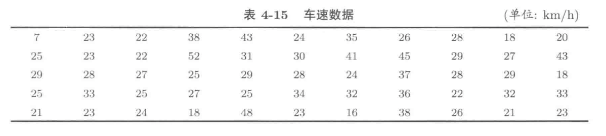
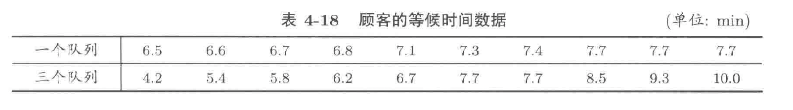

#### 4.4 
在R语言中，函数 `hist` 用于绘制直方图或分组条形图，请写出绘制数据 `x` 的频率直方图的程序代码：
```{R, eval=F}
# freq=F或FALSE即可（记得全大写
hist(x, freq=F)
hist(x, freq=FALSE)
```

#### 4.10 
在某城市的一条街道上，有55辆车的车速被一台雷达设备测出，数据如下表所示，作出这些数据的频率直方图，并指出总体是什么，总体分布密度的主要特征是什么



```{R}
v <- c(7,23,22,38,43,24,35,26,28,18,20,
       25,23,22,52,31,30,41,45,29,27,43,
       29,28,27,25,29,28,24,37,28,29,18,
       25,33,25,27,25,34,32,36,22,32,33,
       21,23,24,18,48,23,16,38,26,21,23)
hist(v, freq=F)
```

#### 4.19
...

#### 4.21
计算下列各组数据的四分位距、方差和标准差

1. 下列数据是某县最近一年来每个月发生汽车碰撞的次数：
  $$
  27, 8, 17, 11, 15, 25, 16, 14, 14, 14, 13, 18
  $$
    ```{R}
    x <- c(27, 8, 17, 11, 15, 25, 16, 14, 14, 14, 13, 18)
    # 四分位距，注意四分位距和四分位差定义的区别，四分位距不需要除以2
    quantile(x, 0.75)[[1]] - quantile(x, 0.25)[[1]]
    IQR(x)
    # 方差
    var(x)
    # 标准差
    sd(x)
    sqrt(var(x))
    quantile(x, 0.25, type=5)
    quantile(x, 0.75, type=5)
    ```
  
2. 下列数据是对配戴眼镜的成年近视患者瞳距的度量（单位：mm）：
  $$
  67, 66, 59, 62, 63, 66, 66, 55;
  $$
    ```{R}
    x <- c(67, 66, 59, 62, 63, 66, 66, 55)
    # 四分位距，注意四分位距和四分位差定义的区别，四分位距不需要除以2
    quantile(x, 0.75)[[1]] - quantile(x, 0.25)[[1]]
    IQR(x)
    # 方差
    var(x)
    # 标准差
    sd(x)
    sqrt(var(x))
    ```
3. 下列数据是麦当劳餐厅中对顾客的服务时间（单位：s）：
  $$
  8, 107, 35, 93, 65, 55, 119, 83, 99, 74, 46, 108
  $$
    ```{R}
    x <- c(8, 107, 35, 93, 65, 55, 119, 83, 99, 74, 46, 108)
    # 四分位距，注意四分位距和四分位差定义的区别，四分位距不需要除以2
    quantile(x, 0.75)[[1]] - quantile(x, 0.25)[[1]]
    IQR(x)
    # 方差
    var(x)
    # 标准差
    sd(x)
    sqrt(var(x))
    ```

#### 4.22 
某银行的一个储蓄所有三个服务窗口，想从如下的两种方式中确定顾客排队规则：

1. 每个窗口单独排成一个队列，共三个队列，顾客任选一队列等候服务
2. 所有顾客排成一个队列，三个服务窗口对队列中的顾客依次服务

改储蓄所对两种规则进行了实验，观察顾客等候服务的时间，得到如下表的数据，请根据表中的数据确定排队规则。




```{R}
x1 <- c(6.5,6.6,6.7,6.8,7.1,7.3,7.4,7.7,7.7,7.7)
x2 <- c(4.2,5.4,5.8,6.2,6.7,7.7,7.7,8.5,9.3,10.0)

df <- data.frame(
  "one line" = x1,
  "three line" = x2
)
apply(df, 2, mean)
apply(df, 2, var)
apply(df, 2, summary)
```


#### 4.24
模拟 $100$ 个标准正态分布 $\mathcal{N}(0,1)$ 的随机数，计算样本均值和样本中位数，绘制出频率直方图和盒型图。

```{R}
mu <- 0
sigma <- 1
m <- 100
x <- rnorm(m, mu, sigma)
# 均值 
mean(x)
sum(x) / m
# 中位数
median(x)
quantile(x, 0.5)
# 频率直方图
hist(x, freq=F)
# 盒型图
boxplot(x)
```