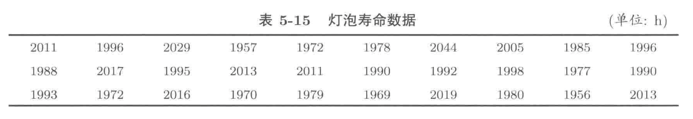

#### 5.3 
假设总体变量 $X\sim U(0,1)$，取容量为 $3$ 的简单随机样本 $X_{1},X_{2},X_{3}$，为了估计总体方差，可用样本方差 $S^{2}$ 和统计量：
$$
T = \frac{1}{3}\sum_{k=1}^{3}(X_{k}- \bar{X})^{2}
$$
试用随机模拟的方法对比 $S^{2}$ 和 $T$ 中哪一个估计总体方差的效果更好。
```{R}
m <- 10000
x <- matrix(runif(m * 3, 0, 1), m, 3)
S2 <- apply(x, 1, var)
tmpT <- S2 * 2 / 3
paraDf <- data.frame(S2=S2, T=tmpT)
meanS2 <- mean(S2)
meanT <- mean(tmpT)
mseS2 <- mean((S2 - 1/12) ** 2)
mseT <- mean((tmpT - 1/12) ** 2)

results <- c(meanS2, meanT, mseS2, mseT)
results <- data.frame(matrix(results, 2, 2), row.names=c("S2", "T"))
names(results) <- c("mean", "mse")
results

boxplot(paraDf, horizontal = TRUE)
abline(v = meanS2, col="green", lwd=2)
abline(v = meanT, col="blue", lwd=2)
abline(v = 1/12, col="red", lwd=2, lty=2)
```

#### 5.7
若从一台机器生产的螺栓中选择 $100$ 个螺栓，结果发现 $2$ 个不合格产品，尝试使用矩估计和极大似然估计方法估计此机器所生产产品的不合格率。

1. $X\sim B(100, p)$
    - 根据似然函数的定义：$L(p;\mathbf{x}) = \prod_{i=1}^{n}f(x_{i}\vert p)$，则其对数似然函数
    $$
    \ell(p;\mathbf{x}) = \sum_{i=1}^{n}\log f(x_{i}\vert p)
    $$
    - 结合 $B(100,p)$ 的密度函数：$f(x\vert p) = \mathbb{P}(X = k) = {100 \choose k}p^{k}(1-p)^{100 - k}$
    $$
    \begin{split}
    \ell(p; \mathbf{x}) &= \sum_{i=1}^{n} \log {100\choose x_{i}} p^{x_{i}}(1-p)^{100-x_{i}} \\
    & = \sum_{i=1}^{n} \log {100\choose x_{i}} + \sum_{i=1}^{n} x_{i} \cdot \log p  + \sum_{i=1}^{n} (100 - x_{i})\cdot \log (1-p) \\
    & \propto \sum_{i=1}^{n} x_{i} \cdot \log p  + \sum_{i=1}^{n} (100 - x_{i})\cdot \log (1-p)
    \end{split}
    $$
    - 此时，样本只有一个观测值：$x = 2$
    ```{R}
    # 不推公式版
    tmpF <- function(p, x){
      log_density_x <- log(dbinom(x, 100, p))
      return(sum(log_density_x))
    }
    hatPara1 <- optimize(tmpF, x = 2, interval = c(0,1),maximum=TRUE)
    hatPara1$maximum
    # 推公式版
    tmpF2 <- function(p, x){
      return(log(p) * sum(x) + sum((100-x))* log(1-p))
    }
    hatPara2 <- optimize(tmpF2, x = 2, interval = c(0,1),maximum=TRUE)
    hatPara2$maximum
    ```

2. $X\sim B(1,p)$
    - 根据似然函数的定义：$L(p;\mathbf{x}) = \prod_{i=1}^{n}f(x_{i}\vert p)$，则其对数似然函数
    $$
    \ell(p;\mathbf{x}) = \sum_{i=1}^{n}\log f(x_{i}\vert p)
    $$
    - 结合 $B(1,p)$ 的密度函数：$f(x\vert p) = \mathbb{P}(X = k) = p^{k}(1-p)^{1 - k}$
    $$
    \begin{split}
    \ell(p; \mathbf{x}) &= \sum_{i=1}^{n}  \log p^{x_{i}}(1-p)^{1-x_{i}} \\
    & = \sum_{i=1}^{n} x_{i} \log p + \sum_{i=1}^{n} (1-x_{i}) \log (1-p)
    \end{split}
    $$
    - 此时，样本有 $100$ 个观测值：
    $$
    [\underbrace{1,1}_{2}, \underbrace{0,0,\dots, 0}_{98}] 
    $$
    ```{R}
    x <- c(rep(1,2), rep(0, 98))
    # 不推公式版
    tmpF3 <- function(p, x){
      log_density_x <- log(dbinom(x, 1, p))
      return(sum(log_density_x))
    }
    hatPara3 <- optimize(tmpF3, x = x, interval = c(0,1),maximum=TRUE)
    hatPara3$maximum
    # 推公式版
    tmpF4 <- function(p, x){
      return(log(p) * sum(x) + sum((1-x))* log(1-p))
    }
    hatPara4 <- optimize(tmpF4, x = x, interval = c(0,1),maximum=TRUE)
    hatPara4$maximum
    ```

#### 5.8
某射手在 $1000$ 次射击中，有 $5$ 次脱靶，分别使用矩估计和极大似然方法估计该名射手的命中率。

1. $X\sim B(1000, p)$
    - 根据似然函数的定义：$L(p;\mathbf{x}) = \prod_{i=1}^{n}f(x_{i}\vert p)$，则其对数似然函数
    $$
    \ell(p;\mathbf{x}) = \sum_{i=1}^{n}\log f(x_{i}\vert p)
    $$
    - 结合 $B(1000,p)$ 的密度函数：$f(x\vert p) = \mathbb{P}(X = k) = {1000 \choose k}p^{k}(1-p)^{1000 - k}$
    $$
    \begin{split}
    \ell(p; \mathbf{x}) &= \sum_{i=1}^{n} \log {1000\choose x_{i}} p^{x_{i}}(1-p)^{1000-x_{i}} \\
    & = \sum_{i=1}^{n} \log {1000\choose x_{i}} + \sum_{i=1}^{n} x_{i} \cdot \log p  + \sum_{i=1}^{n} (1000 - x_{i})\cdot \log (1-p) \\
    & \propto \sum_{i=1}^{n} x_{i} \cdot \log p  + \sum_{i=1}^{n} (1000 - x_{i})\cdot \log (1-p)
    \end{split}
    $$
    - 此时，样本只有一个观测值：$x = 995$
    ```{R}
    # 不推公式版
    tmpF <- function(p, x){
      log_density_x <- log(dbinom(x, 1000, p))
      return(sum(log_density_x))
    }
    hatPara1 <- optimize(tmpF, x = 995, interval = c(0,1),maximum=TRUE)
    hatPara1$maximum
    # 推公式版
    tmpF2 <- function(p, x){
      return(log(p) * sum(x) + sum((1000-x))* log(1-p))
    }
    hatPara2 <- optimize(tmpF2, x = 995, interval = c(0,1),maximum=TRUE)
    hatPara2$maximum
    ```

2. $X\sim B(1,p)$
    - 根据似然函数的定义：$L(p;\mathbf{x}) = \prod_{i=1}^{n}f(x_{i}\vert p)$，则其对数似然函数
    $$
    \ell(p;\mathbf{x}) = \sum_{i=1}^{n}\log f(x_{i}\vert p)
    $$
    - 结合 $B(1,p)$ 的密度函数：$f(x\vert p) = \mathbb{P}(X = k) = p^{k}(1-p)^{1 - k}$
    $$
    \begin{split}
    \ell(p; \mathbf{x}) &= \sum_{i=1}^{n}  \log p^{x_{i}}(1-p)^{1-x_{i}} \\
    & = \sum_{i=1}^{n} x_{i} \log p + \sum_{i=1}^{n} (1-x_{i}) \log (1-p)
    \end{split}
    $$
    - 此时，样本有 $1000$ 个观测值：
    $$
    [\underbrace{1,\dots,1,1}_{995}, \underbrace{0,0,\dots, 0}_{5}] 
    $$
    ```{R}
    x <- c(rep(1,995), rep(0, 5))
    # 不推公式版
    tmpF3 <- function(p, x){
      log_density_x <- log(dbinom(x, 1, p))
      return(sum(log_density_x))
    }
    hatPara3 <- optimize(tmpF3, x = x, interval = c(0,1),maximum=TRUE)
    hatPara3$maximum
    # 推公式版
    tmpF4 <- function(p, x){
      return(log(p) * sum(x) + sum((1-x))* log(1-p))
    }
    hatPara4 <- optimize(tmpF4, x = x, interval = c(0,1),maximum=TRUE)
    hatPara4$maximum
    ```
  
#### 5.9
在一位教师一学期的 $32$ 小时答疑时间内来了 $64$ 名学生，用 $\xi$ 表示 $1$ 小时来答疑的人数。若 $\xi \sim P(\lambda)$，试用矩估计和极大似然方法估计 $\lambda$。

- 根据似然函数的定义：$L(\lambda;\mathbf{x}) = \prod_{i=1}^{n}f(x_{i}\vert \lambda)$，则其对数似然函数
  $$
  \ell(\lambda;\mathbf{x}) = \sum_{i=1}^{n}\log f(x_{i}\vert \lambda)
  $$
- 结合 $P(\lambda)$ 的密度函数：$f(x\vert p) = \mathbb{P}(X = k) =e^{-\lambda} \frac{\lambda^{k}}{k!}$
  $$
  \begin{split}
  \ell(p; \mathbf{x}) &= \sum_{i=1}^{n}\log e^{-\lambda} \frac{\lambda^{x_{i}}}{x_{i}!} \\
  & = \sum_{i=1}^{n} (-\lambda) + \sum_{i=1}^{n} x_{i}\cdot \log  \lambda - \sum_{i=1}^{n}x_{i}! \\
  & \propto -n\lambda  + \sum_{i=1}^{n}x_{i} \cdot \log \lambda
  \end{split}
  $$
- 根据题意，在 $n=32$ 时，我们有观测值 $\sum_{i=1} ^{32} x_{i} =64$
```{R}
# 只有推公式版
tmpF <- function(lambda, x){
  return(-32 * lambda + x * log(lambda))
}

hatPara <- optimize(tmpF, x=64, interval=c(0,100), maximum=TRUE)
hatPara$maximum
```


#### 5.18
某灯泡厂生产的灯泡的寿命 $X\sim N(\mu, 500)$，当生产情况正常时，灯泡的平均使用寿命不小于 $2000\mathrm{\, h}$。现从生产线上获得的 $X$ 的重复观测样本如下表所示，问：在显著性水平 $0.01$ 下，生产线工作是否正常？



1. 根据题意写出原假设：
$$
H_{0}:\, \mu \ge 2000
$$
2. 根据题目可知，$X\sim N(\mu, 500)$ 结合大数定律：对于样本量为 $n$ 的重复观测样本，其样本均值 $\bar{X} = \frac{1}{n}\sum_{i=1}^{n}X_{i}$ 服从正态分布：
    $$
    \bar{X} \sim N\left(\mu, \frac{500}{n}\right)
    $$
3. 根据原假设，可计算$p$-值：
$$
\begin{split}
\mathbb{P}_{H_{0}}(\bar{X} - \mu_{0} < \bar{x} - \mu_{0}) & = \mathbb{P}\left(\frac{\bar{X} -\mu_{0}}{\sqrt{500 / n}} < \frac{\bar{x} -\mu_{0}}{\sqrt{500 / n}}\right) \\
& = \Phi\left(\frac{\bar{x} - \mu_{0}}{\sqrt{500/n}}\right)
\end{split}
$$
```{R}
x <- c(2011,1996,2029,1957,1972,1978,2044,2005,1985,1996,
       1988,2017,1995,2013,2011,1990,1992,1998,1977,1990,
       1993,1972,2016,1970,1979,1969,2019,1980,1956,2013)
n <- length(x)
sigma2 <- 500
mu0 <- 2000
alpha <- 0.01
pvalue <- pnorm((mean(x)- mu0)/sqrt(sigma2/n))
if(pvalue < alpha){
  cat("p值为", pvalue ,"，原假设被拒绝，产线工作异常")
} else{
  cat("p值为", pvalue ,"，无法拒绝原假设，产线工作正常")
}
```

或可以计算标准化后的值同 $z_{0.01}$ 进行对比
```{R}
n <- length(x)
z <- (mean(x) - mu0)/sqrt(sigma2/n)
zThreshold <- qnorm(0.01)
if (z <= zThreshold){
  cat("z=", round(z,3), "，小于等于", round(zThreshold,3),"故拒绝原假设，产线异常", sep="")
}else{
  cat("z=", round(z,3), "，大于", round(zThreshold,3),"故无法拒绝原假设，产线正常", sep="")
}
```