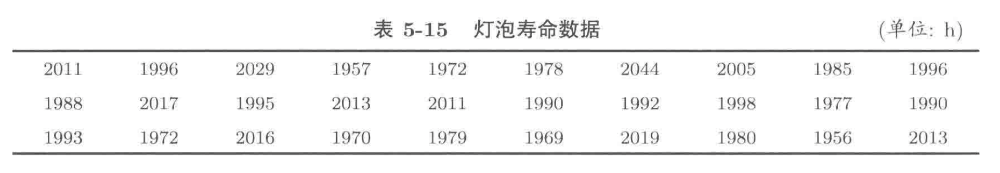

\pagebreak
# 第8次作业
#### 2.43
设 $\xi\sim B(1,0.3)$，对于 $i=1,2,\dots,10000$，分别使用R语言模拟 $\xi$ 的重复观测结果 $10i$ 次，并计算相应的重复观测结果的算术平均值 $\bar{x}_{i}$；绘制 $(i,\bar{x}_{i})$ 的折线图，分析该折线随着 $i$ 增大变化的趋势及原因

- **答**：这道题目要求我们计算不同样本量下的样本均值，并将结果使用折线图绘制出来。考察：(1) 对于 `for` 循环的使用；(2) 对于向量的基础操作，即如何往向量中添加元素；(3) 基础绘图
    - **方法1**：直接生成 $10 \times 10000$ 个随机数，在 `for` 循环中每次计算前 $10i$ 个元素的算术平均值，并存成向量。
        ```{R, eval=F}
        # 2.43 程序
        i <- 1:10000                    # 根据题意定义向量i=1,2,...,10000
        xi <- rbinom(10*max(i),1,0.3)   # 生成 10*10000 个服从B(1,0.3)的随机数
        x_bar <- c()                    # 定义一个空向量，用于存储不同样本量的均值
        # 通过for循环，每次计算xi前10*j个元素的均值，并作为最后一个元素添加给向量x_bar
        for (j in i){
          x_bar <- c(x_bar, mean(xi[1:10*j]))
        }
        plot(i, x_bar, type="l") # 使用plot绘图，第一个是横坐标向量，第二个是纵坐标向量，type="l" 即设置其为折线图
        abline(h=0.3, col="red", lty=2, lwd=2) # 绘制参考线
        ```
    - **方法二**：通过 `for` 循环，每次生成 $10i$ 个样本，并计算这 $10i$ 个样本的均值，然后存成向量。
        ```{R, eval=F}
        # 2.43 程序
        i <- 1:10000    # 根据题意定义向量i=1,2,....,10000
        x_bar <- c()    # 定义一个空向量，用于存储不同样本量的均值
        # 通过for循环，每次生成样本量为 10*j 的随机数，并计算其均值，作为最后一个元素添加给向量 x_bar
        for (j in i){
          xi <- rbinom(10*j,1,0.3)
          x_bar <- c(x_bar, mean(xi))
        }
        plot(i, x_bar, type="l")    # plot绘制折线图
        abline(h=0.3, col="red", lty=2, lwd=2) # 添加总体期望的参考线
        ```

#### 2.44
设 $\xi$ 服从以 $1000,10$ 和 $50$ 为参数的超几何分布，对于 $i=1,2,\dots,10000$，分别使用R语言模拟 $\xi$ 的重复观测结果 $10i$ 次，并计算相应的重复观测结果的算术平均值 $\bar{x}_{i}$；绘制 $(i,\bar{x}_{i})$ 的折线图，分析该折线随着 $i$ 增大变化的趋势及原因

- **答**：这道题目要求我们计算不同样本量下的样本均值，并将结果使用折线图绘制出来。考察：(1) 对于 `for` 循环的使用；(2) 对于向量的基础操作，即如何往向量中添加元素；(3) 基础绘图
    - **方法1**：直接生成 $10 \times 10000$ 个随机数，在 `for` 循环中每次计算前 $10i$ 个元素的算术平均值，并存成向量。
        ```{R,eval=F}
        # 2.44 程序
        i = 1:10000                           # 根据题意定义向量i=1,2,....,10000
        xi <- rhyper(max(i) * 10, 10, 990, 50)# 生成10000*10个服从参数为1000,10和50的超几何分布的随机数
        x_bar <- c()        # 定义一个空向量用于存储不同样本量下的算术平均值
        # 利用for循环计算前10*j个元素的算术平均值，并作为最后一个元素添加到向量x_bar中
        for (j in i){
          x_bar <- c(x_bar, mean(xi[1:j*10]))
        }
        plot(i, x_bar, type="l") # 通过plot函数，将设置type="l"绘制折线图
        abline(h=0.5, lty=2, lwd=2, col="red")
        ```
    - **方法二**：通过 `for` 循环，每次生成 $10i$ 个样本，并计算这 $10i$ 个样本的均值，然后存成向量。
        ```{R,eval=F}
        # 2.44 程序
        i = 1:10000       # 根据题意定义向量i=1,2,...,10000
        x_bar <- c()      # 定义一个空向量用于存储不同样本量下的均值
        # 通过for循环，每次生成不同样本量的样本，并计算均值，将其作为最后一个元素添加到向量 x_bar 中
        for (j in i){
          xi <- rhyper(j * 10, 10, 990, 50)
          x_bar <- c(x_bar, mean(xi))
        }
        plot(i, x_bar, type="l")    # 利用plot绘制折线图
        abline(h=0.5, lty=2, lwd=2, col="red") # 绘制参考线（总体数学期望）
        ```


#### 2.49
设 $\xi \sim B(10000,0.3)$，写出蒙特卡洛方法近似计算 $F_{\xi}(5555)$ 的R语言程序代码，并将计算结果与 `pbinom(5555,10000,0.3)` 的计算结果相比较，分析近似计算的精度和重复观测次数之间的关系。（这道题出的不是很好。

- **答**：这道题让我们用蒙特卡洛模拟的方法来估计已知分布的分布函数值，我们可以借用经验分布函数的方法来进行估计，设我们有 $n$ 个对于该分布的观测值 $X_{1},\dots, X_{n}$，则其经验分布函数 $F_{n}(x)$ 为
$$
F_{n}(x) = \frac{n(\{i:1\le i\le n,\, X_{i} \le x\})}{n}
$$
其中分子 $n(\{i:1\le i\le n,\, X_{i} \le x\})$ 表示 $n$ 个样本 $X_{i}$ 中小于 $x$ 个数，在r语言中我们可以十分简单的计算得到。根据大数定律，有：
$$
\lim_{n\to \infty}F_{n}(x) = F(x) = \mathbb{P}(X \le x)
$$
我们可以根据如上概念进行蒙特卡洛模拟。
    ```{R}
    # 2.49 程序
    sim_freq <- c() # 定义空向量用于存储不同样本量下的蒙特卡洛模拟结果
    true_prob <- pbinom(5555, 10000,0.3) # 计算实际的分布函数值
    # 在不同样本量(10,100,1000)下进行蒙特卡洛模拟
    for (n in c(10,100,1000)) {
      sim_B <- rbinom(n, 10000,0.3)  # 生成n个服从B(10000,0.3)的随机数（即对总体B(10000,0.3)进行n次重复观测）
      tmp_freq <- mean(sim_B <= 5555) # 计算经验分布，即n次重复观测中小于等于5555的次数占总观测次数的比例；需要了解：向量的关系运算，逻辑型和数值型之间转换的规则。
      sim_freq <- c(sim_freq,tmp_freq) # 将模拟的结果存储到向量sim_freq中
      abs_diff <- abs(true_prob - tmp_freq) # 计算模拟结果和实际结果之间的误差
      cat("重复观测数为 ",n," 的估计结果为 ", tmp_freq, " 其和真实值之间的差距 ", abs_diff,"\n") # 打印出结果
    }
    ```


#### 2.52
设 $\xi \sim U(-10,10)$，写出蒙特卡洛方法近似计算 $F_{\xi}(0.5)$ 的R语言程序代码，并将计算结果与 `punif(0.5,-10,10)` 的计算结果相比较，分析近似计算的精度和重复观测次数之间的关系。

- **答**：和上道题类似，这道题让我们用蒙特卡洛模拟的方法来估计已知分布的分布函数值，我们可以借用经验分布函数的方法来进行估计，设我们有 $n$ 个对于该分布的观测值 $X_{1},\dots, X_{n}$，则其经验分布函数 $F_{n}(x)$ 为
$$
F_{n}(x) = \frac{n(\{i:1\le i\le n,\, X_{i} \le x\})}{n}
$$
其中分子 $n(\{i:1\le i\le n,\, X_{i} \le x\})$ 表示 $n$ 个样本 $X_{i}$ 中小于 $x$ 个数，在r语言中我们可以十分简单的计算得到。根据大数定律，有：
$$
\lim_{n\to \infty}F_{n}(x) = F(x) = \mathbb{P}(X \le x)
$$
我们可以根据如上概念进行蒙特卡洛模拟。
    ```{R}
    # 2.52 程序
    sim_freq <- c()       # 定义空向量用于存储不同样本量下的蒙特卡洛模拟结果
    true_prob <- punif(0.5, -10, 10) # 计算实际的分布函数值
    # 在不同样本量(10,100,1000)下进行蒙特卡洛模拟
    for (n in c(10,100,1000,10000)) {
      sim_U <- runif(n, -10,10) # 生成n个服从U(-10,10)的随机数（即对总体U(-10,10)进行n次重复观测）
      tmp_freq <- mean(sim_U <= 0.5) # 计算经验分布0.5；需要了解：向量的关系运算，逻辑型和数值型之间转换的规则。
      sim_freq <- c(sim_freq,tmp_freq) # 将模拟的结果存储到向量sim_freq中
      abs_diff <- abs(true_prob - tmp_freq) # 计算模拟结果和实际结果之间的误差
      cat("重复观测数为",n,"的估计结果为", tmp_freq, "其和真实值之间的差距", abs_diff,"\n") # 打印结果
    }
    ```

#### 2.54
试用蒙特卡洛方法估算定积分 $\displaystyle\int_{0}^{1}x^{2}e^{x^{2}}\,dx$

- **答** 参考P88页的方法：此处我们的积分区间是 $[0,1]$ 被积函数 $f(x) = x^{2}e^{x^{2}}$。对于最一般的积分形式：
$$
\int_{a}^{b}f(x)\,dx
$$
蒙特卡洛模拟的步骤如下：
    1. 生成积分区间内服从均匀分布的 $n$ 个随机数，即 $Y_{i}\sim U(a,b)\,(i=1,2,\dots,n)$
    2. 根据被积函数 $f(x)$ 对第一步所得的随机数进行计算，得到 $n$ 个随机变量 $f(Y_{i})\,(i=1,2,\dots,n)$
    3. 根据如下公式进行计算: 
    $$
    \int_{a}^{b}f(x)\,dx \approx (b-a) \frac{1}{N}\sum_{i=1}^{N}f(Y_{i})
    $$
    其实就是计算上一步得到的 $n$ 个随机变量 $f(Y_{i})$ 的算术平均值后乘以积分上下限的差 $b-a$
    ```{R}
    # 2.54 程序
    Y <- runif(10000, 0,1) # 生成10000个服从U(0,1)的随机数
    f_Y = Y^2 * exp(Y^2)  # 计算f(Y)
    estim_int <- mean(f_Y) * (1-0) # 计算f(Y)的算术平均值，并乘以积分上下限的差(1-0)
    true_int <- integrate(function(x) x^2 * exp(x^2), 0,1) # 使用integrate函数精确计算
    cat("蒙特卡洛模拟的结果为", estim_int, "，实际的计算结果为", true_int$value) # 比较二者差异
    ```


#### 2.60
若大学生中男生的身高均值为 $\mathrm{173.61\, cm}$，标准差为 $4.96 \mathrm{\,cm}$。随机选取 $16$ 名男大学生。在RStudio中，写出应用中心极限定理近似计算这 $16$ 名大学生的身高均值落在区间 $(168.65,178.57)$（单位：$\mathrm{cm}$）内的概率的程序代码，并给出近似计算的结果。

- **答** 此题目主要考察了中心极限定理的应用：根据中心极限定理，对于 $16$ 名男大学生的身高均值 $\bar{X}$，其近似于正态分布
    $$
    \bar{X} \sim N(\mathbb{E}(X), D(X)/16)
    $$
    其中 
    - $\mathbb{E}(X)= 173.61$ 
    - $D(X) = 4.96^{2}$
    
  题目要求我们计算 $\mathbb{P}(168.65\le \bar{X} \le 178.57)$，根据正态分布的性质，我们可以将 $\bar{X}$ 进行标准化为标准正态分布：
  $$
  \mathbb{P}\left(\frac{168.65 - \mathbb{E}(X)}{\sqrt{D(X)/16}} \le \frac{\bar{X} - \mathbb{E}(X)}{\sqrt{D(X)/16}} \le \frac{178.57 - \mathbb{E}(X)}{\sqrt{D(X)/16}}\right) = \Phi\left(\frac{178.57 - \mathbb{E}(X)}{\sqrt{D(X)/16}}\right)-\Phi\left(\frac{168.65 - \mathbb{E}(X)}{\sqrt{D(X)/16}}\right)
  $$
  此处 $\Phi(x)$ 为标准正态分布的分布函数在 $x$ 点的函数值。
    
    ```{R, eval=F}
    # 2.54 程序
    mu = 173.61      # 总体均值
    sigma2 = 4.96^2  # 总体方差
    mean_sigma2 = sigma2 / 16 # 样本均值的方差
    # 可以不标准化，直接根据样本均值服从分布的参数计算
    up = pnorm(178.57, mu, sqrt(mean_sigma2))  
    low = pnorm(168.65, mu, sqrt(mean_sigma2))
    up - low
    
    # 标准化后进行计算
    z_up = (178.57 - mu)/(sqrt(mean_sigma2))
    z_down = (168.65 - mu)/(sqrt(mean_sigma2))
    pnorm(z_up) - pnorm(z_down) # pnorm不写其他参数就默认为标准正态分布的参数：均值为0，标准差为1
    ```
    
    
\pagebreak
# 第9次作业
4. 抛质地均匀的硬币 $200$ 次，写出出现正面朝上概率的R代码。
```{R}
# 4 程序
x <- c(0,1) # 投掷一枚均匀的硬币只有正面，反面两种情况，我们用0表示反面，1表示正面
coins <- sample(x, 200, T) # 从0,1中有放回的随机抽取200次，即可得到抛掷200次均匀硬币的结果
mean(coins == 1) # 计算正面朝上（观测结果为1）发生的频率
sum(coins == 1)/200 # 计算正面朝上（观测结果为1）发生的频率
```

5. 抛质地均匀的骰子 $100$ 次，写出出现 $6$ 点概率的R代码。
```{R}
# 5 程序
x <- 1:6 # 投掷一枚骰子有6中可能结果{1,2,3,4,5,6}
dices <- sample(x, 100, T) # 从{1,2,3,4,5,6} 中有放回的随机抽取100次，即可得到抛掷100次均匀骰子的实验结果
mean(dices == 6) # 计算6点出现的频率
sum(dices == 6)/100 # 计算6点出现的频率
```

6. 用计算机模拟 $100$ 次抛掷一颗质地均匀的骰子的实验结果，写出相应的R程序代码。
```{R}
# 6 程序
sample(1:6,100,T)
```

7. 投掷一枚硬币，正面朝上的概率为 $p$，(4) 如果这枚硬币质地均匀，$p=0.5$，连续投掷 $20$ 次，正面朝上次数不超过 $8$ 次的概率，写出R语言代码。
    - 根据题意可知，连续投掷20次，正面朝上的次数 $X$ 服从二项分布：
    $$
    X\sim B(20, 0.5)
    $$
    - 结合分布函数的定义，正面朝上不超过 $8$ 次的概率：
    $$
    \mathbb{P}(X \le 8) = F_{X}(8)
    $$
    ```{R}
    # 7 程序
    pbinom(8, 20, 0.5) # 可以直接使用二项分布的分布函数：pbinom
    ```


\pagebreak
# 第5章作业
#### 5.3 
假设总体变量 $X\sim U(0,1)$，取容量为 $3$ 的简单随机样本 $X_{1},X_{2},X_{3}$，为了估计总体方差，可用样本方差 $S^{2}$ 和统计量：
$$
T = \frac{1}{3}\sum_{k=1}^{3}(X_{k}- \bar{X})^{2}
$$
试用随机模拟的方法对比 $S^{2}$ 和 $T$ 中哪一个估计总体方差的效果更好。
```{R}
m <- 10000
x <- matrix(runif(m * 3, 0, 1), m, 3)
S2 <- apply(x, 1, var)
tmpT <- S2 * 2 / 3
paraDf <- data.frame(S2=S2, T=tmpT)
meanS2 <- mean(S2)
meanT <- mean(tmpT)
mseS2 <- mean((S2 - 1/12) ** 2)
mseT <- mean((tmpT - 1/12) ** 2)

results <- c(meanS2, meanT, mseS2, mseT)
results <- data.frame(matrix(results, 2, 2), row.names=c("S2", "T"))
names(results) <- c("mean", "mse")
results

boxplot(paraDf, horizontal = TRUE)
abline(v = meanS2, col="green", lwd=2)
abline(v = meanT, col="blue", lwd=2)
abline(v = 1/12, col="red", lwd=2, lty=2)
```

#### 5.7
若从一台机器生产的螺栓中选择 $100$ 个螺栓，结果发现 $2$ 个不合格产品，尝试使用矩估计和极大似然估计方法估计此机器所生产产品的不合格率。

1. $X\sim B(100, p)$
    - 根据似然函数的定义：$L(p;\mathbf{x}) = \prod_{i=1}^{n}f(x_{i}\vert p)$，则其对数似然函数
    $$
    \ell(p;\mathbf{x}) = \sum_{i=1}^{n}\log f(x_{i}\vert p)
    $$
    - 结合 $B(100,p)$ 的密度函数：$f(x\vert p) = \mathbb{P}(X = k) = {100 \choose k}p^{k}(1-p)^{100 - k}$
    $$
    \begin{split}
    \ell(p; \mathbf{x}) &= \sum_{i=1}^{n} \log {100\choose x_{i}} p^{x_{i}}(1-p)^{100-x_{i}} \\
    & = \sum_{i=1}^{n} \log {100\choose x_{i}} + \sum_{i=1}^{n} x_{i} \cdot \log p  + \sum_{i=1}^{n} (100 - x_{i})\cdot \log (1-p) \\
    & \propto \sum_{i=1}^{n} x_{i} \cdot \log p  + \sum_{i=1}^{n} (100 - x_{i})\cdot \log (1-p)
    \end{split}
    $$
    - 此时，样本只有一个观测值：$x = 2$
    ```{R}
    # 不推公式版
    tmpF <- function(p, x){
      log_density_x <- log(dbinom(x, 100, p))
      return(sum(log_density_x))
    }
    hatPara1 <- optimize(tmpF, x = 2, interval = c(0,1),maximum=TRUE)
    hatPara1$maximum
    # 推公式版
    tmpF2 <- function(p, x){
      return(log(p) * sum(x) + sum((100-x))* log(1-p))
    }
    hatPara2 <- optimize(tmpF2, x = 2, interval = c(0,1),maximum=TRUE)
    hatPara2$maximum
    ```

2. $X\sim B(1,p)$
    - 根据似然函数的定义：$L(p;\mathbf{x}) = \prod_{i=1}^{n}f(x_{i}\vert p)$，则其对数似然函数
    $$
    \ell(p;\mathbf{x}) = \sum_{i=1}^{n}\log f(x_{i}\vert p)
    $$
    - 结合 $B(1,p)$ 的密度函数：$f(x\vert p) = \mathbb{P}(X = k) = p^{k}(1-p)^{1 - k}$
    $$
    \begin{split}
    \ell(p; \mathbf{x}) &= \sum_{i=1}^{n}  \log p^{x_{i}}(1-p)^{1-x_{i}} \\
    & = \sum_{i=1}^{n} x_{i} \log p + \sum_{i=1}^{n} (1-x_{i}) \log (1-p)
    \end{split}
    $$
    - 此时，样本有 $100$ 个观测值：
    $$
    [\underbrace{1,1}_{2}, \underbrace{0,0,\dots, 0}_{98}] 
    $$
    ```{R}
    x <- c(rep(1,2), rep(0, 98))
    # 不推公式版
    tmpF3 <- function(p, x){
      log_density_x <- log(dbinom(x, 1, p))
      return(sum(log_density_x))
    }
    hatPara3 <- optimize(tmpF3, x = x, interval = c(0,1),maximum=TRUE)
    hatPara3$maximum
    # 推公式版
    tmpF4 <- function(p, x){
      return(log(p) * sum(x) + sum((1-x))* log(1-p))
    }
    hatPara4 <- optimize(tmpF4, x = x, interval = c(0,1),maximum=TRUE)
    hatPara4$maximum
    ```

#### 5.8
某射手在 $1000$ 次射击中，有 $5$ 次脱靶，分别使用矩估计和极大似然方法估计该名射手的命中率。

1. $X\sim B(1000, p)$
    - 根据似然函数的定义：$L(p;\mathbf{x}) = \prod_{i=1}^{n}f(x_{i}\vert p)$，则其对数似然函数
    $$
    \ell(p;\mathbf{x}) = \sum_{i=1}^{n}\log f(x_{i}\vert p)
    $$
    - 结合 $B(1000,p)$ 的密度函数：$f(x\vert p) = \mathbb{P}(X = k) = {1000 \choose k}p^{k}(1-p)^{1000 - k}$
    $$
    \begin{split}
    \ell(p; \mathbf{x}) &= \sum_{i=1}^{n} \log {1000\choose x_{i}} p^{x_{i}}(1-p)^{1000-x_{i}} \\
    & = \sum_{i=1}^{n} \log {1000\choose x_{i}} + \sum_{i=1}^{n} x_{i} \cdot \log p  + \sum_{i=1}^{n} (1000 - x_{i})\cdot \log (1-p) \\
    & \propto \sum_{i=1}^{n} x_{i} \cdot \log p  + \sum_{i=1}^{n} (1000 - x_{i})\cdot \log (1-p)
    \end{split}
    $$
    - 此时，样本只有一个观测值：$x = 995$
    ```{R}
    # 不推公式版
    tmpF <- function(p, x){
      log_density_x <- log(dbinom(x, 1000, p))
      return(sum(log_density_x))
    }
    hatPara1 <- optimize(tmpF, x = 995, interval = c(0,1),maximum=TRUE)
    hatPara1$maximum
    # 推公式版
    tmpF2 <- function(p, x){
      return(log(p) * sum(x) + sum((1000-x))* log(1-p))
    }
    hatPara2 <- optimize(tmpF2, x = 995, interval = c(0,1),maximum=TRUE)
    hatPara2$maximum
    ```

2. $X\sim B(1,p)$
    - 根据似然函数的定义：$L(p;\mathbf{x}) = \prod_{i=1}^{n}f(x_{i}\vert p)$，则其对数似然函数
    $$
    \ell(p;\mathbf{x}) = \sum_{i=1}^{n}\log f(x_{i}\vert p)
    $$
    - 结合 $B(1,p)$ 的密度函数：$f(x\vert p) = \mathbb{P}(X = k) = p^{k}(1-p)^{1 - k}$
    $$
    \begin{split}
    \ell(p; \mathbf{x}) &= \sum_{i=1}^{n}  \log p^{x_{i}}(1-p)^{1-x_{i}} \\
    & = \sum_{i=1}^{n} x_{i} \log p + \sum_{i=1}^{n} (1-x_{i}) \log (1-p)
    \end{split}
    $$
    - 此时，样本有 $1000$ 个观测值：
    $$
    [\underbrace{1,\dots,1,1}_{995}, \underbrace{0,0,\dots, 0}_{5}] 
    $$
    ```{R}
    x <- c(rep(1,995), rep(0, 5))
    # 不推公式版
    tmpF3 <- function(p, x){
      log_density_x <- log(dbinom(x, 1, p))
      return(sum(log_density_x))
    }
    hatPara3 <- optimize(tmpF3, x = x, interval = c(0,1),maximum=TRUE)
    hatPara3$maximum
    # 推公式版
    tmpF4 <- function(p, x){
      return(log(p) * sum(x) + sum((1-x))* log(1-p))
    }
    hatPara4 <- optimize(tmpF4, x = x, interval = c(0,1),maximum=TRUE)
    hatPara4$maximum
    ```
  
#### 5.9
在一位教师一学期的 $32$ 小时答疑时间内来了 $64$ 名学生，用 $\xi$ 表示 $1$ 小时来答疑的人数。若 $\xi \sim P(\lambda)$，试用矩估计和极大似然方法估计 $\lambda$。

- 根据似然函数的定义：$L(\lambda;\mathbf{x}) = \prod_{i=1}^{n}f(x_{i}\vert \lambda)$，则其对数似然函数
  $$
  \ell(\lambda;\mathbf{x}) = \sum_{i=1}^{n}\log f(x_{i}\vert \lambda)
  $$
- 结合 $P(\lambda)$ 的密度函数：$f(x\vert p) = \mathbb{P}(X = k) =e^{-\lambda} \frac{\lambda^{k}}{k!}$
  $$
  \begin{split}
  \ell(p; \mathbf{x}) &= \sum_{i=1}^{n}\log e^{-\lambda} \frac{\lambda^{x_{i}}}{x_{i}!} \\
  & = \sum_{i=1}^{n} (-\lambda) + \sum_{i=1}^{n} x_{i}\cdot \log  \lambda - \sum_{i=1}^{n}x_{i}! \\
  & \propto -n\lambda  + \sum_{i=1}^{n}x_{i} \cdot \log \lambda
  \end{split}
  $$
- 根据题意，在 $n=32$ 时，我们有观测值 $\sum_{i=1} ^{32} x_{i} =64$
```{R}
# 只有推公式版
tmpF <- function(lambda, x){
  return(-32 * lambda + x * log(lambda))
}

hatPara <- optimize(tmpF, x=64, interval=c(0,100), maximum=TRUE)
hatPara$maximum
```


#### 5.18
某灯泡厂生产的灯泡的寿命 $X\sim N(\mu, 500)$，当生产情况正常时，灯泡的平均使用寿命不小于 $2000\mathrm{\, h}$。现从生产线上获得的 $X$ 的重复观测样本如下表所示，问：在显著性水平 $0.01$ 下，生产线工作是否正常？



1. 根据题意写出原假设：
$$
H_{0}:\, \mu \ge 2000
$$
2. 根据题目可知，$X\sim N(\mu, 500)$ 结合大数定律：对于样本量为 $n$ 的重复观测样本，其样本均值 $\bar{X} = \frac{1}{n}\sum_{i=1}^{n}X_{i}$ 服从正态分布：
    $$
    \bar{X} \sim N\left(\mu, \frac{500}{n}\right)
    $$
3. 根据原假设，可计算$p$-值：
$$
\begin{split}
\mathbb{P}_{H_{0}}(\bar{X} - \mu_{0} < \bar{x} - \mu_{0}) & = \mathbb{P}\left(\frac{\bar{X} -\mu_{0}}{\sqrt{500 / n}} < \frac{\bar{x} -\mu_{0}}{\sqrt{500 / n}}\right) \\
& = \Phi\left(\frac{\bar{x} - \mu_{0}}{\sqrt{500/n}}\right)
\end{split}
$$
```{R}
x <- c(2011,1996,2029,1957,1972,1978,2044,2005,1985,1996,
       1988,2017,1995,2013,2011,1990,1992,1998,1977,1990,
       1993,1972,2016,1970,1979,1969,2019,1980,1956,2013)
n <- length(x)
sigma2 <- 500
mu0 <- 2000
alpha <- 0.01
pvalue <- pnorm((mean(x)- mu0)/sqrt(sigma2/n))
if(pvalue < alpha){
  cat("p值为", pvalue ,"，原假设被拒绝，产线工作异常")
} else{
  cat("p值为", pvalue ,"，无法拒绝原假设，产线工作正常")
}
```

或可以计算标准化后的值同 $z_{0.01}$ 进行对比
```{R}
n <- length(x)
z <- (mean(x) - mu0)/sqrt(sigma2/n)
zThreshold <- qnorm(0.01)
if (z <= zThreshold){
  cat("z=", round(z,3), "，小于等于", round(zThreshold,3),"故拒绝原假设，产线异常", sep="")
}else{
  cat("z=", round(z,3), "，大于", round(zThreshold,3),"故无法拒绝原假设，产线正常", sep="")
}
```

#### 练习5.24
某快餐店外卖部经理想要了解完成一份订单所需时间和送货距离之间的关系。他随机抽取了20份订单，获取了这些订单的送货距离和所需时间，将所得数据列入下表。试建立完成一份订单所需时间与送货距离的经验方程。


```{R}
distance <- c(6.1,0.3,0.3,2.0,5.9,0.7,3.7,6.4,7.2,7.0,
              0.9,4.6,4.5,3.6,1.6,6.8,7.0,7.3,4.8,5.6)
time <- c(23.3,4.4,5.3,9.8,22.8,7.1,15.5,21.5,26.2,27.0,
					8.3,16.7,17.8,14.6,8.3,23.6,25.9,26.0,19.1,20.9)
```

1. 绘制散点图，观察距离 `distance` 和 `time` 之间的关系：
    ```{R}
    plot(distance, time, type="p")
    ```
2. 将送货时间作为响应变量 $Y$，送货距离 $x$ 作为解释变量。由散点图知，我们可以使用简单的线性回归模型来拟合其经验方程：
    $$
    Y = a + b  x + \varepsilon
    $$
3. 使用如下R语言进行模型的参数估计和模型评价：
    ```{R}
    tmpModel <- lm(time ~ distance)
    summary(tmpModel)
    ```
4. 所以送货时间 $Y$ 对于送货距离 $x$ 的经验方程为：
    $$
    Y = 4.222 + 3.009 x
    $$
    该模型的$R^{2}$
    ```{R}
    summary(tmpModel)$r.squared
    ```
    该模型参数的估计值：
    ```{R}
    tmpModel$coefficients
    coef(tmpModel)
    ```
    该模型的残差平方和：
    ```{R}
    sum(tmpModel$residuals ^ 2)
    ```
    
        